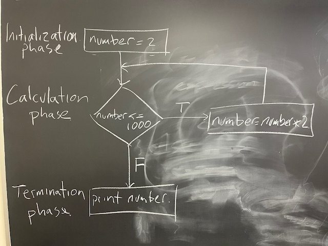

### Week 2: Preclass homework for Thursday

Flowchart, to pseudocode, to code. Come prepared to briefly share your solutions with a peer. There's rarely one answer to a coding problem and it's interesting to see how different people solve the same problem.


#### 1. Complete the exercise: sentinel controlled repetition

In Tuesday's class, we sketched out the flowchart for an algorithm to find the first number greater than 1000 that is a power of 2. Here's the sketch we came up with:




Now write the pseudocode.

Make the pseudocode an R comment.

Below each line of pseudocode, translate to R code.


#### 2. Complete the exercise: counter controlled repetition

We did not start the second problem (last slide in the lecture notes), which is an exercise to design an algorithm using the while structure to do counter controlled repetition. Sketch a flowchart to solve this problem. As above, write the corresponding pseudocode and translate to R code.

A photo (e.g. as a .jpg or .pdf) of a hand-drawn flowchart is fine. For photos, I suggest saving in a moderate resolution standard format (e.g. about 100 kb file size .jpg).


For both questions above **push your files to your GitHub repository**. To push, first commit to your local repository, then do

   ```bash
   git push
   ```
Check on the GitHub website that everything is there as expected.

