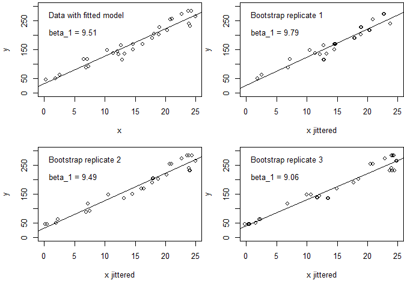
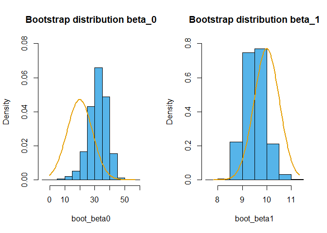
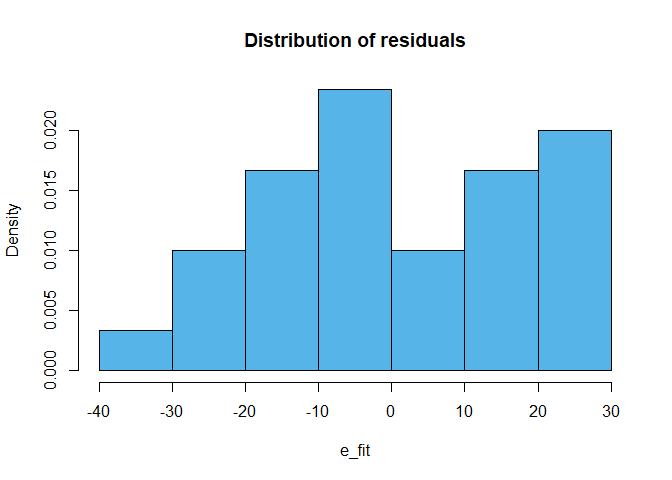
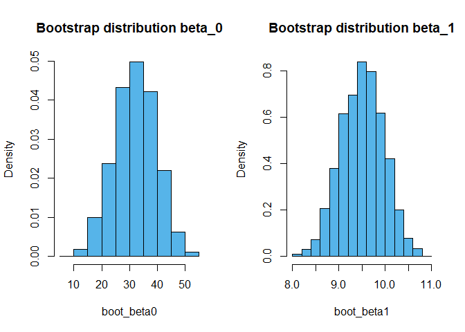
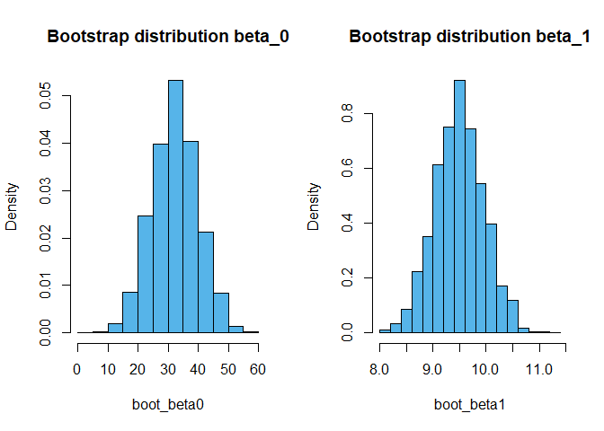
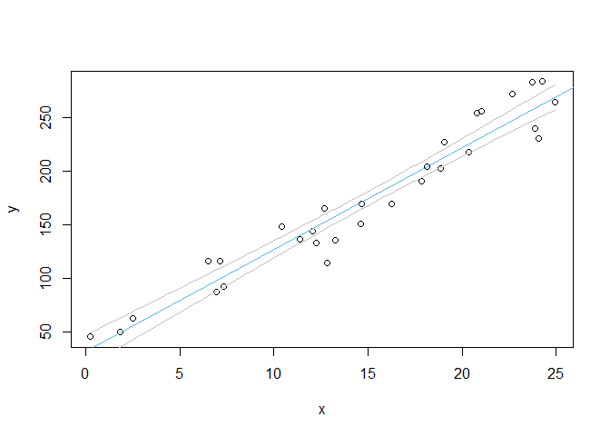

Bootstrap algorithm
================
Brett Melbourne
10 Sep 2020

## Plugging in information from the sample

So far we have seen that the sampling distribution, the distribution of
a sample statistic under repeated sampling from the population, is the
core of frequentist inference. Since we don’t have direct access to the
true sampling distribution, we’ve also seen that the plug in principle
is commonly used, whereby properties of the single sample are used to
stand in for unknown properties of the sampling distribution. In the
linear model case, the plug in quantity was the residual standard error,
$\hat{\sigma}_e$ (the standard error of the deviations after the best
fit model was found). The bootstrap is a more direct approach to the
plug in principle.

Recall the sampling distribution algorithm for the parameters
(y-intercept or slope) of the simple linear model:

    repeat very many times
        sample data from the population
        fit the linear model
        estimate the parameters
    plot sampling distribution (histogram) of the parameter estimates

At the first step, “sample data from the population”, there is an
unknown distribution of the population. The bootstrap does the plug in
here.

## Non-parametric bootstrap

There are several ways of plugging in a distribution for the population
at the “sample data from the population” step. The first way is to use
the data from the sample. This is called the non-parametric bootstrap.
For our simple linear model, the non-parametric bootstrap algorithm is:

    repeat very many times
        resample data (with replacement) from the single sample
        fit the linear model
        estimate the parameters
    plot sampling distribution (histogram) of the parameter estimates

First we’ll generate some fake data for illustration. We’ll use the same
data as before. Recall that what we are doing here is drawing one sample
dataset from the “true” population with known parameters.

``` r
set.seed(4.6) #make example reproducible
n <- 30  #size of dataset
b0 <- 20 #true y intercept
b1 <- 10 #true slope
s <- 20  #true standard deviation of the errors
x <- runif(n, min=0, max=25) #nb while we have used runif, x is not a random variable
y <- b0 + b1 * x + rnorm(n, sd=s) #random sample of y from the population
df <- data.frame(x, y)
```

Here is the model fitted to these data and the first three bootstrap
replicates:

``` r
par(mfrow=c(2,2), mar=c(5,4,0.3,0))

# Plot the data with fitted model
ylim <- c(0,300)
xlim <- c(0,25)
with(df, plot(x, y, xlim=xlim, ylim=ylim))
fit <- lm(y ~ x, data=df)
abline(fit)
text(0, 0.9*300, "Data with fitted model", pos=4)
beta1_lab <- paste( "beta_1 =", round(coef(fit)[2], 2) )
text(0, 0.7*300, beta1_lab, pos=4)

# The first 3 bootstrap replicates
for ( i in 1:3 ) {
    # Resample data in y,x pairs from the sample with replacement
    df_boot <- df[sample(1:n, replace=TRUE),] #sample y,x pairs
    # Fit the linear model
    fit_boot <- lm(y ~ x, data=df_boot)
    # Get the parameter estimate
    beta1_lab <- paste("beta_1 =", round(coef(fit_boot)[2], 2))
    # Plot this single bootstrap replicate
    with(df_boot, plot(jitter(x, 10), y, xlim=xlim, ylim=ylim, xlab="x jittered"))
    abline(fit_boot)
    text(0, 0.9*300, paste("Bootstrap replicate", i), pos=4)
    text(0, 0.7*300, beta1_lab, pos=4)
}
```

<!-- -->

You can see that because we’ve resampled datasets from the original data
with replacement, the new datasets don’t have all the (x,y) pairs from
the original dataset and instead have some repeated (x,y) pairs
(revealed by the jittering on the x axis). This may seem odd but the
idea is that we’re using information in the data to gain information
about the sampling distribution. The bootstrapped fits of the linear
models give us new estimates of the slope, $\beta_1$. And now here is
the full bootstrapped sampling distribution for $\beta_0$ and $\beta_1$,
and we’ll compare it to the true sampling distribution for this
population:

``` r
reps <- 2000
boot_beta0 <- rep(NA, reps)
boot_beta1 <- rep(NA, reps)
for ( i in 1:reps ) {
    # Resample data in y,x pairs from the sample with replacement
    df_boot <- df[sample(1:n, replace=TRUE),] #sample y,x pairs
    # Fit the linear model
    fit_boot <- lm(y ~ x, data=df_boot)
    # Keep the parameter estimates
    boot_beta0[i] <- coef(fit_boot)[1]
    boot_beta1[i] <- coef(fit_boot)[2]
}
par(mfrow=c(1,2))

# Bootstrap distribution for beta_0
hist(boot_beta0, freq=FALSE, ylim=c(0, 0.08), col="#56B4E9",
     main="Bootstrap distribution beta_0")

# Theoretical "true" sampling distribution for beta_0
varpx <- mean((x-mean(x)) ^ 2) #population variance of x
k0 <- sqrt( 1 + mean(x)^2 / varpx )
s0 <- k0 * s / sqrt(n)
yy <- seq(min(boot_beta0), max(boot_beta0), length.out=100)
lines(yy, dnorm(yy, mean=b0, sd=s0), lwd=2, col="#E69F00")

# Bootstrap distribution for beta_1
hist(boot_beta1, freq=FALSE, ylim=c(0,0.8), col="#56B4E9",
     main="Bootstrap distribution beta_1")

# Theoretical "true" sampling distribution for beta_1
k1 <- 1 / sqrt(varpx)
s1 <- k1 * s / sqrt(n)
yy <- seq(min(boot_beta1), max(boot_beta1), length.out=100)
lines(yy, dnorm(yy, mean=b1, sd=s1), lwd=2, col="#E69F00")
```

<!-- -->

We see that the bootstrap distributions (histograms) are not the same as
the true sampling distributions (orange curve). But of course we expect
that. The data are one realization, a **sample**, from the population
with true values of $\beta_0$ = 20 and $\beta_1$ = 10. Since we’re using
the sample data, our bootstrap distribution is going to reflect the
properties of the sample. In particular, we expect the means of the
bootstrap distribution to be at the estimated values of the one sample
that is our data. However, we see that despite the offset, the bootstrap
distributions are shaped roughly like the true sampling distributions.
We can see this more obviously if we compare the standard deviations of
the bootstrap distributions to the standard error of the classical
estimate from the linear regression:

``` r
sd(boot_beta0)
```

    ## [1] 6.350912

``` r
sd(boot_beta1)
```

    ## [1] 0.4361676

``` r
summary(fit)$coefficients
```

    ##              Estimate Std. Error   t value     Pr(>|t|)
    ## (Intercept) 32.096061   7.690906  4.173248 2.636342e-04
    ## x            9.511143   0.470481 20.215786 3.060848e-18

Now we see that the bootstrap estimates of the standard error for the
two parameters are very similar. To recap, what we’ve done is attempt to
recreate the sampling distribution by using the data in the sample as a
plug in for the population distribution of (x,y) and we see that this
non-parameteric bootstrap quite accurately recovers the standard error.
The non-parametric bootstrap is a simple algorithm that can be applied
quite widely to a range of problems.

## Empirical bootstrap

Now, let’s look at a slightly more sophisticated version. Recall that
the linear model is:

$$ y_i = \beta_0 + \beta_1x_i + e_i$$

and that one way of thinking about this model in terms of the sampling
distribution is that the imagined population that we repeatedly sample
from is some true **population of errors**, $e$. The empirical bootstrap
uses this idea directly using the following algorithm:

    repeat very many times
        resample the errors (with replacement) from the single sample
        create new y-values from the estimated parameters and resampled errors
        fit the linear model
        estimate the parameters
    plot sampling distribution (histogram) of the parameter estimates

So what we’re going to do here is draw from the following distribution
of errors from our model fit:

``` r
e_fit <- fit$residuals
hist(e_fit, freq=FALSE, col="#56B4E9", main="Distribution of residuals")
```

<!-- -->

One noticable thing here is that the distribution of these residuals,
the $e_i\mathrm{s}$ from our one sample, are not particularly Normal
looking, even though we know that they were in fact drawn from a Normal
distribution (our simulated truth). A feature of the empirical bootstrap
is that we are not going to make an assumption about the distribution
from which the errors were actually drawn but instead use the
information in the sample to tell us about it.

Here is the R implementation for the empirical boostrap algorithm:

``` r
reps <- 2000
boot_beta0 <- rep(NA, reps)
boot_beta1 <- rep(NA, reps)
df_boot <- df
for ( i in 1:reps ) {
    # Resample errors from the model fit with replacement
    e_boot <- sample(e_fit, replace=TRUE)
    # Create new y-values at the original x values
    df_boot$y <- coef(fit)[1] + coef(fit)[2] * df_boot$x + e_boot
    # Fit the linear model
    fit_boot <- lm(y ~ x, data=df_boot)
    # Keep the parameter estimates
    boot_beta0[i] <- coef(fit_boot)[1]
    boot_beta1[i] <- coef(fit_boot)[2]
}
par(mfrow=c(1,2))

# Bootstrap distribution for beta_0
hist(boot_beta0, freq=FALSE, col="#56B4E9", main="Bootstrap distribution beta_0")

# Bootstrap distribution for beta_1
hist(boot_beta1, freq=FALSE, col="#56B4E9", main="Bootstrap distribution beta_1")
```

<!-- -->

Compared to the non-parametric bootstrap, we see that these bootstrap
distributions are much more Normal looking. Once again, this is a
consequence of the central limit theorem. Comparing now the standard
deviations of these bootstrap distributions to the standard error of the
classical estimate from the linear regression, we see good concordance:

``` r
sd(boot_beta0)
```

    ## [1] 7.515995

``` r
sd(boot_beta1)
```

    ## [1] 0.4603036

``` r
summary(fit)$coefficients
```

    ##              Estimate Std. Error   t value     Pr(>|t|)
    ## (Intercept) 32.096061   7.690906  4.173248 2.636342e-04
    ## x            9.511143   0.470481 20.215786 3.060848e-18

The empirical bootstrap is useful in a wide range of situations where we
have a distribution of residuals and we are less sure about the
underlying distribution.

## Parametric bootstrap

The final version of the bootstrap is the parametric bootstrap. For this
version, we make some additional assumptions. Assumptions are not bad.
They are merely modeling devices. All models are wrong but some are
useful, as the famous saying goes. In other words, compared to the
previous versions of the bootstrap, we are doing some additional
modeling here. It turns out that this version is particularly useful
because we can apply it to essentially any fitted parametric model.
Crucially, we often need to call on this approach in more complex
models, such as mixed effect models, where analytical approaches for the
uncertainty are simply not available for some model estimates.

Here is the algorithm for the parametric bootstrap:

    repeat very many times
        sample from the error distribution
        create new y-values from the estimated parameters and errors
        fit the linear model
        estimate the parameters
    plot sampling distribution (histogram) of the parameter estimates

Steps 1 and 2 within the repetition structure essentially say: “generate
data from the fitted model”, where the fitted model embodies all the
model assumptions. Our model assumption is that the $e_i$s are drawn
from a Normal distribution, so our model is as follows:

$y_i = \beta_0 + \beta_1 x_i + e_i$  
$e_i \sim \mathrm{Normal}(0,\sigma)$

Now, we don’t know $\sigma$, so we’ll plug in the residual standard
error from the model fit as an estimate. Here is the algorithm in R:

``` r
reps <- 2000
boot_beta0 <- rep(NA, reps)
boot_beta1 <- rep(NA, reps)
df_boot <- df #data frame

# Estimate for sigma = sqrt(Var(e)), where the denominator for Var(e) is the
# residual degrees of freedom, n - 2 in the simple linear model because we
# estimate two parameters.
var_e_hat <- sum(fit$residuals ^ 2) / fit$df.residual
sigma_hat <- sqrt(var_e_hat)

# Bootstrap realizations
for ( i in 1:reps ) {
    # Sample errors from the Normal distribution
    e_boot <- rnorm(n, 0, sigma_hat)
    # Create new y-values at the original x values
    df_boot$y <- coef(fit)[1] + coef(fit)[2] * df_boot$x + e_boot
    # Fit the linear model
    fit_boot <- lm(y ~ x, data=df_boot)
    # Keep the parameter estimates
    boot_beta0[i] <- coef(fit_boot)[1]
    boot_beta1[i] <- coef(fit_boot)[2]
}
par(mfrow=c(1,2))

# Bootstrap distribution for beta_0
hist(boot_beta0, freq=FALSE, col="#56B4E9", main="Bootstrap distribution beta_0")

# Bootstrap distribution for beta_1
hist(boot_beta1, freq=FALSE, col="#56B4E9", main="Bootstrap distribution beta_1")
```

<!-- -->

Again, we see good concordance with the classical estimates for the
standard error:

``` r
sd(boot_beta0)
```

    ## [1] 7.622419

``` r
sd(boot_beta1)
```

    ## [1] 0.4670221

``` r
summary(fit)$coefficients
```

    ##              Estimate Std. Error   t value     Pr(>|t|)
    ## (Intercept) 32.096061   7.690906  4.173248 2.636342e-04
    ## x            9.511143   0.470481 20.215786 3.060848e-18

## Bootstrapped confidence intervals

We can construct confidence intervals for the parameters from roughly
twice the bootstrap standard error, or more directly from the 95%
central interval of the bootstrap samples (called the percentile
method):

``` r
# Rough 95% confidence interval for beta_0
c(coef(fit)[1] - 2*sd(boot_beta0), coef(fit)[1] + 2*sd(boot_beta0))
```

    ## (Intercept) (Intercept) 
    ##    16.85122    47.34090

``` r
# Rough 95% confidence interval for beta_1
c(coef(fit)[2] - 2*sd(boot_beta1), coef(fit)[2] + 2*sd(boot_beta1))
```

    ##         x         x 
    ##  8.577099 10.445187

``` r
# Bootstrap percentile method for beta_0
quantile(boot_beta0, probs=c(0.025,0.975))
```

    ##     2.5%    97.5% 
    ## 16.90788 47.15391

``` r
# Bootstrap percentile method for beta_1
quantile(boot_beta1, probs=c(0.025,0.975))
```

    ##      2.5%     97.5% 
    ##  8.585649 10.435112

``` r
# Compare to classical intervals
confint(fit)
```

    ##                 2.5 %   97.5 %
    ## (Intercept) 16.341954 47.85017
    ## x            8.547406 10.47488

We see that these intervals are very similar.

A very powerful use of the parametric bootstrap, is that we can use it
to calculate the uncertainty of any quantity that is an output of a
parametric model. We just have to keep the bootstrap realizations of
that quantity, which we do in the last part of the loop above where it
says “Keep the parameter estimates”. For example, in our simple linear
model, we can calculate the uncertainty of the estimated mean of y for a
particular value of x, or indeed the entire range of x, as in a
confidence band. Here we calculate 95% confidence intervals for y as a
function of x.

``` r
reps <- 2000
boot_beta0 <- rep(NA, reps)
boot_beta1 <- rep(NA, reps)
df_boot <- df #data frame
xx <- seq(min(df$x), max(df$x), length.out=100)
y_hat <- matrix(NA, nrow=reps, ncol=length(xx))

# Estimate for sigma = sqrt(Var(e)), where the denominator for Var(e) is the
# residual degrees of freedom, n - 2 in the simple linear model because we
# estimate two parameters.
var_e_hat <- sum(fit$residuals ^ 2) / fit$df.residual
sigma_hat <- sqrt(var_e_hat)

# Bootstrap realizations
for ( i in 1:reps ) {
    # Sample errors from the Normal distribution
    e_boot <- rnorm(n, 0, sigma_hat)
    # Create new y-values at the original x values
    df_boot$y <- coef(fit)[1] + coef(fit)[2] * df_boot$x + e_boot
    # Fit the linear model
    fit_boot <- lm(y ~ x, data=df_boot)
    # Keep the y estimates for a range of x
    y_hat[i,] <- coef(fit_boot)[1] + coef(fit_boot)[2] * xx
}

# Calculate percentiles for y estimates
ci_upper <- rep(NA, length(xx))
ci_lower <- rep(NA, length(xx))
for ( j in 1:length(xx) ) {
    ci_upper[j] <- quantile(y_hat[,j], prob=0.975)
    ci_lower[j] <- quantile(y_hat[,j], prob=0.025)
}

# Plot model fit with bootstrapped 95% confidence intervals
with(df, plot(x, y))
abline(fit, col="#56B4E9")
lines(xx, ci_upper, col="grey")
lines(xx, ci_lower, col="grey")
```

<!-- -->

## Summary

We’ve seen how the bootstrap is a computational way to obtain all the
inferences in a frequentist analysis based on the fundamental concept of
the sampling distribution. The bootstrap can be used in many places
where analytical inferences cannot be drawn. The different versions of
the bootstrap use different plug-ins for the sampling distribution:

- non-parametric bootstrap: resample the data with replacement
- empirical bootstrap: resample the errors with replacement
- parametric bootstrap: sample from the parametric distribution
