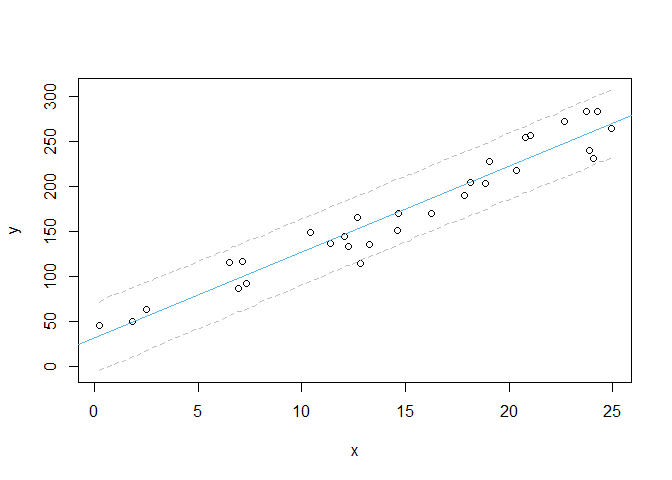

Algorithm for bootstrapped prediction intervals
================
Brett Melbourne
25 Sep 2024

## Accounting for both parameter uncertainty and data generating process

So far we’ve seen bootstrapped confidence intervals for the mean of y\|x
(aka the line), which are based on the sampling distribution for y\|x.
The sampling distribution is measuring the uncertainty in y that is due
to parameter uncertainty. When our goal is to predict the likely value
of a new observation of y, we also need to account for the data
generating process. The bootstrap algorithm can do this in a very
general way that can be applied to any model. We take the basic
bootstrap we used for confidence intervals (estimating the parameter
uncertainty) but now add the data generating process (DGP) to simulate
new values of y at each iteration. In this way, we build a distribution
for y that accounts for both parameter uncertainty and uncertainty due
to the data generating process.

## Preliminaries

First we’ll generate some fake data for illustration, using the same
data as before.

``` r
set.seed(4.6) #make example reproducible
n <- 30  #size of dataset
b0 <- 20 #true y intercept
b1 <- 10 #true slope
s <- 20  #true standard deviation of the errors
x <- runif(n, min=0, max=25) #nb while we have used runif, x is not a random variable
y <- b0 + b1 * x + rnorm(n, sd=s) #random sample of y from the population
df <- data.frame(x, y)
```

And then we’ll fit the model

``` r
fit <- lm(y ~ x, data=df)
```

## Parametric bootstrapped prediction interval

Here is the algorithm:

    define a grid of new x values to predict y
    repeat very many times
        sample from the error distribution of DGP
        simulate new y-values from the original estimated parameters of model
        fit the model (estimate the parameters)
        keep: simulate new data y|x using estimated parameters
    calculate quantiles of the generated data distributions
    plot quantiles

``` r
reps <- 10000 #increase this for smoother PI curves
boot_beta0 <- rep(NA, reps)
boot_beta1 <- rep(NA, reps)
df_boot <- df #data frame

# Estimate for sigma_e = sqrt(Var(e)), where the denominator for Var(e) is the
# residual degrees of freedom, n - 2 in the simple linear model because we
# estimate two parameters.
var_e_hat <- sum(fit$residuals ^ 2) / fit$df.residual
sigma_e_hat <- sqrt(var_e_hat)

# Set up grid of x values for simulated y's, and storage for new y's
xx <- seq(min(df$x), max(df$x), length.out=100)
y_sim <- matrix(NA, nrow=reps, ncol=length(xx))

# Bootstrap realizations
for ( i in 1:reps ) {
    
    # Sample errors from the Normal distribution
    e_boot <- rnorm(n, 0, sigma_e_hat)
    
    # Create new y-values at the original x values
    df_boot$y <- coef(fit)[1] + coef(fit)[2] * df_boot$x + e_boot
    
    # Fit the linear model
    fit_boot <- lm(y ~ x, data=df_boot)
    
    #Generate data from the fitted model, one point per x value
    var_e_hat <- sum(fit_boot$residuals ^ 2) / fit_boot$df.residual
    boot_sigma_e_hat <- sqrt(var_e_hat)
    e_sim <- rnorm(length(xx), 0, boot_sigma_e_hat)
    y_sim[i,] <- coef(fit_boot)[1] + coef(fit_boot)[2] * xx + e_sim
}

# Calculate percentiles for generated y data
pi_upper <- rep(NA, length(xx))
pi_lower <- rep(NA, length(xx))
for ( j in 1:length(xx) ) {
    pi_upper[j] <- quantile(y_sim[,j], prob=0.975)
    pi_lower[j] <- quantile(y_sim[,j], prob=0.025)
}

# Plot model fit with bootstrapped 95% prediction intervals
yupr <- max(pi_upper)
ylwr <- min(pi_lower)
with(df, plot(x, y, ylim=c(ylwr,yupr)))
abline(fit, col="#56B4E9")
lines(xx, pi_upper, col="grey", lty=2)
lines(xx, pi_lower, col="grey", lty=2)
```

<!-- -->

## Summary

…
