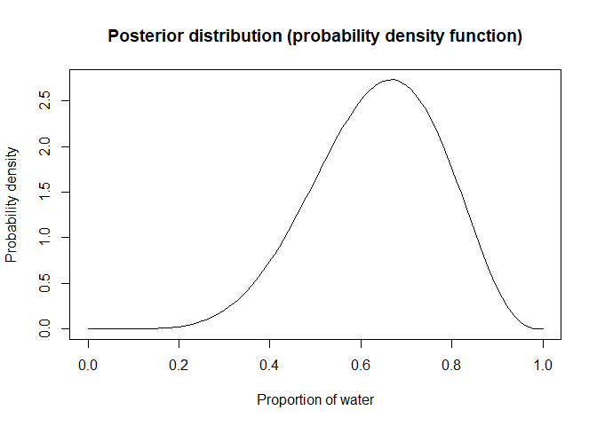
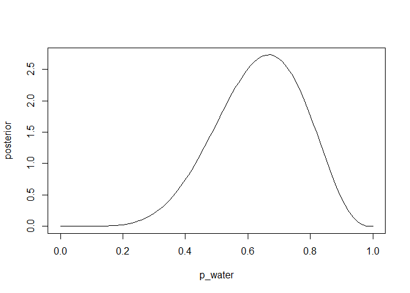

Grid approximation of posterior distribution
================
Brett Melbourne
3 Oct 2022 (revised 9 Oct 2024)

Example from McElreath 2016 p 40

Algorithm

    load data
    define grid of parameter values with resolution r
    for each parameter value
        unstandardized posterior = prior * likelihood
    total probability = sum(unstandardized posteriors) * r
    for each parameter value
        posterior Pr density = unstandardized posterior / total probability
    plot posterior Pr density vs parameter values

Translated to R as a structured program

``` r
# load data (6 water hits out of 9 tosses)
water <- data.frame(hits=6, ntosses=9)

# define grid of parameter values (proportion water) with resolution r
r <- 0.01
p_water <- seq(from=0, to=1, by=r)
n_pars <- length(p_water)

# for each parameter value calculate the unstandardized posterior
u_posterior <- rep(NA, n_pars)
for ( i in 1:n_pars ) {
    prior <- dunif(p_water[i])
    likelihood <- dbinom(water$hits, size=water$ntosses, prob=p_water[i])
    u_posterior[i] <- prior * likelihood
}

# calculate total probability
total_probability <- sum(u_posterior) * r

# for each parameter value, calculate posterior
posterior <- rep(NA, n_pars)
for ( i in 1:n_pars ) {
    posterior[i] <- u_posterior[i] / total_probability
}

# plot posterior probability vs parameter values
plot(p_water, posterior, xlab="Proportion of water", 
     ylab="Probability density", main="Posterior distribution (probability density function)", type="l")
```

<!-- -->

Translated to R as vectorized code

``` r
# load data (6 water hits out of 9 tosses)
water <- data.frame(hits=6, ntosses=9)

# define grid of parameter values (proportion water) with resolution r
r <- 0.01
p_water <- seq(from=0, to=1, by=r)
n_pars <- length(p_water)

# calculate prior at each parameter value
prior <- dunif(p_water)

# calculate likelihood at each parameter value
likelihood <- dbinom(water$hits, size=water$ntosses, prob=p_water)

# calculate unstandardized posterior at each parameter value
u_posterior <- likelihood * prior

# calculate total probability
total_probability <- sum(u_posterior) * r

# calculate posterior at each parameter value
posterior <- u_posterior / total_probability

# plot posterior probability vs parameter values
plot(p_water, posterior, xlab="Proportion of water", 
     ylab="Probability density", main="Posterior distribution (probability density function)", type="l")
```

<!-- -->

A minimalist vectorized version

``` r
water <- data.frame(hits=6, ntosses=9)
r <- 0.01
p_water <- seq(0, 1, by=r)
prior <- dunif(p_water)
likelihood <- dbinom(water$hits, water$ntosses, p_water)
posterior <- prior * likelihood / sum(prior * likelihood * r)
plot(p_water, posterior, type="l") 
```

<!-- -->

Data recording individual events is equivalent with some minor
modifications. Our data for individual events would be

``` r
water <- data.frame(hits=c(1,0,1,1,1,0,1,0,1))
water
```

    ##   hits
    ## 1    1
    ## 2    0
    ## 3    1
    ## 4    1
    ## 5    1
    ## 6    0
    ## 7    1
    ## 8    0
    ## 9    1

For one parameter value (e.g. p_water=0.2), the likelihood for each of
these datapoints is

``` r
dbinom(water$hits, size=1, 0.2)
```

    ## [1] 0.2 0.8 0.2 0.2 0.2 0.8 0.2 0.8 0.2

We need a repetition structure now because `dbinom()` does not return
the full set of calculations for a vector of data crossed with a vector
of parameters. We need to consider the dataset one parameter at a time.

``` r
r <- 0.01
p_water <- seq(0, 1, by=r)
n_pars <- length(p_water)
prior <- dunif(p_water)
likelihood <- rep(NA, n_pars)
for ( i in 1:n_pars ) {
    likelihood[i] <- exp(sum(dbinom(water$hits, size=1, p_water[i], log=TRUE)))
}
posterior <- prior * likelihood / sum(prior * likelihood * r)
plot(p_water, posterior, type="l")
```

<!-- -->
