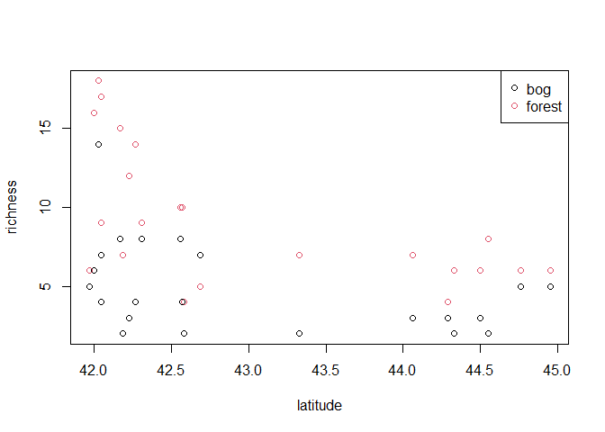
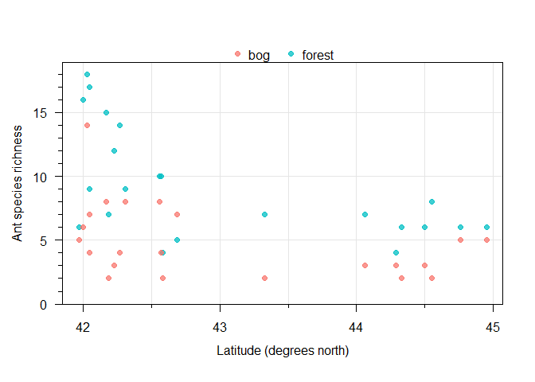

Visualization with the ants data
================
Brett Melbourne
2024-10-29

``` r
library(ggplot2)
library(scales) #for ggplot color palette in function hue_pal
```

Read in the data:

``` r
ant <- read.csv("data/ants.csv")
ant$habitat <- factor(ant$habitat)
```

In the style of base plot.default

``` r
plot(ant$latitude, ant$richness, col=ant$habitat)
legend("topright", levels(ant$habitat), pch=1, col=1:2)
```

<!-- -->

In the style of base plot.formula

``` r
plot(richness ~ latitude, col=habitat, data=ant)
legend("topright", levels(ant$habitat), pch=1, col=1:2)
```

<!-- -->

Using with() to specify the dataframe

``` r
with(ant, plot(latitude, richness, col=habitat))
with(ant, legend("topright", levels(habitat), pch=1, col=1:2))
```

<!-- -->

Or, for multiline plotting code

``` r
with(ant,
{
    plot(latitude, richness, col=habitat)
    legend("topright", levels(habitat), pch=1, col=1:2)
}
)
```

<!-- -->

Red-blue provides more consistent separation

``` r
show_col(palette.colors(palette="R4"))
```

<!-- -->

``` r
rd_bl <- palette.colors(palette="R4")[c(2,4)]
plot(ant$latitude, ant$richness, col=rd_bl[ant$habitat])
legend("topright", levels(ant$habitat), pch=1, col=rd_bl)
```

<!-- -->

The Okabe-Ito palette is colorblind friendly

``` r
show_col(palette.colors(palette="Okabe-Ito"))
```

<!-- -->

``` r
cb_pal <- palette.colors(palette="Okabe-Ito")[c(7,3)]
plot(ant$latitude, ant$richness, col=cb_pal[ant$habitat])
legend("topright", levels(ant$habitat), pch=1, col=cb_pal)
```

<!-- -->

ggplot default color palette

``` r
ggc <- pal_hue(h=c(0,360)+15, c=100, l=65, h.start=0, direction=1)
show_col(ggc(2))
```

<!-- -->

``` r
show_col(ggc(6))
```

<!-- -->

Base plot with ggplot colors

``` r
plot(ant$latitude, ant$richness, col=ggc(2)[ant$habitat])
legend("topright", levels(ant$habitat), pch=1, col=ggc(2))
```

<!-- -->

Nicer position for the legend (outside data panel)

``` r
plot(ant$latitude, ant$richness, col=ggc(2)[ant$habitat])
legend("top", levels(ant$habitat), pch=1, col=ggc(2),
       bty="n", horiz=TRUE, inset=-0.1, xpd=NA)
```

<!-- -->

Add a grid

``` r
plot(ant$latitude, ant$richness, col=ggc(2)[ant$habitat],
     panel.first=grid(col="gray90", lty=1, lwd=0.5))
legend("top", levels(ant$habitat), pch=1, col=ggc(2),
       bty="n", horiz=TRUE, inset=-0.1, xpd=NA)
```

<!-- -->

Base plot with simple grammar of graphics logic

``` r
with( ant,
{
    # Set up coordinate system with default x and y scales for the data
    plot(latitude, richness, type="n",
         panel.first=grid(col="gray90", lty=1, lwd=0.5))
    
    # Add geom point layer with channel (aesthetic) mappings
    points(x=latitude, y=richness, col=ggc(2)[habitat])
    
    # Add legend
    legend("top", levels(habitat), pch=1, col=ggc(2), bty="n", 
           horiz=TRUE, inset=-0.1, xpd=NA)
}
)
```

<!-- -->

Base plot with expanded grammar of graphics logic. These details were
chosen to make the data clearer:

- minor tick marks to highlight the discrete data
- filled circles for greater visibility
- points with partial transparency to alleviate overlap
- y axis includes and starts at exactly zero to judge relative species
  richness
- more informative axis titles
- legend on top to take up less column space (more room for data) and
  reduce lookup effort

``` r
with( ant,
{
    # Set up coordinate system with explicit x and y scales for the data
    plot(latitude, richness, type="n", axes=FALSE, ann=FALSE,
         ylim=c(0, 1.05 * max(richness)), yaxs="i")
    abline(v=seq(42, 45, 0.5), col="gray90", lty=1, lwd=0.5)
    abline(h=seq(0, 15, 5), col="gray90", lty=1, lwd=0.5)
    axis(1, at=seq(42, 45, 1))
    axis(1, at=seq(42, 45, 0.5), labels=FALSE, tcl=-0.25)
    axis(2, at=seq(0, 15, 5), las=2)
    axis(2, at=seq(0, 20, 1), labels=FALSE, tcl=-0.25)
    box()
    
    # Add geom point layer with channel (aesthetic) mappings
    ggct <- adjustcolor(ggc(2), alpha.f=0.75) #transparency to help overlap
    points(x=latitude, y=richness, pch=19, col=ggct[habitat])
    
    # Add legend
    legend("top", levels(habitat), pch=19, col=ggct, bty="n", 
           horiz=TRUE, inset=-0.1, xpd=NA)
    
    # Add annotations
    mtext("Latitude (degrees north)", 1, line=2.5)
    mtext("Ant species richness", 2, line=2.5)
}
)
```

<!-- -->

Using ggplot with explicit mapping

``` r
ggplot(data=ant) + 
    geom_point(mapping=aes(x=latitude, y=richness, col=habitat))
```

<!-- -->

Adding black and white theme

``` r
ggplot(data=ant) + 
    geom_point(mapping=aes(x=latitude, y=richness, col=habitat)) +
    theme_bw()
```

<!-- -->

Minimal ggplot syntax with layer inheritance

``` r
ggplot(ant, aes(latitude, richness, col=habitat)) + 
    geom_point() +
    theme_bw()
```

<!-- -->

Faceting by habitat

``` r
ggplot(ant, aes(x=latitude, y=richness, col=habitat)) + 
    geom_point() +
    facet_wrap(vars(habitat)) +
    theme_bw()
```

<!-- -->

Controlling marks, scales, legends, annotations (same modifications as
base plot previously)

``` r
ggplot(ant, aes(x=latitude, y=richness, col=habitat)) + 
    geom_point(size=2, alpha=0.75) +
    scale_y_continuous(breaks=seq(0, 20, 5),
                       minor_breaks=seq(0, 20, 1),
                       expand=expansion(mult=c(0, 0.05))) +
    coord_cartesian(ylim=c(0, max(ant$richness))) +
    guides(x=guide_axis(minor.ticks=TRUE),
           y=guide_axis(minor.ticks=TRUE),
           color=guide_legend(nrow=1, byrow=TRUE)) +
    labs(x="Latitude (degrees north)",
         y="Ant species richness") +
    theme_bw() +
    theme(panel.grid.minor.y=element_blank(),
          axis.minor.ticks.length=rel(0.5),
          legend.position="top",
          legend.title=element_blank())
```

<!-- -->
