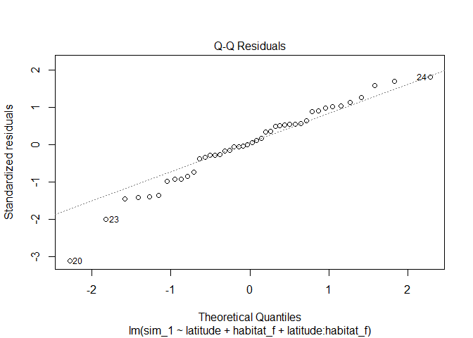
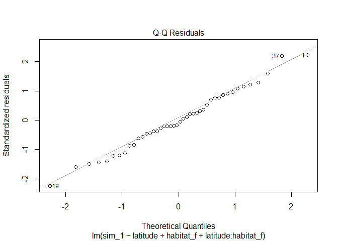
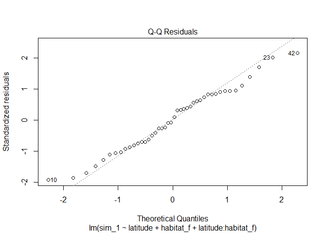

Model checking for two models of the ants data
================
Brett Melbourne
2024-10-29

Second in a series of scripts to analyze the ant data described in
Ellison (2004). This script includes basic linear models of raw and
log-transormed richness trained by both likelihood and SSQ, and model
checking approaches that can be applied to a wide variety of likelihood
models plus equivalent specialist tools provided in the base R `stats`
package for fits using `lm()`. Future scripts will consider more
alternative models for these data, using a variety of training and
inference algorithms.

``` r
library(ggplot2)
```

Read in and plot the data

``` r
ant <- read.csv("../class-materials/data/ants.csv")
ant$habitat_f <- factor(ant$habitat) #factor for base plots and lm models

ggplot(ant, aes(x=latitude, y=richness, col=habitat)) +
    geom_point() +
    ylim(0, 18)
```

<!-- -->

### Training by maximum likelihood

Model

``` r
lmod <- function(b0_b, b1_b, b0_f, b1_f, habitat, latitude) {
    richness <- ifelse(habitat == "bog",
                       b0_b + b1_b * latitude,
                       b0_f + b1_f * latitude)
    return(richness)
}
```

Negative log likelihood

``` r
# sigma (sd) enters this function on the log scale
lm_nll <- function(p, richness, habitat, latitude) {
    mu <- lmod(b0_b=p[1], b1_b=p[2], b0_f=p[3], b1_f=p[4], habitat, latitude)
    nll <- -sum(dnorm(richness, mean=mu, sd=exp(p[5]), log=TRUE))
    return(nll)
}
```

Optimize with BFGS seems to do best

``` r
#sigma will be searched on the log scale
p_start <- c(50, -1, 100, -2, log(3))
fit <- optim(p_start, lm_nll, richness=ant$richness, habitat=ant$habitat,
               latitude=ant$latitude, method="BFGS")
fit
```

    ## $par
    ## [1]  53.772544  -1.136890 109.465733  -2.331104   1.107653
    ## 
    ## $value
    ## [1] 111.17
    ## 
    ## $counts
    ## function gradient 
    ##       68       26 
    ## 
    ## $convergence
    ## [1] 0
    ## 
    ## $message
    ## NULL

Estimated linear parameters

``` r
beta_0_b <- fit$par[1]
beta_1_b <- fit$par[2]
beta_0_f <- fit$par[3]
beta_1_f <- fit$par[4]
sigma <- exp(fit$par[5]) #backtransform
```

Model predictions for a grid of latitudes

``` r
predictions <- expand.grid(
    habitat=c("bog", "forest"),
    latitude=seq(min(ant$latitude), max(ant$latitude), length.out=50)
    )
predictions$richness <- lmod(beta_0_b, beta_1_b, beta_0_f, beta_1_f,
                             predictions$habitat, predictions$latitude)
```

### Model check 1. Plot model with the data.

Does it look sensible? Any obvious issues?

``` r
ggplot(ant, aes(x=latitude, y=richness, col=habitat)) +
    geom_point() +
    geom_line(data=predictions) +
    ylim(0, 18)
```

<!-- -->

### Model check 2. Residuals vs fitted values

Fitted values are the predictions of the model for each data point

``` r
fv <- lmod(beta_0_b, beta_1_b, beta_0_f, beta_1_f, ant$habitat, ant$latitude)
r <- ant$richness - fv
sr <- r / sigma #standardized residuals

plot(fv, sr, col=ant$habitat_f, ylab="Standardized residuals",
     xlab="Fitted values", main="Residuals vs fitted")
abline(h=0, col="gray")
legend("top", levels(ant$habitat_f), pch=1, col=1:2,
       bty="n", horiz=TRUE, inset=-0.1, xpd=NA)
```

<!-- -->

### Model check 3. Scale-location plot

``` r
plot(fv, abs(sr), col=ant$habitat_f, ylab="abs(standardized residuals)", 
     xlab="Fitted values", main="Scale-location")
```

<!-- -->

### Model check 4. Residuals vs latitude

``` r
plot(ant$latitude, sr, col=ant$habitat_f, ylab="Residuals", xlab="Latitude",
     main="Residuals vs latitude")
abline(h=0, col="gray")
```

<!-- -->

### Model check 5. Histogram of residuals assessed against theoretical distribution

``` r
hist(r, xlab="Residuals", main="Histogram of residuals", freq=FALSE)
rseq <- seq(min(r), max(r), length.out=100)
lines(rseq, dnorm(rseq, mean=0, sd=sigma), col="blue")
```

<!-- -->

### Model check 6. Quantile-quantile plot

``` r
qqnorm(r)
qqline(r)
```

<!-- -->

### Model check 7. Influence of individual points

``` r
# Leave one out (LOO) influence algorithm (case deletion diagnostic)
n <- nrow(ant)
case <- 1:n
casedel <- matrix(nrow=n, ncol=6)
pnames <- c("beta_0_b", "beta_1_b", "beta_0_f", "beta_1_f", "sigma", "nll")
colnames(casedel) <- pnames
p_start <- fit$par[1:5]
for ( i in case ) {
    ant_loo <- ant[-i,]
    fitloo <- optim(p_start, lm_nll, richness=ant_loo$richness, 
                    habitat=ant_loo$habitat, latitude=ant_loo$latitude, 
                    method="BFGS")
    casedel[i,1:5] <- fitloo$par
    casedel[i,6] <- fitloo$value
    print(paste("Deleted", i, "of", n, sep=" ")) #Monitoring
}
```

Calculate likelihood displacement

``` r
LD <- 2 * ( casedel[,"nll"] - fit$val )
```

Calculate percent change in parameters

``` r
par_pc <- (casedel * NA)[,-6] 
for ( p in 1:5 ) {
    par_pc[,p] <- 100 * ( casedel[,p] - fit$par[p] ) / abs(fit$par[p])
}
```

LOO overall influence plot

``` r
plot(case, abs(LD), xlab="Case", ylab="Likelihood displacement",
     main="Influence plot")
text(25, abs(LD)[25], "25", cex=0.8, pos=4)
```

<!-- -->

LOO parameter sensitivities

``` r
op <- par(no.readonly = TRUE)
par(mfrow=c(2,3))
ylim <- c(0, max(abs(par_pc)))
for ( i in 1:5 ) {
    plot(case, abs(par_pc[,i]), col=ant$habitat_f, xlab="Case", 
         ylab=paste("abs(% change)", pnames[i]))
    abline(h=0, col="gray")
    legend("top", levels(ant$habitat_f), pch=1, col=1:2,
           bty="n", horiz=TRUE, inset=-0.15, xpd=NA)
    text(25, abs(par_pc[25,i]), "25", cex=0.8, pos=4)
}
mtext("Percent change in parameter without case i", 3, -2.5, outer=TRUE)
par(op)
```

<!-- -->

Identify influential case 25

``` r
ggplot(ant, aes(x=latitude, y=richness, col=habitat)) +
    geom_point() +
    geom_text(data=ant[25,], label="25", col="black") +
    ylim(0, 18)
```

<!-- -->

### Built in tools

Of course many of these plots are very easy to make with built in tools
for models that can be trained via `lm`

``` r
fit_lm <- lm(richness ~ latitude + habitat_f + latitude:habitat_f, data=ant)
plot(fit_lm, 1)
```

<!-- -->

``` r
plot(fit_lm, 2)
```

<!-- -->

``` r
plot(fit_lm, 3)
```

<!-- -->

``` r
plot(fit_lm, 4)
```

<!-- -->

### Log(richness) model

Let’s consider the alternative model with a log(richness)
transformation, this time with `lm` tools for brevity

``` r
fit_lm_log <- lm(log(richness) ~ latitude + habitat_f + latitude:habitat_f, data=ant)
predictions$habitat_f <- factor(predictions$habitat)
predictions$log_richness <- predict(fit_lm_log, newdata=predictions)
predictions$richness_bt <- exp(predictions$log_richness)
```

Plot model with the data, both on log and natural scales

``` r
ggplot(NULL, aes(col=habitat)) +
    geom_point(data=ant,         aes(x=latitude, y=log(richness))) +
    geom_line( data=predictions, aes(x=latitude, y=log_richness)) 
```

<!-- -->

``` r
ggplot(NULL, aes(col=habitat)) +
    geom_point(data=ant,         aes(x=latitude, y=richness)) +
    geom_line( data=predictions, aes(x=latitude, y=richness_bt)) +
    ylim(0, 18)
```

<!-- -->

In the other model checks below, we see that residuals are better
behaved and the problem with case 25 is reduced.

Residuals vs fitted

``` r
plot(fit_lm_log, 1)
```

<!-- -->

Scale-location plot

``` r
plot(fit_lm_log, 3)
```

<!-- -->

Residuals vs latitude

``` r
r <- fit_lm_log$residuals
plot(ant$latitude, r, col=ant$habitat_f, ylab="Residuals", xlab="Latitude",
     main="Residuals vs latitude")
abline(h=0, col="gray")
```

<!-- -->

QQ plot

``` r
plot(fit_lm_log, 2)
```

<!-- -->

Histogram of residuals

``` r
hist(r, xlab="Residuals", main="Histogram of residuals", freq=FALSE)
rseq <- seq(min(r), max(r), length.out=100)
lines(rseq, dnorm(rseq, mean=0, sd=sd(r)), col="blue")
```

<!-- -->

LOO influence (for normal linear models, this is “Cook’s distance”)

``` r
plot(fit_lm_log, 4)
```

<!-- -->

### How do we know what to expect?

We can simulate a bunch of datasets from the model, fit new models and
check their diagnostics. The following plots would thus all be
consistent with the assumptions of the data generating process.

``` r
op <- par(no.readonly = TRUE)
for ( i in 1:20 ) {
    simdat <- cbind(ant, simulate(fit_lm_log))
    simfit <- lm(sim_1 ~ latitude + habitat_f + latitude:habitat_f, data=simdat)
    plot(simfit, 2) #change number 1:5
    # Uncomment below for histogram of residuals
    # r <- simfit$residuals
    # hist(r, xlab="Residuals", main="Histogram of residuals", freq=FALSE)
    # rseq <- seq(min(r), max(r), length.out=100)
    # lines(rseq, dnorm(rseq, mean=0, sd=sd(r)), col="blue")
}
```

<!-- --><!-- --><!-- --><!-- --><!-- --><!-- --><!-- --><!-- --><!-- --><!-- --><!-- --><!-- --><!-- --><!-- --><!-- --><!-- --><!-- --><!-- --><!-- --><!-- -->

``` r
par(op)
```
