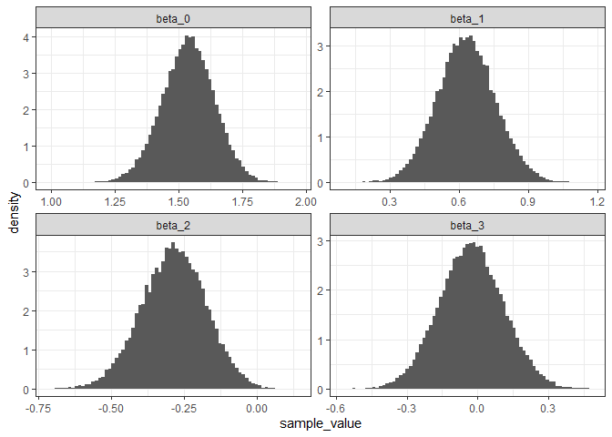

Ant data Generalized Linear Model - Bayesian
================
Brett Melbourne
5 Nov 2024

Third in a series of scripts to analyze the ant data described in
Ellison (2004). This script includes specifying a Bayesian GLM with
Poisson distribution and log link, training by HMC, and calculating
uncertainties for derived quantities to answer our three scientific
questions. Here we code the model explicitly with the function `ulam()`
from McElreath’s `rethinking` package and code posterior samples for
derived quantities directly from the samples of parameters. Future
scripts will consider frequentist and likelihood GLMs with the `stats`
and `lme4` packages, and easy Bayesian fitting of GLMs with the
`rstanarm` package, and multilevel models to fully account for the
design structure.

This Rmarkdown script can be rendered to a reproducible report
(Ctrl+Shift+K in RStudio).

``` r
library(ggplot2)
library(dplyr)
library(tidyr)
library(rethinking)
theme_set(theme_bw())
```

Read in and plot the data

``` r
ant <- read.csv("data/ants.csv")
ant$habitat <- factor(ant$habitat)
ant |> 
    ggplot(aes(x=latitude, y=richness, col=habitat)) +
    geom_point()
```

<!-- -->

## Model

For the linear predictor, we’ll write the model out explicitly, with the
data organized into single-column variables that express a
linear-additive model design matrix, as in the class slides.

$$
\begin{align}
  y_i &\sim \mathrm{Poisson}(\mu_i) \\
  log(\mu) &= \beta_0 \mathrm{intercept}_i + 
              \beta_1 \mathrm{forest}_i + 
              \beta_2 \mathrm{latitude}_i + 
              \beta_3 \mathrm{forest}_i \mathrm{latitude}_i \\
  \beta_0 &\sim \mathrm{Normal}(1, 10) \\
  \beta_1 &\sim \mathrm{Normal}(0, 10) \\
  \beta_2 &\sim \mathrm{Normal}(0, 10) \\
  \beta_3 &\sim \mathrm{Normal}(0, 10)
\end{align}
$$

I’ve chosen priors with very little information, not so much “weakly
informative” but not totally flat either. For $\beta_0$, I’ve centered
the prior at 1. The linear predictor is on the log scale, so 1
corresponds to $e^1 = 2.7$ for bog species richness, which is closer to
the mean richness of the data than $e^0 = 1$ and is more sensibly shaped
than a prior with a lot of probability mass near a species richness of
0.

## Training

Bayesian fit with `ulam`, spelling out the model. We first need new
columns to represent the design matrix. We’ll also scale by latitude
(center and divide by sd) to improve efficiency of the training
algorithm.

``` r
# Set up variables
mean_lat <- mean(ant$latitude)
sd_lat <- sd(ant$latitude)
d <- ant |>
    mutate(intercept = rep(1, n()),
           forest = ifelse(habitat == "forest", 1, 0),
           latitude = (latitude - mean_lat) / sd_lat,
           forest_X_latitude = forest * latitude) |>
    select(richness, intercept, forest, latitude, forest_X_latitude)
d
```

    ##    richness intercept forest   latitude forest_X_latitude
    ## 1         6         1      1 -0.9813353        -0.9813353
    ## 2        16         1      1 -0.9532972        -0.9532972
    ## 3        18         1      1 -0.9252590        -0.9252590
    ## 4        17         1      1 -0.9065669        -0.9065669
    ## 5         9         1      1 -0.9065669        -0.9065669
    ## 6        15         1      1 -0.7944143        -0.7944143
    ## 7         7         1      1 -0.7757222        -0.7757222
    ## 8        12         1      1 -0.7383380        -0.7383380
    ## 9        14         1      1 -0.7009538        -0.7009538
    ## 10        9         1      1 -0.6635696        -0.6635696
    ## 11       10         1      1 -0.4299183        -0.4299183
    ## 12       10         1      1 -0.4205723        -0.4205723
    ## 13        4         1      1 -0.4112262        -0.4112262
    ## 14        5         1      1 -0.3084197        -0.3084197
    ## 15        7         1      1  0.2897276         0.2897276
    ## 16        7         1      1  0.9719893         0.9719893
    ## 17        4         1      1  1.1869484         1.1869484
    ## 18        6         1      1  1.2243326         1.2243326
    ## 19        6         1      1  1.3832155         1.3832155
    ## 20        8         1      1  1.4299458         1.4299458
    ## 21        6         1      1  1.6262128         1.6262128
    ## 22        6         1      1  1.8037878         1.8037878
    ## 23        5         1      0 -0.9813353         0.0000000
    ## 24        6         1      0 -0.9532972         0.0000000
    ## 25       14         1      0 -0.9252590         0.0000000
    ## 26        7         1      0 -0.9065669         0.0000000
    ## 27        4         1      0 -0.9065669         0.0000000
    ## 28        8         1      0 -0.7944143         0.0000000
    ## 29        2         1      0 -0.7757222         0.0000000
    ## 30        3         1      0 -0.7383380         0.0000000
    ## 31        4         1      0 -0.7009538         0.0000000
    ## 32        8         1      0 -0.6635696         0.0000000
    ## 33        8         1      0 -0.4299183         0.0000000
    ## 34        4         1      0 -0.4205723         0.0000000
    ## 35        2         1      0 -0.4112262         0.0000000
    ## 36        7         1      0 -0.3084197         0.0000000
    ## 37        2         1      0  0.2897276         0.0000000
    ## 38        3         1      0  0.9719893         0.0000000
    ## 39        3         1      0  1.1869484         0.0000000
    ## 40        2         1      0  1.2243326         0.0000000
    ## 41        3         1      0  1.3832155         0.0000000
    ## 42        2         1      0  1.4299458         0.0000000
    ## 43        5         1      0  1.6262128         0.0000000
    ## 44        5         1      0  1.8037878         0.0000000

Now specify the model in full and train with `ulam`. It will take a
minute to compile, then it will sample from the posterior. I’m choosing
to compile and run with one chain at first to check that the model
compiles, then if all goes well, we’ll carry on.

``` r
bysfitHxL <- ulam(
    alist(
        richness ~ dpois(mu),
        log(mu) <- beta_0 * intercept +
                   beta_1 * forest +
                   beta_2 * latitude +
                   beta_3 * forest_X_latitude,
        beta_0 ~ dnorm(1, 10),
        beta_1 ~ dnorm(0, 10),
        beta_2 ~ dnorm(0, 10),
        beta_3 ~ dnorm(0, 10)
    ),
    data=d
)
```

    ## Running MCMC with 1 chain, with 1 thread(s) per chain...
    ## 
    ## Chain 1 Iteration:   1 / 1000 [  0%]  (Warmup) 
    ## Chain 1 Iteration: 100 / 1000 [ 10%]  (Warmup) 
    ## Chain 1 Iteration: 200 / 1000 [ 20%]  (Warmup) 
    ## Chain 1 Iteration: 300 / 1000 [ 30%]  (Warmup) 
    ## Chain 1 Iteration: 400 / 1000 [ 40%]  (Warmup) 
    ## Chain 1 Iteration: 500 / 1000 [ 50%]  (Warmup) 
    ## Chain 1 Iteration: 501 / 1000 [ 50%]  (Sampling) 
    ## Chain 1 Iteration: 600 / 1000 [ 60%]  (Sampling) 
    ## Chain 1 Iteration: 700 / 1000 [ 70%]  (Sampling) 
    ## Chain 1 Iteration: 800 / 1000 [ 80%]  (Sampling) 
    ## Chain 1 Iteration: 900 / 1000 [ 90%]  (Sampling) 
    ## Chain 1 Iteration: 1000 / 1000 [100%]  (Sampling) 
    ## Chain 1 finished in 0.1 seconds.

The model compiles and the training algorithm doesn’t complain. So, now
for a serious run. There will be a bunch of messages tracking progress
of the chains.

``` r
bysfitHxL <- ulam(bysfitHxL, chains=4, cores=4, warmup=1000, iter=10000)
```

Parameter information

``` r
precis(bysfitHxL, prob=0.95, digits=4)
```

    ##               mean        sd       2.5%       97.5%     rhat ess_bulk
    ## beta_0  1.53649119 0.1019609  1.3334393  1.73425025 1.000270 14029.10
    ## beta_1  0.63215921 0.1260865  0.3877904  0.88277157 1.000076 13971.38
    ## beta_2 -0.28517140 0.1103057 -0.5056801 -0.07343556 1.000125 14025.57
    ## beta_3 -0.02542328 0.1371578 -0.2926911  0.24605310 1.000231 13850.66

In the `precis` table, we can look at the posterior sample means
(`mean`) for a point estimate of the parameter values. The standard
deviation (`sd`) of the posterior samples is one measure of uncertainty.
The range between the 2.5 and 97.5 percentiles is a 95% central
posterior interval (CPI) for the parameters. The final two columns are
MCMC diagnostics. We see especially that the `rhat` values are all 1,
indicating convergence, and `ess_bulk` (effective number of samples) is
very high for all parameters. Remember that these parameters describe
the linear predictor, which is on the log scale. For example, $\beta_0$
is the intercept for bog habitat and backtransformed corresponds to
about 4.5 species, which is in the right ballpark for the data with
latitude centered.

### Working with posterior samples

We’ll first work with the samples directly (as we did in McElreath Ch
4). Doing it the slightly harder way first will prepare you for building
your own custom analyses by developing a deeper understanding of the
data structures as well as experience with visualization. In a following
script, we’ll do the same analysis with convenient functions in
`rstanarm`.

``` r
samples <- extract.samples(bysfitHxL)
class(samples)
```

    ## [1] "list"

``` r
str(samples)
```

    ## List of 4
    ##  $ beta_0: num [1:36000, 1] 1.56 1.64 1.43 1.6 1.47 ...
    ##  $ beta_1: num [1:36000, 1] 0.485 0.579 0.755 0.63 0.686 ...
    ##  $ beta_2: num [1:36000, 1] -0.398 -0.3 -0.297 -0.209 -0.256 ...
    ##  $ beta_3: num [1:36000, 1] 0.00739 0.04207 -0.05913 -0.08174 -0.11422 ...
    ##  - attr(*, "source")= chr "ulam posterior from object"

``` r
names(samples)
```

    ## [1] "beta_0" "beta_1" "beta_2" "beta_3"

### Visualizing the posterior

We can plot histograms directly from the samples. To do this with
`ggplot`, we first need the samples in a dataframe instead of the
default list structure. We’ll copy the samples to a dataframe.

``` r
samplesdf <- data.frame(samples)
head(samplesdf)
```

    ##    beta_0   beta_1    beta_2      beta_3
    ## 1 1.56427 0.484861 -0.398477  0.00739028
    ## 2 1.64303 0.578886 -0.300128  0.04207150
    ## 3 1.43089 0.755010 -0.296927 -0.05913350
    ## 4 1.60051 0.630478 -0.208942 -0.08173650
    ## 5 1.46616 0.686051 -0.255783 -0.11422400
    ## 6 1.49541 0.669552 -0.268499  0.04869490

We can go one step further, converting the dataframe to tidy format
(using `pivot_longer()` from `tidyr`) and then using `facet_wrap()` to
plot histograms for all 4 parameters in one `ggplot`. We’ll also use
`after_stat(density)` to make histograms scaled so the total probability
(area under the bars) is 1; we are effectively plotting the probability
density.

``` r
samplesdf |> 
    pivot_longer(cols=everything(), names_to="parameter", values_to="sample_value") |> 
    ggplot() +
    geom_histogram(aes(x=sample_value, y=after_stat(density)), bins=75) +
    facet_wrap(vars(parameter), scales="free")
```

<!-- -->

These histograms are not merely diagnostic. *The posterior distribution
is the full inference for a parameter*. Diagnostically, we want to ask
if the samples are giving us a good picture of the posterior
distribution. These histograms look very nice. We see that the
distributions are roughly symmetric (statistical theory for these types
of models suggests the posterior would be approximately Normal) and
quite smooth (not noisy) due to the large number of samples. Notably,
the tails are quite smooth.

Sometimes you might only want one of the histograms, in which case you
can do it quickly and succinctly using `hist` from base plot, or an
abbreviated ggplot (not shown).

``` r
hist(samples$beta_0, breaks=75)
ggplot() + 
    geom_histogram(aes(samples$beta_0), bins=75)
```

Check the traceplot to confirm convergence and check the behavior.

``` r
traceplot(bysfitHxL)
```

<!-- -->

We’ll dive into more diagnostic checks for MCMC chains and the model in
a later script.

## Inference

### Parameter credible intervals

We get 95% credible intervals (HPDI) directly from the samples

``` r
HPDI(samples$beta_0, prob=0.95)
```

    ##   |0.95   0.95| 
    ## 1.33284 1.73347

``` r
HPDI(samples$beta_1, prob=0.95)
```

    ##    |0.95    0.95| 
    ## 0.387577 0.882389

``` r
HPDI(samples$beta_2, prob=0.95)
```

    ##      |0.95      0.95| 
    ## -0.5035680 -0.0723188

``` r
HPDI(samples$beta_3, prob=0.95)
```

    ##     |0.95     0.95| 
    ## -0.284957  0.253357

These are almost the same as the CPIs (in the `precis` table above) due
to the symmetric posteriors and our large set of samples.

### Mean curves, intervals for curves (HPDI), posterior predictive distribution

These quantities don’t come directly from the samples for individual
parameters but instead are quantities that we derive from combinations
of the samples (i.e. functions of the samples). The following is quite
literal. We could make this more elegant but the steps needed are clear
this way.

``` r
# Initialize a grid of latitudes, scaled the same as we scaled the data
lat_lwr <- (41.92 - mean_lat) / sd_lat
lat_upr <- (45 - mean_lat) / sd_lat
latitude <- seq(from=lat_lwr, to=lat_upr, length.out=50)

# Initialize storage
n <- length(latitude)
hpdi_bog <- matrix(NA, nrow=n, ncol=5) #to store hpdi values and mean
colnames(hpdi_bog) <- c("mnmu","mulo95","muhi95","ppdlo95","ppdhi95")
hpdi_forest <- matrix(NA, nrow=n, ncol=5)
colnames(hpdi_forest) <- c("mnmu","mulo95","muhi95","ppdlo95","ppdhi95")

# For each latitude, form the posterior
for ( i in 1:n ) {
    
    # First form samples for the linear predictor \eta
    eta_bog <- samples$beta_0 + 
               samples$beta_2 * latitude[i]
    eta_forest <- samples$beta_0 + 
                  samples$beta_1 + 
                  samples$beta_2 * latitude[i] + 
                  samples$beta_3 * latitude[i]
    
    # Then use inverse link for samples of the posterior \mu
    mu_bog <- exp(eta_bog)
    mu_forest <- exp(eta_forest)
    
    # Sample from Poisson to get the posterior predictive distribution
    ppd_bog <- rpois(n=length(mu_bog), lambda=mu_bog)
    ppd_forest <- rpois(n=length(mu_forest), lambda=mu_forest)
    
    # Mean and intervals of these samples
    hpdi_bog[i,1] <- mean(mu_bog)
    hpdi_bog[i,2:3] <- HPDI(mu_bog, prob=0.95)
    #hpdi_bog[i,4:5] <- HPDI(ppd_bog, prob=0.95)
    hpdi_bog[i,4:5] <- quantile(ppd_bog, prob=c(0.025,0.975)) #CPI
    hpdi_forest[i,1] <- mean(mu_forest)
    hpdi_forest[i,2:3] <- HPDI(mu_forest, prob=0.95)
    #hpdi_forest[i,4:5] <- HPDI(ppd_forest, prob=0.95)
    hpdi_forest[i,4:5] <- quantile(ppd_forest, prob=c(0.025,0.975)) #CPI
    
}
rm(eta_bog, eta_forest, mu_bog, mu_forest) #clean up
```

Notice that we calculated expectations (e.g. `mean(mu_bog)`) and
intervals directly on the scale of the data (the “response” scale), not
on the linear predictor scale. If we calculated first on the linear
predictor scale and then backtransformed the HPDI intervals to the
response scale they would be biased due to nonlinear averaging. Also,
the posterior predictive distribution (PPD) can, of course, only be on
the response scale. I used the CPI (`quantile()`) for the posterior
predictive distribution because plots of the HPDI and CPI were
substantially similar but the CPI was more numerically stable.

Package in tidy format for plotting

``` r
latitude <- latitude * sd_lat + mean_lat
predsbog <- data.frame(habitat=rep("bog", n), latitude, hpdi_bog)
predsforest <- data.frame(habitat=rep("forest", n), latitude, hpdi_forest)
preds <- rbind(predsbog, predsforest)
rm(latitude, n, hpdi_bog, hpdi_forest, predsbog, predsforest) #clean up
```

Now we can visualize these inferences. The plot is built in layers with
different `geoms` representing different aspects of the model (curves,
credible intervals, prediction intervals) and data. We’ll add two
variations to our previous visualizations of these data to improve
visual perception and interpretation (i.e. to make the data and story
clear):

1.  colors with semantic meaning (green for forest, orange/brown for
    bog) that are also colorblind friendly
2.  labels added directly to the plot to reduce translational effort

The credible intervals for the means are the shaded regions while the
dashed lines show the posterior predictive interval.

``` r
bfc <- c("#d95f02", "#1b9e77") #bog & forest colors
preds |>
    ggplot() +
    geom_ribbon(aes(x=latitude, ymin=mulo95, ymax=muhi95, fill=habitat),
                alpha=0.2) +
    geom_line(aes(x=latitude, y=mnmu, col=habitat)) +
    geom_line(aes(x=latitude, y=ppdlo95, col=habitat), lty=2) +
    geom_line(aes(x=latitude, y=ppdhi95, col=habitat), lty=2) +
    geom_point(data=ant, aes(x=latitude, y=richness, col=habitat)) +
    annotate("text", x=42.7, y=3.3, label="Bog", col=bfc[1]) +
    annotate("text", x=43.85, y=9.5, label="Forest", col=bfc[2]) +
    scale_fill_manual(values=bfc) +
    scale_color_manual(values=bfc) +
    scale_y_continuous(breaks=seq(0, 20, 4), minor_breaks=seq(0, 20, 2)) +
    coord_cartesian(ylim=c(0, 20)) +
    xlab("Latitude (degrees north)") +
    ylab("Ant species richness") +
    theme(legend.position="none")
```

<!-- -->

Notice that the intervals for forest are wider than for bog. This is
because the uncertainty scales with the mean of the response. Also
notice that the intervals for the posterior predictive distribution have
discrete steps. This is because the data generating process is discrete
(e.g. we cannot have 1.3 species). The intervals are quite smooth. With
fewer iterations, Monte Carlo error would be greater and we would see a
few blips in the intervals for the predictive distribution and some
wiggles in the mean intervals.

### Scientific questions

Let’s consider now our original three scientific questions. We can
answer question 1: **How does species richness vary with latitude?** The
above plot shows this. Species richness declines with latitude and
appears to be well described by a gentle exponential decline over the
range of the data (because the inverse link function is exponential).
The uncertainty in this relationship for both habitats is shown by the
credible intervals for the mean. We can also answer question 2: **Is
this relationship different between habitats?** There are two answers,
depending on our view. On the one hand, we could conclude from the plot
that species richness starts higher and declines faster with latitude in
forest than in bog habitat. On the other hand, the exponential decline
is about the same and there is little evidence for a difference in the
exponent as judged by the value and uncertainty of $\beta_3$ (the
difference in the exponent between habitats). The mean and 95% CPI for
this parameter is (repeating here from earlier):

``` r
mean(samples$beta_3)
```

    ## [1] -0.02542328

``` r
HPDI(samples$beta_3, prob=0.95)
```

    ##     |0.95     0.95| 
    ## -0.284957  0.253357

Finally, we can’t properly answer question 3: **How different is species
richness between habitats?** We can see from the plot above that mean
species richness is mostly higher in forest than bog, judging by the
non-overlap of the credible intervals for the mean. We can also roughly
read off the difference (about 5.5 at latitude 42, or 2.5 at latitude
45). But we haven’t yet precisely quantified this difference or its
uncertainty. Let’s do that next.

### Non-standard derived quantities

To answer question 3, we need to make our own relevant quantities: the
differences in mean species richness between habitats at different
latitudes. These differences are a function of the parameters, so we can
**derive** samples of them from samples of the parameters. The first
half of this code is substantially the same as above; the main action is
at the line that calculates the difference. The object `diff` contains
the posterior samples for the difference in mean richness at a given
latitude. I found the CPI to be a good and stable estimate of the
credible interval.

``` r
# Initialize variables and storage 
lat_lwr <- (41.92 - mean_lat) / sd_lat
lat_upr <- (45 - mean_lat) / sd_lat
latitude <- seq(from=lat_lwr, to=lat_upr, length.out=50)
n <- length(latitude)
forest_bog_diff <- matrix(NA, nrow=n, ncol=3) #to store mean and hpdi values
colnames(forest_bog_diff) <- c("mndiff","difflo95","diffhi95")

# For each latitude, form the posterior
for ( i in 1:n ) {
    
    # First form samples for the linear predictor \eta
    eta_bog <- samples$beta_0 + 
               samples$beta_2 * latitude[i]
    eta_forest <- samples$beta_0 + 
                  samples$beta_1 + 
                  samples$beta_2 * latitude[i] + 
                  samples$beta_3 * latitude[i]
    
    # Then use inverse link for samples of the posterior \mu
    mu_bog <- exp(eta_bog)
    mu_forest <- exp(eta_forest)
    
    # Now calculate the habitat difference (derived quantity)
    diff <- mu_forest - mu_bog
    
    # Mean and intervals of these samples
    forest_bog_diff[i,1] <- mean(diff)
    #forest_bog_diff[i,2:3] <- HPDI(diff, prob=0.95)
    forest_bog_diff[i,2:3] <- quantile(diff, prob=c(0.025,0.975)) #CPI

}

# Package in a dataframe (with latitude rescaled to original)
latitude <- latitude * sd_lat + mean_lat
diff_df <- data.frame(cbind(forest_bog_diff, latitude))
rm(latitude,n,forest_bog_diff,eta_bog,eta_forest,mu_bog,mu_forest,diff) #clean up
```

Plot the difference with its uncertainty. I’ve used `coord_cartesian()`
to set the y-axis limits instead of `ylim()` in case the ribbon region
goes beyond the axis limit. In `ggplot()` the dataset is truncated to
the axis limits by default, which could lead to a missing chunk of the
ribbon. The upper limit of the interval is very close to 8.3 and goes a
hair above in some runs of the stochastic sampler.

``` r
diff_df |> 
    ggplot() +
    geom_ribbon(aes(x=latitude, ymin=difflo95, ymax=diffhi95),
        alpha=0.2) +
    geom_line(aes(x=latitude, y=mndiff)) +
    coord_cartesian(ylim=c(0,8.3)) +
    xlab("Latitude (degrees north)") +
    ylab("Difference in species richness (forest - bog)")
```

<!-- -->

Now we have quantitatively answered question 3: **How different is
species richness between habitats?** We can see how the difference
declines with latitude, and we can see how the uncertainty changes with
latitude showing that mean ant richness in forest is clearly higher than
in bog across the entire range of latitudes.
