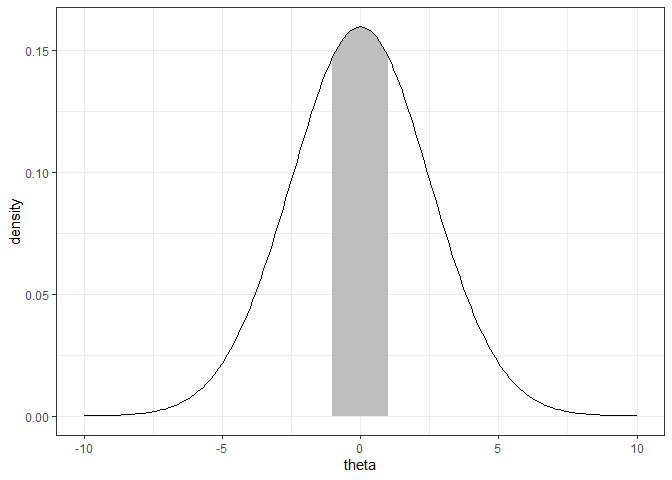
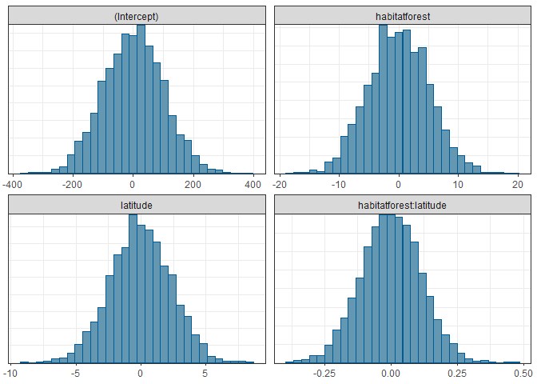

Ant data GLM - priors for Bayesian model
================
Brett Melbourne
31 Oct 2022 (updated 8 Nov 2024)

Here we look at the priors in the Poisson log-link GLM for the model
specified with `rstanarm` (see previous script).

``` r
library(ggplot2)
library(rstanarm)
options(mc.cores=parallel::detectCores())
theme_set(theme_bw())
```

Read in data and train the model

``` r
ant <- read.csv("data/ants.csv")
ant$habitat <- factor(ant$habitat)
bysfitHxL <- stan_glm(richness ~ habitat + latitude + habitat:latitude, 
                      family=poisson, data=ant)
```

To see what priors have been used

``` r
prior_summary(bysfitHxL)
```

    ## Priors for model 'bysfitHxL' 
    ## ------
    ## Intercept (after predictors centered)
    ##  ~ normal(location = 0, scale = 2.5)
    ## 
    ## Coefficients
    ##   Specified prior:
    ##     ~ normal(location = [0,0,0], scale = [2.5,2.5,2.5])
    ##   Adjusted prior:
    ##     ~ normal(location = [0,0,0], scale = [4.94,2.34,0.11])
    ## ------
    ## See help('prior_summary.stanreg') for more details

Before `rstanarm` trains the model it centers and scales the predictor
variables. This improves the behavior of the MCMC algorithm resulting in
faster and more reliable convergence. The default priors are specified
on this scale, which results in parameter estimates in standard
deviation units. For this model (GLM, Poisson with log link) we see that
the priors for the intercept and the three betas are all Normal(0, 2.5):
`location` is the mean of the distribution and `scale` is the standard
deviation. There is a corresponding `Adjusted prior`, which is the
equivalent prior on the original scale.

What does a Normal(0, 2.5) prior look like? To visualize, we can compute
it:

``` r
# Calculate the curve for Normal(0,2.5)
theta <- seq(-10, 10, 0.1)
prior2.5 <- dnorm(theta, mean=0, sd=2.5)

# Outline polygon for 1 sd area under the curve
auc_1_sd <- c(prior2.5[abs(theta) <= 1], 0, 0)
theta_uc <- c(theta[abs(theta) <= 1], 1, -1)

# Plot distribution and 1 sd under curve
ggplot() +
    geom_polygon(aes(x=theta_uc, y=auc_1_sd), fill="grey") +
    geom_line(aes(x=theta, y=prior2.5)) +
    labs(x="theta", y="density")
```

<!-- -->

This is a weakly informative prior. We are expressing a tendency for the
parameter to be near zero but most of the probability mass (area under
the curve) is beyond 1 standard deviation unit, allowing plausible
values out to about 6 or 7 standard deviation units. But magnitudes as
large as 10 standard deviation units are very implausible.

A useful way to visualize the priors for a given model is to draw from
the prior predictive distribution by calling `stan_glm()` with the
argument `prior_PD=TRUE`.

``` r
prior_pred <- stan_glm(richness ~ habitat + latitude + habitat:latitude, 
                      family=poisson, data=ant, prior_PD=TRUE)
plot(prior_pred, "hist", bins=30)
```

<!-- -->

This shows the prior distributions corresponding to the unscaled
predictor variables. Biologically, how should we interpret these prior
distributions for the ant data? Recall that the parameters are for the
linear predictor, so the x axis is in units of log(richness) since our
model has a log link function. Also, latitude is not scaled, so latitude
= 0 corresponds to the equator. Thus, the intercept prior is saying
fairly plausible values of log(richness) at the equator are between -200
to 200. This corresponds to a species richness range:

``` r
exp(c(-200, 200))
```

    ## [1] 1.383897e-87 7.225974e+86

Clearly that’s biologically implausible. We know there are far more than
zero ant species at the equator and the number of ant species at the
equator doesn’t exceed the estimated number of all species of organisms
on the planet by 80 or so orders of magnitude! But we’re modeling data
in a narrow range of latitude and the intercept is extrapolating well
beyond that, so considering biological information at the extrapolated
value is not necessarily a good idea.

More information on priors in `rstanarm`, including links to examples
and vignettes is here

``` r
?priors
```

and <https://mc-stan.org/rstanarm/articles/priors.html>.
