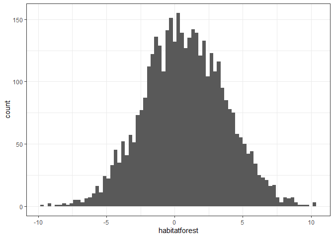
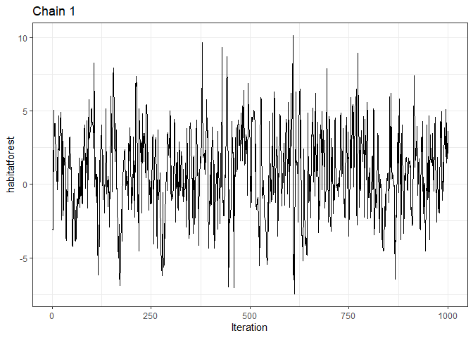
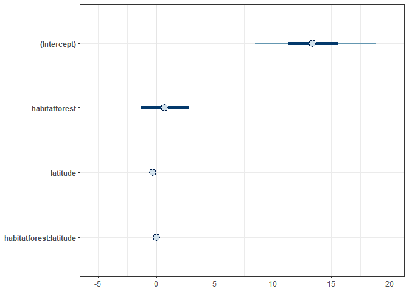
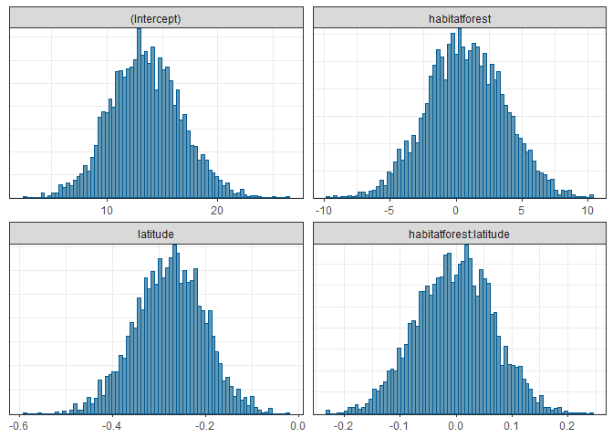
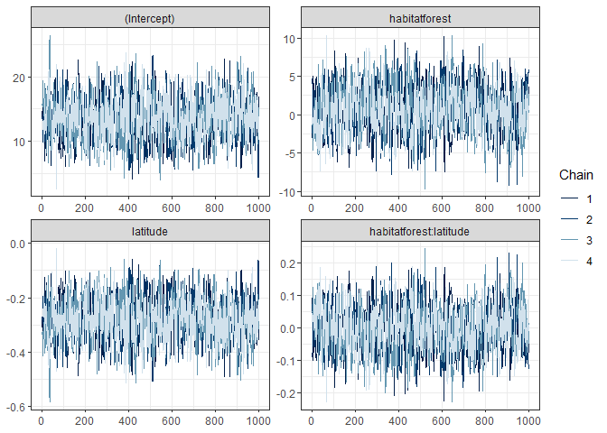
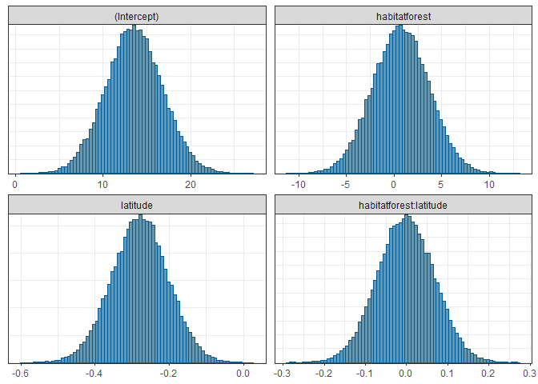
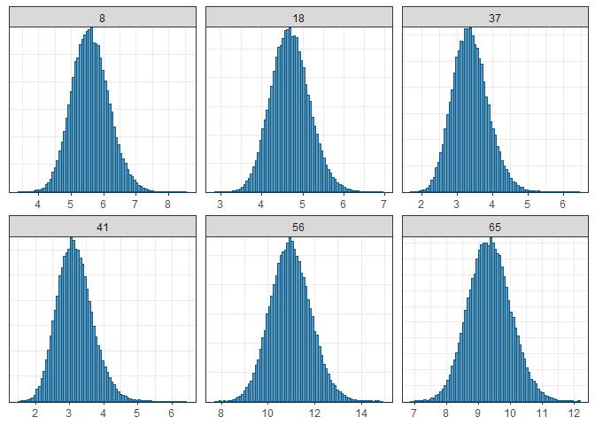
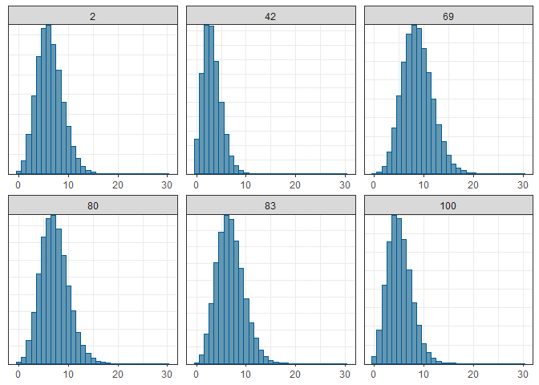
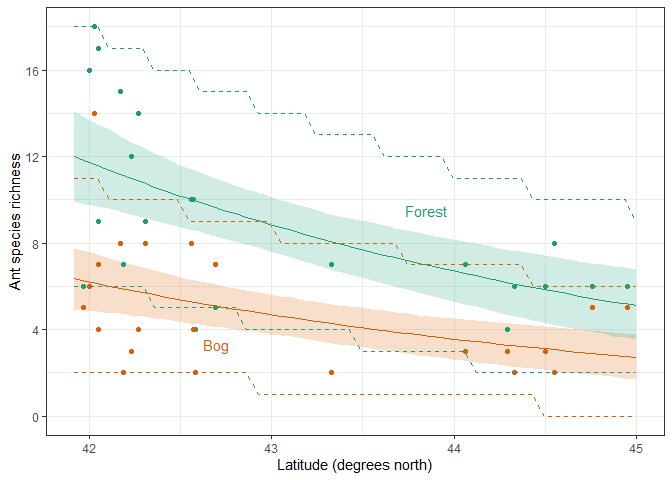

Ant data Generalized Linear Model - Bayesian
================
Brett Melbourne
16 Oct 2018 (updated 6 Nov 2024)

Fourth? in a series of scripts to analyze the ant data described in
Ellison (2004). This script includes Bayesian inference from the GLM.
Future scripts will consider multilevel models to fully account for the
design structure.

This script can be rendered to a reproducible report.  
`rmarkdown::render("09_8_ants_bayesian_GLM.Rmd")`, or *Ctrl+Shift+K* in
RStudio.

Set up for Bayesian analysis (order is important):

``` r
library(ggplot2)
library(dplyr)
library(rstanarm)
library(bayesplot)
options(mc.cores=parallel::detectCores())
source("source/hpdi.R") #hpdi() for calculating credible intervals
theme_set(theme_bw())
```

Read in the data

``` r
ant <- read.csv("data/ants.csv")
ant$habitat <- factor(ant$habitat)
```

## Model

The model and data were described in the previous script.

## Training

Bayesian fit with `rstanarm`

``` r
bysfitHxL <- stan_glm(richness ~ habitat + latitude + habitat:latitude, 
                      family=poisson, data=ant)
```

We obtain a `summary()` in the same way as many other analyses in R,
which will display estimates for the parameters along with their
uncertainty.

``` r
summary(bysfitHxL, digits=4)
```

    ## 
    ## Model Info:
    ##  function:     stan_glm
    ##  family:       poisson [log]
    ##  formula:      richness ~ habitat + latitude + habitat:latitude
    ##  algorithm:    sampling
    ##  sample:       4000 (posterior sample size)
    ##  priors:       see help('prior_summary')
    ##  observations: 44
    ##  predictors:   4
    ## 
    ## Estimates:
    ##                          mean    sd      10%     50%     90%  
    ## (Intercept)            13.4791  3.1696  9.5189 13.3793 17.5640
    ## habitatforest           0.7469  2.9499 -3.0399  0.6871  4.5681
    ## latitude               -0.2776  0.0742 -0.3732 -0.2755 -0.1853
    ## habitatforest:latitude -0.0026  0.0690 -0.0918 -0.0015  0.0863
    ## 
    ## Fit Diagnostics:
    ##            mean   sd     10%    50%    90% 
    ## mean_PPD 7.0336 0.5784 6.2955 7.0227 7.7727
    ## 
    ## The mean_ppd is the sample average posterior predictive distribution of the outcome variable (for details see help('summary.stanreg')).
    ## 
    ## MCMC diagnostics
    ##                        mcse   Rhat   n_eff
    ## (Intercept)            0.0913 1.0020 1205 
    ## habitatforest          0.1025 1.0046  829 
    ## latitude               0.0021 1.0019 1196 
    ## habitatforest:latitude 0.0024 1.0045  826 
    ## mean_PPD               0.0114 1.0010 2596 
    ## log-posterior          0.0365 1.0021 1458 
    ## 
    ## For each parameter, mcse is Monte Carlo standard error, n_eff is a crude measure of effective sample size, and Rhat is the potential scale reduction factor on split chains (at convergence Rhat=1).

In this table, we can look at the posterior sample means
(`Estimates: mean`) for a point estimate of the parameter values. The
standard deviation (`Estimates: sd`) of the posterior samples is one
measure of uncertainty. Twice the standard deviation is roughly a 95%
credible interval assuming the posterior distribution is Normal. We can
compare the mean to the median (`Estimates: 50%`, the 50th percentile of
the posterior samples) and the 10th to the 90th percentiles of the
samples to have a sense of the symmetry of the posterior distribution.
The range between the 10th and 90th percentiles is another measure of
uncertainty (80% CPI by default).

Under `MCMC diagnostics` we see especially that the `Rhat` values are
all 1, indicating convergence, and `n_eff`, the effective number of
samples, is quite good (1000+) for all parameters. The Monte Carlo
standard error (`mcse`) is the amount of error contributed by the
sampling algorithm. We’d like to see that be relatively small compared
to the standard deviations (`sd`) of the parameters.

The `mean_ppd` (mean of the posterior predictive distribution) is a
quick check for gross problems with the fit. It’s just the predicted
mean of the response. Compare this to the observed mean of the data.
They should be in a similar ballpark. Here, `mean_ppd` is very close to
the observed mean.

``` r
mean(ant$richness)
```

    ## [1] 7.022727

### Working with posterior samples

We already looked at working with the samples directly in a previous
script. If you ever need to work with the samples from an `rstanarm` fit
directly, you can get them with `as.matrix()`, `as.data.frame()`, or
`as.array()`. These are the post-warmup samples. The warmup samples are
not saved. For the combined chains (stacked but not shuffled):

``` r
samples <- as.data.frame(bysfitHxL)
head(samples, 3)
```

    ##   (Intercept) habitatforest   latitude habitatforest:latitude
    ## 1    13.66350     -3.054780 -0.2840336             0.08940458
    ## 2    15.66460     -3.108630 -0.3305627             0.09078269
    ## 3    11.87179      2.328287 -0.2426403            -0.03763527

``` r
samples |>
    ggplot() +
    geom_histogram(aes(x=habitatforest), bins=75)
```

<!-- -->

Or for the separate chains:

``` r
chains <- as.array(bysfitHxL)
str(chains)
```

    ##  num [1:1000, 1:4, 1:4] 13.66 15.66 11.87 14.73 9.97 ...
    ##  - attr(*, "dimnames")=List of 3
    ##   ..$ iterations: NULL
    ##   ..$ chains    : chr [1:4] "chain:1" "chain:2" "chain:3" "chain:4"
    ##   ..$ parameters: chr [1:4] "(Intercept)" "habitatforest" "latitude" "habitatforest:latitude"

``` r
ggplot() +
    geom_line(mapping=aes(x=1:1000, y=chains[,"chain:1","habitatforest"])) +
    labs(x="Iteration", y="habitatforest", title = "Chain 1")
```

<!-- -->

Nevertheless, it would be rare to need to access chains directly because
we can use various convenience functions provided by `rstanarm` for
model checking. See the next script for Bayesian model checking.

### Visualizing posterior samples with convenience functions

See `?plot.stanreg` for information.

``` r
plot(bysfitHxL, "intervals")
```

<!-- -->

``` r
plot(bysfitHxL, "hist", bins=75)
```

<!-- -->

``` r
plot(bysfitHxL, "trace")
```

<!-- -->

All of these `plot` methods implement functions from the `bayesplot`
package, which one could use alternatively. Since `plot` only accepts
the fitted object (here `bysfitHxL`), the `bayesplot` plotting functions
are more versatile because they can accept a wider range of inputs. Here
is the ’bayesplot\` call for the previous traceplot but using as input
the chains extracted from the stanfit object (the plot, not shown, is
identical).

``` r
mcmc_trace(chains)
```

The documentation for `bayesplot` is at
<https://mc-stan.org/bayesplot/index.html>.

## Inference

Extracting and calculating everything manually from the samples is a lot
of coding work. The convenience functions in `rstanarm` make inference
tasks easier for common inferences. Calculating common derived
quantities and their uncertainty, such as regression curves, is
straightforward and not too much harder for most other derived
quantities. We look at some of these next.

### Parameter credible intervals

The intervals provided by `rstanarm` are central posterior intervals
(CPI) as the authors argue this is most appropriate for the types of
models and parameters covered by `rstanarm`. Here is the convenience
function for the parameter CPIs, which are 90% intervals by default:

``` r
posterior_interval(bysfitHxL)
```

    ##                                5%        95%
    ## (Intercept)             8.4458533 18.8398642
    ## habitatforest          -4.1281469  5.6741464
    ## latitude               -0.4026510 -0.1596420
    ## habitatforest:latitude -0.1171129  0.1116471

There is a strong argument for using the CPI in these GLMs in lieu of
the highest posterior density interval (HPDI). We saw from the
histograms above that the posteriors of the parameters are quite
symmetric but there was still noise in the tails of the samples. Thus,
the CPI is a more numerically stable estimate of the credible interval
(even though the CPI is not strictly a credible interval itself) and the
90% interval is more stable. See `?posterior_interval` for more
discussion.

My inclination is always to do the more theoretically justified thing
for later iterations of a model. So let’s gather plenty of samples
(e.g. 60K) to stabilize those tails. I’m not a statistician fitting
hundreds of models a day 24/7/365. I’m a researcher with one dataset
that I spent years collecting; I can wait another few seconds for a
little more precision! (PS, the extra precision is not that important
but it makes my plots less wiggly and visual beauty is a thing).

``` r
bysfitHxL <- stan_glm(richness ~ habitat + latitude + habitat:latitude, 
                      family=poisson, data=ant, warmup=1000, iter=16000)
mcmc_hist(bysfitHxL, bins=75)
```

<!-- -->

For comparison with our previous scripts, here are the 95% CPIs with the
nice stable estimates

``` r
posterior_interval(bysfitHxL, prob=0.95)
```

    ##                              2.5%      97.5%
    ## (Intercept)             7.2154700 20.0003334
    ## habitatforest          -5.0559259  6.5113058
    ## latitude               -0.4304675 -0.1312756
    ## habitatforest:latitude -0.1376706  0.1332009

If we want HPDIs instead, we could calculate them directly from the
samples, e.g. here using the `hpdi()` function from our class-materials
`source` directory. These are not recommended without stabilizing the
tails of the distribution, as we’ve done.

``` r
samples <- as.data.frame(bysfitHxL)
hpdi(samples$"(Intercept)", prob=0.95)
```

    ##         lower   upper
    ## [1,] 7.232663 20.0064

``` r
hpdi(samples$habitatforest, prob=0.95)
```

    ##          lower    upper
    ## [1,] -4.989827 6.572593

``` r
hpdi(samples$latitude, prob=0.95)
```

    ##           lower      upper
    ## [1,] -0.4283467 -0.1295207

``` r
hpdi(samples$"habitatforest:latitude", prob=0.95)
```

    ##           lower     upper
    ## [1,] -0.1348225 0.1356414

These are almost the same as the CPIs due to the symmetric posteriors.

### Convenience functions for derived samples

As in the `predict()` function associated with `glm()`, convenience
functions for samples of quantities derived from the model take a
`newdat` argument that simplifies coding. The two workhorse functions
are `posterior_linpred()` to calculate samples from the posterior
distribution of derived quantities and `posterior_predict()` to generate
samples from the posterior predictive distribution of derived
quantities. These are analogous to the roles played by the confidence
interval and the prediction interval in frequentist inference. To do
what we did manually in the previous Bayesian script working directly
with the samples, first make a dataframe with the desired values of the
explanatory variables.

``` r
newd <- data.frame(latitude=rep(seq(from=41.92, to=45, length.out=50), 2),
                   habitat=factor(rep(c("bog","forest"), each=50)))
```

There are 100 combinations of latitude and habitat in this dataframe, 50
from bog and 50 from forest

``` r
nrow(newd)
```

    ## [1] 100

``` r
newd[1:6,]   #some rows from bog
```

    ##   latitude habitat
    ## 1 41.92000     bog
    ## 2 41.98286     bog
    ## 3 42.04571     bog
    ## 4 42.10857     bog
    ## 5 42.17143     bog
    ## 6 42.23429     bog

``` r
newd[51:56,] #some rows from forest
```

    ##    latitude habitat
    ## 51 41.92000  forest
    ## 52 41.98286  forest
    ## 53 42.04571  forest
    ## 54 42.10857  forest
    ## 55 42.17143  forest
    ## 56 42.23429  forest

Then, derive samples for the posterior distribution of the inverse link
function, i.e. Dist($\mu$), which we’ll call `pmu`.

``` r
pmu <- posterior_linpred(bysfitHxL, transform=TRUE, newdata=newd)
#pmu <- posterior_epred(bysfitHxL, newdata=newd)
```

This is a matrix where each row is a sample from the posterior for each
of the variable combinations in columns

``` r
class(pmu)
```

    ## [1] "matrix" "array"

``` r
str(pmu)
```

    ##  num [1:60000, 1:100] 6.34 6.85 5.88 7.28 7.22 ...
    ##  - attr(*, "dimnames")=List of 2
    ##   ..$ iterations: NULL
    ##   ..$           : chr [1:100] "1" "2" "3" "4" ...

Take a look at some of these samples to judge the shape and noisiness of
the posterior

``` r
mcmc_hist(pmu, pars=sample(colnames(pmu), 6), bins=75)
```

<!-- -->

Some of these posterior distributions for mean richness seem somewhat
skewed with a longer tail to the right, which makes sense because
richness is constrained positive. I’m going to choose the HPDI here.

The estimated expected values for $mu$ for each variable combination are
then

``` r
mnmu <- colMeans(pmu)
```

and the 95% credible intervals for the mean are

``` r
n <- nrow(newd)
mean_intervals <- data.frame(mulo95=rep(NA,n), muhi95=rep(NA,n))
for ( i in 1:n ) {
    mean_intervals[i,] <- hpdi(pmu[,i], prob=0.95)
}
```

For predictions, first derive samples for the posterior predictive
distribution, which we’ll call ppd

``` r
ppd <- posterior_predict(bysfitHxL, newdata=newd)
str(ppd)
```

    ##  int [1:60000, 1:100] 6 11 6 8 3 6 4 6 4 10 ...
    ##  - attr(*, "dimnames")=List of 2
    ##   ..$ : NULL
    ##   ..$ : chr [1:100] "1" "2" "3" "4" ...

``` r
mcmc_hist(ppd, pars=sample(colnames(ppd), 6), breaks=seq(-0.5,30.5))
```

<!-- -->

and the 95% prediction intervals (here CPI for stability) are then

``` r
prediction_intervals <- predictive_interval(ppd)
prediction_intervals <- data.frame(prediction_intervals)
names(prediction_intervals) <- c("ppdlo95", "ppdhi95")
```

Plot (code is the same as previous script)

``` r
preds <- cbind(newd, mnmu, mean_intervals, prediction_intervals)
bfc <- c("#d95f02", "#1b9e77") #bog & forest colors
preds %>%
    ggplot() +
    geom_ribbon(mapping=aes(x=latitude, ymin=mulo95, ymax=muhi95, fill=habitat),
                alpha=0.2) +
    geom_point(data=ant, mapping=aes(x=latitude, y=richness, col=habitat)) +
    geom_line(mapping=aes(x=latitude, y=mnmu, col=habitat)) +
    geom_line(mapping=aes(x=latitude, y=ppdlo95, col=habitat), lty=2) +
    geom_line(mapping=aes(x=latitude, y=ppdhi95, col=habitat), lty=2) +
    annotate("text", x=42.7, y=3.3, label="Bog", col=bfc[1]) +
    annotate("text", x=43.85, y=9.5, label="Forest", col=bfc[2]) +
    scale_fill_manual(values=bfc) +
    scale_color_manual(values=bfc) +
    scale_y_continuous(breaks=seq(0, 20, 4), minor_breaks=seq(0, 20, 2)) +
    xlab("Latitude (degrees north)") +
    ylab("Ant species richness") +
    theme(legend.position="none")
```

<!-- -->

## Summary

Comparing inference algorithms for frequentist and Bayesian approaches
to model means and predictions so far:

| Tool | Mean | Uncertainty of mean | Uncertainty of prediction |
|:---|:---|:---|:---|
| lm | predict() | predict(int=“confidence”) | predict(int=“prediction”) |
| glm | predict(type= “response”) | predict(se.fit=TRUE) | via bootstrap |
|  |  | or via bootstrap |  |
| stan_glm | mean(pmu) | hpdi(pmu), cpi(pmu) | hpdi(ppd), cpi(ppd) |

where:

- `pmu <- posterior_linpred(transform = TRUE)`, or
  `pmu <- posterior_epred()`
- `ppd <- posterior_predict()`
