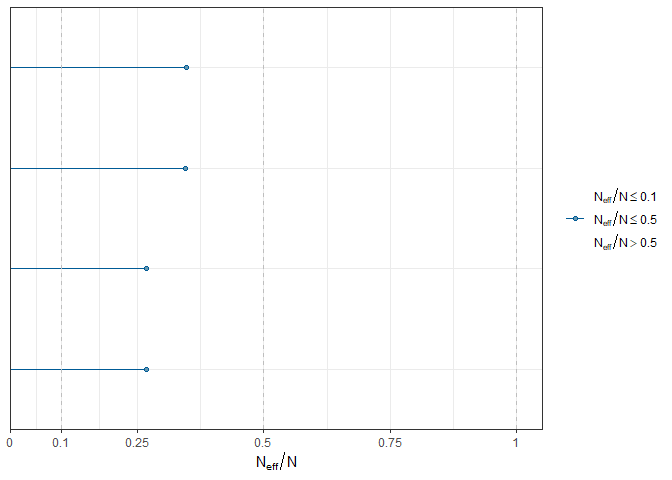
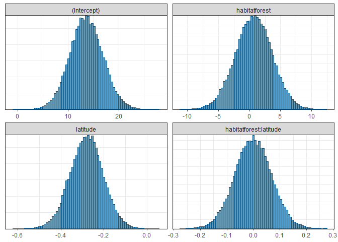
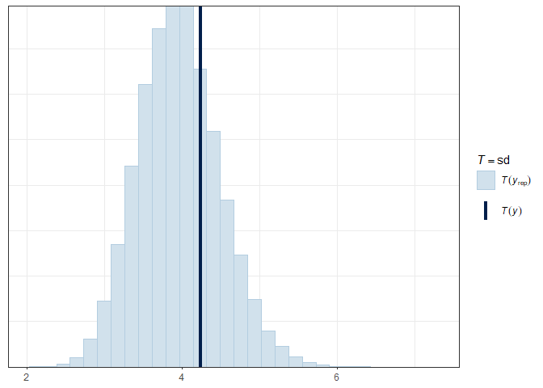
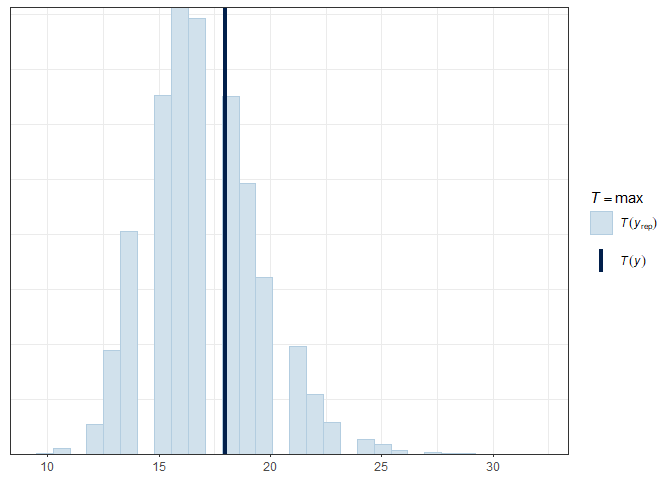
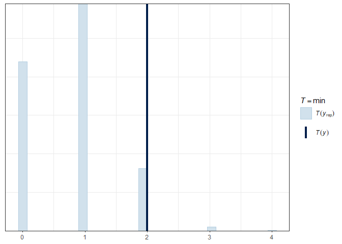

Ant data: Bayesian model checking
================
Brett Melbourne
7 Dec 2021 (updated 9 Nov 2024)

Sixth in a series of scripts to analyze the ant data described in
Ellison (2004). This script performs some basic model checking of the
Poisson log-link GLM, highlighting the use of posterior predictive
checks in `rstanarm`.

Set up for Bayesian analysis

``` r
library(ggplot2)
library(rstanarm)
options(mc.cores = parallel::detectCores())
theme_set(theme_bw())
```

Read in the data

``` r
ant <- read.csv("data/ants.csv")
ant$habitat <- factor(ant$habitat)
```

Fit the model

``` r
bysfitHxL <- stan_glm(richness ~ habitat + latitude + habitat:latitude, 
                        family=poisson, data=ant)
```

The shinystan app has a bunch of diagnostics that can be browsed

``` r
launch_shinystan(bysfitHxL)
```

Click diagnose. I suggest routinely checking these:

- NUTS (plots), “By model parameter”, top two plots. The left one is the
  trace plot of the chains to assess convergence. The right plot is the
  posterior (check it’s shape). Look at each parameter by changing from
  the pulldown.
- R_hat, n_eff, se_mean. This is a quick graphical overview but I will
  usually check these by printing a summary table instead.
- Autocorrelation. This is useful to see how efficient your chains are.
  If the autocorrelation declines quickly with lag, that’s good.
- PPcheck. Look at all of these. The idea of the posterior predictive
  check is to simulate data from the fitted model. Does the simulated
  data look like the real data? Check especially “Distribution of
  observed data vs replications” (especially overlaid densities) and
  “Distributions of test statistics”.

You can replicate these diagnostic plots in code. I prefer to use the
code versions to keep a record of what I’ve checked and to add any
commentary. On the other hand, large models with many parameters have an
overwhelming number of potential diagnostic plots. The shinystan
interface is handy for browsing these but it’s nice to keep a selection
in code. Also, the shinystan interface doesn’t seem to work if you
request more samples than the default as it seems to break many of the
plots.

Refitting the model with more samples:

``` r
bysfitHxL <- stan_glm(richness ~ habitat + latitude + habitat:latitude, 
                        family=poisson, data=ant, warmup=1000, iter=16000)
```

In `rstanarm` the main functions for reproducing diagnostic plots via
code are `plot()` and `pp_check()`. We saw some of the `plot()` options
in the previous script. I’ve added a few more here for the convergence
statistic (r_hat) the number of effective samples (n_eff), and
autocorrelation function of the chains (acf):

``` r
plot(bysfitHxL, "neff")
```

<!-- -->

``` r
plot(bysfitHxL, "rhat")
```

<!-- -->

``` r
plot(bysfitHxL, "hist", bins=75)
```

<!-- -->

``` r
plot(bysfitHxL, "trace")
```

<!-- -->

``` r
plot(bysfitHxL, "combo")
```

<!-- -->

``` r
plot(bysfitHxL, "acf")
```

<!-- -->

For more information and available plots see

``` r
?plot.stanreg
bayesplot::available_mcmc()
```

Here are some of the main posterior predictive diagnostic plots using
`pp_check()`.

``` r
# Distribution of observed data vs replications, overlaid densities
p <- pp_check(bysfitHxL, plotfun = "dens_overlay")
p + labs(subtitle="Data density curve (dark) should fit in with the simulations")
```

<!-- -->

``` r
# Additional alternatives to the plot above are (not shown)
pp_check(bysfitHxL, plotfun = "hist")
pp_check(bysfitHxL, plotfun = "boxplot", nreps=30)
```

``` r
# Distributions of test statistic, mean
pp_check(bysfitHxL, plotfun = "stat", stat = "mean")
```

<!-- -->

``` r
# Distributions of test statistic, sd
pp_check(bysfitHxL, plotfun = "stat", stat = "sd")
```

<!-- -->

``` r
# Distributions of test statistic, max
pp_check(bysfitHxL, plotfun = "stat", stat = "max")
```

<!-- -->

``` r
# Distributions of test statistic, min
pp_check(bysfitHxL, plotfun = "stat", stat = "min")
```

<!-- -->

``` r
# Scatterplot of y vs. average yrep
p <- pp_check(bysfitHxL, plotfun = "scatter_avg")
p + labs(title="Essentially observed vs fitted",
         subtitle="Points should be around the 1:1 dashed line")
```

<!-- -->

``` r
# Residuals
pp_check(bysfitHxL, plotfun = "error_hist", nreps = 6)
```

<!-- -->

The above plots show that the fitted model produces data much like the
real data with one important exception: the real data don’t contain
richness values less than 2, as revealed in the plot of `min`
(i.e. minimum species richness) as the test statistic. Although
uncommon, we do sometimes see simulated datasets with minimum richness
of 2 in the diagnostic plot. The real data could be such a realization.
So the Poisson distribution is perhaps not a bad approximation of the
data generating process and reasonable for drawing inferences. However,
my knowledge of ecology leads me to suspect that the biological process
has an important distinction from a Poisson process that prevents
species richness from often being less than 2. There is more complexity
to how an ecological community assembles than a simple assembly-rate
process modeled by the Poisson distribution and it seems highly unlikely
that zero species would ever be a result of the species inventory.

There are many other options for `pp_check()` graphics to be explored.
Some of the most useful, are the grouped versions. For example:

``` r
pp_check(bysfitHxL, plotfun = "ppc_dens_overlay_grouped", group="habitat", nreps=30)
```

<!-- -->

The plots made by `pp_check()` use functions from the `bayesplot`
package, which you could alternatively use directly (useful if you want
to investigate something not covered by `pp_check()` or outside of
`rstanarm`). For example, here is code to replicate the previous
`pp_check()` plot.

``` r
bayesplot::ppc_dens_overlay_grouped(y=ant$richness, 
                                    yrep=posterior_predict(bysfitHxL, draws=30), 
                                    group=ant$habitat)
```

See the help topics for more options:

``` r
?pp_check
bayesplot::available_ppc()
```
