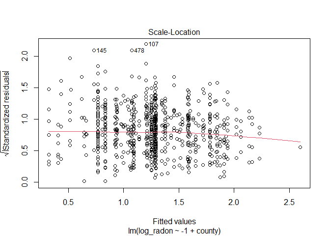

Multilevel model of radon levels M1
================
Brett Melbourne
14 Oct 2018 (updated 12 Nov 2024)

Reading: Chapter 12 of Gelman & Hill

This is part 2: M1 variance components model (G&H 12.2). Here we fit a
simple variance components model of the average that accounts for
grouping structures (in other language, it is purely a random effects
model and does not have any fixed effects). As well as this random
effects model (or partial pooling model) we’ll look at the contrasting
models for no pooling and complete pooling. In part 3 we’ll add a
house-level (G&H 12.3-4) predictor of radon. In part 4, we’ll add a
county-level predictor.

``` r
library(lme4)      #max lik multilevel: lmer(), glmer() etc
library(arm)       #for se.ranef()
library(ggplot2)
library(gridExtra) #arranging multiple plots
library(dplyr)
library(rstanarm)  #Bayesian multilevel: stan_lmer(), stan_glmer() etc
options(mc.cores=parallel::detectCores())
theme_set(theme_bw())
```

Read in data, calculate log radon and convert county to a factor. See
`data/radon_MN_about.txt` for data source.

``` r
radon_dat <- read.csv("data/radon_MN.csv")
radon_dat$log_radon <- log(ifelse(radon_dat$radon==0, 0.1, radon_dat$radon))
radon_dat <- mutate(radon_dat, county=factor(county))
```

### G&H 12.2. Multilevel analysis with no predictors

Our aim here is to look at some models for the mean. We’ll look at three
models:

1.  Complete pooling - the simplest model for the overall mean
2.  No pooling - county means, considering counties as fixed effects
3.  Partial pooling - county means, considering counties as random
    effects

G&H prefer to not use the terms fixed and random but I use them here
because many of you will have learned it this way already. See G&H for
more discussion of this. We will broadly follow Gelman & Hill’s analysis
in Chapter 12 with some elaborations here and there, and we’ll use
`rstanarm` instead of BUGS.

#### Complete pooling model

In this case, complete pooling is just the overall mean. That is, we
omit any data structure or grouping variables.

``` r
poolmean <- mean(radon_dat$log_radon)
poolmean
```

    ## [1] 1.224623

``` r
cp_pred_df <- data.frame(poolmean) #df for use with ggplot
```

#### No pooling model

You can think of **no pooling** as separately calculating an estimate of
the mean for each county. For example, tabulate the means (and sd and
se) for each county:

``` r
lnrad_mean_var <- 
    radon_dat |>
    group_by(county) |>
    summarize(sample_size=n(), cty_mn=mean(log_radon), cty_sd=sd(log_radon)) |>
    mutate(cty_se=cty_sd / sqrt(sample_size)) |>
    mutate(sample_size_jit = jitter(sample_size)) #jitter added for plotting
```

Whenever I do a calculation or summary operation I like to look at the
whole result to check that everything makes sense and scan for problems.
So I would do this to print every row:

``` r
print(lnrad_mean_var, n=Inf) #n=Inf to print all rows
```

But here are the first 10 rows

``` r
print(lnrad_mean_var, n=10) #n=Inf to print all rows
```

    ## # A tibble: 85 × 6
    ##    county     sample_size cty_mn cty_sd cty_se sample_size_jit
    ##    <fct>            <int>  <dbl>  <dbl>  <dbl>           <dbl>
    ##  1 AITKIN               4  0.660  0.459  0.230            4.02
    ##  2 ANOKA               52  0.833  0.770  0.107           52.2 
    ##  3 BECKER               3  1.05   0.750  0.433            2.90
    ##  4 BELTRAMI             7  1.14   0.968  0.366            6.96
    ##  5 BENTON               4  1.25   0.424  0.212            3.99
    ##  6 BIG STONE            3  1.51   0.516  0.298            3.08
    ##  7 BLUE EARTH          14  1.91   0.553  0.148           14.1 
    ##  8 BROWN                4  1.63   0.608  0.304            4.04
    ##  9 CARLTON             10  0.931  0.615  0.194            9.95
    ## 10 CARVER               6  1.20   1.90   0.777            5.84
    ## # ℹ 75 more rows

In printing the whole data frame I saw that there are three counties
with only one sample, so we were not able to calculate a standard error
for those. We could fix this (by estimating from sample size and sd of
the other counties) but let’s not worry at this stage. Plot what we’ve
got (there is a warning for the missing standard error segment geoms):

``` r
lnrad_mean_var |> 
    ggplot() +
    geom_hline(data=cp_pred_df, mapping=aes(yintercept=poolmean), col="blue") +
    geom_point(mapping=aes(x=sample_size_jit, y=cty_mn)) +
    geom_linerange(mapping=aes(x=sample_size_jit, 
                               ymin=cty_mn - cty_se, 
                               ymax=cty_mn + cty_se)) +
    scale_x_continuous(trans="log", breaks=c(1,3,10,30,100)) +
    labs(x="Sample size in county j",
         y="mean ln(radon) in county j",
         title="No pooling: separate means and standard errors by county")
```

    ## Warning: Removed 3 rows containing missing values or values outside the scale range
    ## (`geom_segment()`).

<!-- -->

This plot is very similar to G&H Fig. 12.1a but not the same. The blue
line is the completely pooled estimate (the overall mean). Some of the
standard errors are larger than G&H 12.1a because we have calculated
them independently for each county. The three points to the left without
an interval are the ones we couldn’t calculate a standard error for.

Now we’ll do as G&H did in Ch 12. This is also a **no pooling** analysis
for the county means. This analysis does not pool information about the
**means** but it does pool information about the uncertainty (the error
of each observation contributes to an estimate of the mean residual
error). This is sometimes called the **fixed effects model**, where here
`county` is the fixed effect. To fit this model in a frequentist
paradigm we can use `lm()`, which is implicitly a GLM with Normal
distribution and identity link. We fit `county` as a categorical
variable, which gives us estimated means for each county (the maximum
likelihood estimates are the means of the within-county samples). We use
the means parameterization (i.e without the intercept, thus “-1”):

``` r
npfit <- lm( log_radon ~ -1 + county, data=radon_dat )
```

Check the fitted model (diagnostic plots)

``` r
plot(npfit,1:4,ask=FALSE)
```

<!-- --><!-- --><!-- --><!-- -->

The extended left tail, which has the 0 + 0.1 hack, is evident in the QQ
plot but otherwise the diagnostics look good. Let’s also look at a
residuals histogram compared to the Normal distribution:

``` r
r <- residuals(npfit)
x <- seq(min(r), max(r), length.out=100)
y <- dnorm(x, mean(r), sd(r))
res_df <- data.frame(residuals=r)
norm_df <- data.frame(x=x, y=y)
rm(r,x,y)
ggplot() +
    geom_histogram(data=res_df, mapping=aes(x=residuals, y=after_stat(density)), bins=60) +
    geom_line(data=norm_df, mapping=aes(x=x, y=y), col="red")
```

<!-- -->

So, Normal looks like an adequate approximation for the errors.

Plot the fitted model

``` r
np_pred_df <- data.frame(coef(summary(npfit))[,1:2], 
                         lnrad_mean_var$sample_size_jit)
names(np_pred_df) <- c("cty_mn","cty_se","sample_size_jit")

gh12.1a <- 
    np_pred_df |> 
    ggplot() +
    geom_hline(data=cp_pred_df, mapping=aes(yintercept=poolmean), col="blue") +
    geom_point(mapping=aes(x=sample_size_jit, y=cty_mn)) +
    geom_linerange(mapping=aes(x=sample_size_jit, 
                               ymin=cty_mn-cty_se, 
                               ymax=cty_mn+cty_se)) +
    scale_x_continuous(trans="log", breaks=c(1,3,10,30,100)) +
    ylim(-0.1, 3.3) +
    labs(x="Sample size in county j",y="mean ln(radon) in county j",
         title="No pooling: estimates from linear fixed-effects model")
gh12.1a
```

<!-- -->

Apart from some unimportant details, this is the same as G&H Fig. 12.1a.
The blue line is the complete pooling model (i.e. the overall mean).

#### Partial pooling & shrinkage in multilevel model

In the **complete pooling** model (i.e. the overall mean) we did not
include variation among counties, while in the **no pooling** model, we
estimated the county means separately, whether literally by separate
analyses or in the fixed effects model. In the **partial pooling** model
the estimates for the mean in each county are a balance between the
information in a county sample and information from other counties. To
achieve this, we formulate a **multilevel model**. In the multilevel
model we consider two levels for means: an overall mean and means for
counties. Each of the two levels of these means has an associated
stochastic process so that there are two **variance components**, a
between-county variance associated with the overall mean and a
within-county variance associated with the county means. To fit this
model in a frequentist paradigm we can use `lmer()` from the package
`lme4`. This model is implicitly a generalized linear mixed model (GLMM)
with Normal distribution, identity link, and two levels of
stochasticity:

``` r
ppfit <- lmer( log_radon ~ 1 + (1|county), REML=FALSE, data=radon_dat )
```

The `1` part of the above model specifies the overall mean (the
intercept term) while the `+ (1|county)` part specifies that the
intercepts for each county should be random variables (more specifically
the deviations, or “random effects”, of county means from the overall
mean will be modeled as a Normally distributed random variable).
`REML=FALSE` says to fit by ordinary maximum likelihood rather than the
default residual maximum likelihood.

By default, we get limited diagnostics for `lmer()`. Just residuals vs
fitted. The residual plot looks good though. We will later explore some
other diagnostic options for multilevel likelihood models.

``` r
plot(ppfit)
```

<!-- -->

In the summary we now see estimates for two components (or levels, or
strata) of variance: county (among counties) and residual (among houses
within counties):

``` r
summary(ppfit)
```

    ## Linear mixed model fit by maximum likelihood  ['lmerMod']
    ## Formula: log_radon ~ 1 + (1 | county)
    ##    Data: radon_dat
    ## 
    ##      AIC      BIC   logLik deviance df.resid 
    ##   2261.2   2275.7  -1127.6   2255.2      916 
    ## 
    ## Scaled residuals: 
    ##     Min      1Q  Median      3Q     Max 
    ## -4.4668 -0.5757  0.0432  0.6460  3.3508 
    ## 
    ## Random effects:
    ##  Groups   Name        Variance Std.Dev.
    ##  county   (Intercept) 0.0934   0.3056  
    ##  Residual             0.6366   0.7979  
    ## Number of obs: 919, groups:  county, 85
    ## 
    ## Fixed effects:
    ##             Estimate Std. Error t value
    ## (Intercept)  1.31226    0.04857   27.02

The random effects table shows that the variance at the houses-within
county level, the residual variance (0.6), is about 6 times greater than
the variance at the between-county level (0.09). In other words, most of
the variance in radon is at a small spatial scale, i.e. between houses.
Keep in mind that the house-level variance includes radon measurement
error in addition to natural variability among houses.

Save a plot of the fitted model

``` r
pp_pred_df <- data.frame(coef(ppfit)$county,
                         se.ranef(ppfit)$county[,1],
                         lnrad_mean_var$sample_size_jit)
names(pp_pred_df) <- c("cty_mn","cty_se","sample_size_jit")
pp_mean_df <- data.frame(ovrl_mn=summary(ppfit)$coefficients[1],
                         ovrl_se=summary(ppfit)$coefficients[2])

gh12.1b <- 
    pp_pred_df |> 
    ggplot() +
    geom_hline(data=cp_pred_df, mapping=aes(yintercept=poolmean), col="blue") +
    geom_hline(data=pp_mean_df, mapping=aes(yintercept=ovrl_mn), 
               col="blue", lty=2) +
    geom_point(mapping=aes(x=sample_size_jit, y=cty_mn)) +
    geom_linerange(mapping=aes(x=sample_size_jit,
                               ymin=cty_mn-cty_se,
                               ymax=cty_mn+cty_se)) +
    scale_x_continuous(trans="log", breaks=c(1,3,10,30,100)) +
    ylim(-0.1, 3.3) +
    labs(x="Sample size in county j",y="mean ln(radon) in county j",
         title="Partial pooling: multilevel model, max likelihood")
```

Add a reference point to the saved no pooling and partial pooling plots
to illustrate shrinkage and plot them side by side:

``` r
gh12.1a_ref <- 
    gh12.1a + 
    geom_point(data=np_pred_df[36,],
               mapping=aes(x=sample_size_jit, y=cty_mn), 
               pch=1, cex=10, col="red")

gh12.1b_ref <- 
    gh12.1b + 
    geom_point(data=pp_pred_df[36,],
               mapping=aes(x=sample_size_jit, y=cty_mn),
               pch=1, cex=10, col="red")

grid.arrange(gh12.1a_ref, gh12.1b_ref, nrow = 1)
```

<!-- -->

The right panel is the fitted multilevel model compared to our previous
fit of the no pooling model in the left panel. In the multilevel model
the estimates for the mean in each county are a balance between the
sample mean and the overall mean, depending on the within-county sample
size. That is, the information in a particular county is pooled with the
information from other counties. You can see how this works by comparing
the multilevel (partial pooling) model in the right panel to the no
pooling model in the left panel. If there are more observations for a
given county, there is more information at the county level, so the
estimate of the county mean in the multilevel model remains close to the
sample mean for the county. If there are fewer observations, information
from the other counties will pull an estimate for a particular county
toward the overall mean, like county 36, which is circled in red. This
is called **shrinkage**. The estimate shrinks toward the overall mean.
The other thing to note is the dashed blue line. This is the estimated
overall mean from the multilevel model, which is also a balance of the
information at different levels. You can see that it is higher than the
simpler (but naive) overall mean of the data (solid blue line).

#### Partial pooling, Bayesian fit of multilevel model

Figure 12.1b in G&H was actually from a Bayesian version of the
multilevel model fitted using BUGS. Compared to the maximum likelihood
model we just fitted, G&H’s model had flat priors for the three model
parameters (overall mean and the two variances). The Bayesian version of
our model is accomplished easily with the `stan_lmer()` function of
`rstanarm`. We will use the weakly informative priors of `stan_lmer()`
by default rather than the flat priors in the BUGS fit of G&H. The
difference in analyses is negligible as the data overwhelm the priors.

``` r
ppfit_bayes <- stan_lmer(log_radon ~ 1 + (1|county), data=radon_dat)
print(summary(ppfit_bayes)[,c("mean","sd","n_eff","Rhat")], digits=3)
```

    ##                                              mean     sd n_eff  Rhat
    ## (Intercept)                              1.31e+00 0.0515  1556 1.002
    ## b[(Intercept) county:AITKIN]            -2.47e-01 0.2488  4921 0.999
    ## b[(Intercept) county:ANOKA]             -4.23e-01 0.1163  3481 1.000
    ## b[(Intercept) county:BECKER]            -8.39e-02 0.2603  5837 1.000
    ## b[(Intercept) county:BELTRAMI]          -9.53e-02 0.2226  4915 1.000
    ## b[(Intercept) county:BENTON]            -2.86e-02 0.2471  5530 0.999
    ## b[(Intercept) county:BIG_STONE]          6.20e-02 0.2551  6591 1.001
    ## b[(Intercept) county:BLUE_EARTH]         4.01e-01 0.1841  4502 1.001
    ## b[(Intercept) county:BROWN]              1.20e-01 0.2483  6422 0.999
    ## b[(Intercept) county:CARLTON]           -2.27e-01 0.2045  5461 1.000
    ## b[(Intercept) county:CARVER]            -5.43e-02 0.2266  4492 1.000
    ## b[(Intercept) county:CASS]               4.06e-02 0.2380  5579 1.000
    ## b[(Intercept) county:CHIPPEWA]           1.66e-01 0.2437  5508 1.000
    ## b[(Intercept) county:CHISAGO]           -1.31e-01 0.2267  5736 1.000
    ## b[(Intercept) county:CLAY]               3.18e-01 0.1809  3909 0.999
    ## b[(Intercept) county:CLEARWATER]        -1.30e-01 0.2524  4641 1.000
    ## b[(Intercept) county:COOK]              -1.54e-01 0.2675  4897 1.000
    ## b[(Intercept) county:COTTONWOOD]        -2.23e-01 0.2450  5702 1.000
    ## b[(Intercept) county:CROW_WING]         -2.38e-01 0.1904  5560 0.999
    ## b[(Intercept) county:DAKOTA]            -1.70e-02 0.1078  3253 1.000
    ## b[(Intercept) county:DODGE]              1.51e-01 0.2565  5951 1.000
    ## b[(Intercept) county:DOUGLAS]            1.96e-01 0.2078  4770 0.999
    ## b[(Intercept) county:FARIBAULT]         -3.77e-01 0.2314  4108 0.999
    ## b[(Intercept) county:FILLMORE]          -6.13e-02 0.2730  5325 1.001
    ## b[(Intercept) county:FREEBORN]           3.62e-01 0.2068  5090 1.000
    ## b[(Intercept) county:GOODHUE]            3.63e-01 0.1811  5057 1.000
    ## b[(Intercept) county:HENNEPIN]          -2.52e-02 0.0894  2695 1.001
    ## b[(Intercept) county:HOUSTON]            1.09e-01 0.2255  5475 1.000
    ## b[(Intercept) county:HUBBARD]           -2.12e-01 0.2414  4303 1.000
    ## b[(Intercept) county:ISANTI]            -7.95e-02 0.2536  4791 1.000
    ## b[(Intercept) county:ITASCA]            -2.40e-01 0.1938  5368 1.000
    ## b[(Intercept) county:JACKSON]            3.07e-01 0.2381  4611 1.000
    ## b[(Intercept) county:KANABEC]           -2.98e-02 0.2389  5566 1.000
    ## b[(Intercept) county:KANDIYOHI]          2.85e-01 0.2552  4699 0.999
    ## b[(Intercept) county:KITTSON]           -6.27e-02 0.2688  6472 0.999
    ## b[(Intercept) county:KOOCHICHING]       -4.62e-01 0.2254  4852 0.999
    ## b[(Intercept) county:LAC_QUI_PARLE]      2.98e-01 0.2867  3799 1.001
    ## b[(Intercept) county:LAKE]              -5.65e-01 0.2211  3462 1.000
    ## b[(Intercept) county:LAKE_OF_THE_WOODS]  7.89e-02 0.2451  5135 0.999
    ## b[(Intercept) county:LE_SUEUR]           1.25e-01 0.2339  5343 1.000
    ## b[(Intercept) county:LINCOLN]            3.11e-01 0.2555  5337 0.999
    ## b[(Intercept) county:LYON]               3.03e-01 0.2209  5194 0.999
    ## b[(Intercept) county:MAHNOMEN]           1.96e-03 0.2890  5571 1.000
    ## b[(Intercept) county:MARSHALL]          -6.58e-02 0.1977  6123 0.999
    ## b[(Intercept) county:MARTIN]            -1.91e-01 0.2167  5445 0.999
    ## b[(Intercept) county:MCLEOD]            -1.57e-01 0.1851  5049 1.000
    ## b[(Intercept) county:MEEKER]            -3.69e-02 0.2334  5657 0.999
    ## b[(Intercept) county:MILLE_LACS]        -1.90e-01 0.2827  5508 0.999
    ## b[(Intercept) county:MORRISON]          -1.37e-01 0.2060  4745 0.999
    ## b[(Intercept) county:MOWER]              1.82e-01 0.1815  5283 1.001
    ## b[(Intercept) county:MURRAY]             1.56e-01 0.2910  5299 0.999
    ## b[(Intercept) county:NICOLLET]           3.27e-01 0.2620  5072 1.000
    ## b[(Intercept) county:NOBLES]             1.93e-01 0.2533  5835 0.999
    ## b[(Intercept) county:NORMAN]            -9.68e-02 0.2605  5599 1.000
    ## b[(Intercept) county:OLMSTED]           -7.87e-02 0.1530  4439 1.001
    ## b[(Intercept) county:OTTER_TAIL]         1.89e-02 0.2086  5554 1.000
    ## b[(Intercept) county:PENNINGTON]        -2.18e-01 0.2610  4556 1.000
    ## b[(Intercept) county:PINE]              -3.16e-01 0.2353  3826 1.000
    ## b[(Intercept) county:PIPESTONE]          1.38e-01 0.2474  5877 0.999
    ## b[(Intercept) county:POLK]               1.98e-02 0.2487  5319 1.000
    ## b[(Intercept) county:POPE]              -9.98e-03 0.2664  5795 1.000
    ## b[(Intercept) county:RAMSEY]            -1.83e-01 0.1359  4208 1.000
    ## b[(Intercept) county:REDWOOD]            2.24e-01 0.2379  4852 0.999
    ## b[(Intercept) county:RENVILLE]           3.82e-02 0.2558  4836 1.000
    ## b[(Intercept) county:RICE]               2.93e-01 0.1957  5122 1.000
    ## b[(Intercept) county:ROCK]              -1.17e-02 0.2810  5613 1.000
    ## b[(Intercept) county:ROSEAU]            -3.68e-02 0.1783  4894 1.000
    ## b[(Intercept) county:SCOTT]              1.77e-01 0.1842  5374 1.000
    ## b[(Intercept) county:SHERBURNE]         -1.24e-01 0.2089  4574 0.999
    ## b[(Intercept) county:SIBLEY]            -3.20e-02 0.2443  5408 0.999
    ## b[(Intercept) county:ST_LOUIS]          -5.11e-01 0.0871  2793 1.000
    ## b[(Intercept) county:STEARNS]            4.73e-02 0.1450  4647 1.001
    ## b[(Intercept) county:STEELE]             1.57e-01 0.1991  4699 1.000
    ## b[(Intercept) county:STEVENS]            1.13e-01 0.2702  6312 1.000
    ## b[(Intercept) county:SWIFT]             -1.29e-01 0.2478  5831 1.000
    ## b[(Intercept) county:TODD]               5.94e-02 0.2538  6540 1.000
    ## b[(Intercept) county:TRAVERSE]           2.02e-01 0.2529  5880 1.000
    ## b[(Intercept) county:WABASHA]            2.08e-01 0.2203  5365 1.000
    ## b[(Intercept) county:WADENA]            -1.39e-01 0.2392  5102 0.999
    ## b[(Intercept) county:WASECA]            -3.31e-01 0.2535  4103 1.000
    ## b[(Intercept) county:WASHINGTON]        -5.10e-02 0.1194  3351 1.000
    ## b[(Intercept) county:WATONWAN]           2.86e-01 0.2726  4380 1.000
    ## b[(Intercept) county:WILKIN]             1.28e-01 0.2898  5561 0.999
    ## b[(Intercept) county:WINONA]             9.63e-02 0.1804  5805 0.999
    ## b[(Intercept) county:WRIGHT]             1.82e-01 0.1860  4503 1.000
    ## b[(Intercept) county:YELLOW_MEDICINE]   -3.43e-02 0.2731  6016 1.000
    ## sigma                                    7.98e-01 0.0192  4069 1.000
    ## Sigma[county:(Intercept),(Intercept)]    1.01e-01 0.0318  1277 1.001
    ## mean_PPD                                 1.22e+00 0.0377  4559 1.000
    ## log-posterior                           -1.22e+03 9.4012   772 1.003

Diagnostics: We have previously made trace plots and histograms manually
from samples. A handy tool is the shiny app included with `rstanarm`.
Focus on inspecting convergence in the trace plots and histograms for
the posteriors.

``` r
launch_shinystan(ppfit_bayes)
```

Extract posterior samples

``` r
samples <- as.data.frame(ppfit_bayes$stanfit)
names(samples)
```

    ##  [1] "(Intercept)"                            
    ##  [2] "b[(Intercept) county:AITKIN]"           
    ##  [3] "b[(Intercept) county:ANOKA]"            
    ##  [4] "b[(Intercept) county:BECKER]"           
    ##  [5] "b[(Intercept) county:BELTRAMI]"         
    ##  [6] "b[(Intercept) county:BENTON]"           
    ##  [7] "b[(Intercept) county:BIG_STONE]"        
    ##  [8] "b[(Intercept) county:BLUE_EARTH]"       
    ##  [9] "b[(Intercept) county:BROWN]"            
    ## [10] "b[(Intercept) county:CARLTON]"          
    ## [11] "b[(Intercept) county:CARVER]"           
    ## [12] "b[(Intercept) county:CASS]"             
    ## [13] "b[(Intercept) county:CHIPPEWA]"         
    ## [14] "b[(Intercept) county:CHISAGO]"          
    ## [15] "b[(Intercept) county:CLAY]"             
    ## [16] "b[(Intercept) county:CLEARWATER]"       
    ## [17] "b[(Intercept) county:COOK]"             
    ## [18] "b[(Intercept) county:COTTONWOOD]"       
    ## [19] "b[(Intercept) county:CROW_WING]"        
    ## [20] "b[(Intercept) county:DAKOTA]"           
    ## [21] "b[(Intercept) county:DODGE]"            
    ## [22] "b[(Intercept) county:DOUGLAS]"          
    ## [23] "b[(Intercept) county:FARIBAULT]"        
    ## [24] "b[(Intercept) county:FILLMORE]"         
    ## [25] "b[(Intercept) county:FREEBORN]"         
    ## [26] "b[(Intercept) county:GOODHUE]"          
    ## [27] "b[(Intercept) county:HENNEPIN]"         
    ## [28] "b[(Intercept) county:HOUSTON]"          
    ## [29] "b[(Intercept) county:HUBBARD]"          
    ## [30] "b[(Intercept) county:ISANTI]"           
    ## [31] "b[(Intercept) county:ITASCA]"           
    ## [32] "b[(Intercept) county:JACKSON]"          
    ## [33] "b[(Intercept) county:KANABEC]"          
    ## [34] "b[(Intercept) county:KANDIYOHI]"        
    ## [35] "b[(Intercept) county:KITTSON]"          
    ## [36] "b[(Intercept) county:KOOCHICHING]"      
    ## [37] "b[(Intercept) county:LAC_QUI_PARLE]"    
    ## [38] "b[(Intercept) county:LAKE]"             
    ## [39] "b[(Intercept) county:LAKE_OF_THE_WOODS]"
    ## [40] "b[(Intercept) county:LE_SUEUR]"         
    ## [41] "b[(Intercept) county:LINCOLN]"          
    ## [42] "b[(Intercept) county:LYON]"             
    ## [43] "b[(Intercept) county:MAHNOMEN]"         
    ## [44] "b[(Intercept) county:MARSHALL]"         
    ## [45] "b[(Intercept) county:MARTIN]"           
    ## [46] "b[(Intercept) county:MCLEOD]"           
    ## [47] "b[(Intercept) county:MEEKER]"           
    ## [48] "b[(Intercept) county:MILLE_LACS]"       
    ## [49] "b[(Intercept) county:MORRISON]"         
    ## [50] "b[(Intercept) county:MOWER]"            
    ## [51] "b[(Intercept) county:MURRAY]"           
    ## [52] "b[(Intercept) county:NICOLLET]"         
    ## [53] "b[(Intercept) county:NOBLES]"           
    ## [54] "b[(Intercept) county:NORMAN]"           
    ## [55] "b[(Intercept) county:OLMSTED]"          
    ## [56] "b[(Intercept) county:OTTER_TAIL]"       
    ## [57] "b[(Intercept) county:PENNINGTON]"       
    ## [58] "b[(Intercept) county:PINE]"             
    ## [59] "b[(Intercept) county:PIPESTONE]"        
    ## [60] "b[(Intercept) county:POLK]"             
    ## [61] "b[(Intercept) county:POPE]"             
    ## [62] "b[(Intercept) county:RAMSEY]"           
    ## [63] "b[(Intercept) county:REDWOOD]"          
    ## [64] "b[(Intercept) county:RENVILLE]"         
    ## [65] "b[(Intercept) county:RICE]"             
    ## [66] "b[(Intercept) county:ROCK]"             
    ## [67] "b[(Intercept) county:ROSEAU]"           
    ## [68] "b[(Intercept) county:SCOTT]"            
    ## [69] "b[(Intercept) county:SHERBURNE]"        
    ## [70] "b[(Intercept) county:SIBLEY]"           
    ## [71] "b[(Intercept) county:ST_LOUIS]"         
    ## [72] "b[(Intercept) county:STEARNS]"          
    ## [73] "b[(Intercept) county:STEELE]"           
    ## [74] "b[(Intercept) county:STEVENS]"          
    ## [75] "b[(Intercept) county:SWIFT]"            
    ## [76] "b[(Intercept) county:TODD]"             
    ## [77] "b[(Intercept) county:TRAVERSE]"         
    ## [78] "b[(Intercept) county:WABASHA]"          
    ## [79] "b[(Intercept) county:WADENA]"           
    ## [80] "b[(Intercept) county:WASECA]"           
    ## [81] "b[(Intercept) county:WASHINGTON]"       
    ## [82] "b[(Intercept) county:WATONWAN]"         
    ## [83] "b[(Intercept) county:WILKIN]"           
    ## [84] "b[(Intercept) county:WINONA]"           
    ## [85] "b[(Intercept) county:WRIGHT]"           
    ## [86] "b[(Intercept) county:YELLOW_MEDICINE]"  
    ## [87] "b[(Intercept) county:_NEW_county]"      
    ## [88] "sigma"                                  
    ## [89] "Sigma[county:(Intercept),(Intercept)]"  
    ## [90] "mean_PPD"                               
    ## [91] "log-posterior"

``` r
samples_mu_bar <- samples$"(Intercept)" #Samples of overall mean
samples_b <- samples[,2:86] #Samples of county deviations. Samples by row, 85 cols
```

Algorithm for posterior samples of the county means. This is an example
where we want to get the posterior distribution for a **derived
quantity**: the county means. We merely need to add the samples for the
overall mean (`intercept`) to the samples for the county deviations
(`b`).

``` r
countysamples <- samples_b * NA
for ( i in 1:85 ) {
    countysamples[,i] <- samples_b[,i] + samples_mu_bar
}
# Now calculate mean and standard deviation of the posterior distributions for
# the county means.
countypostmns <- rep(NA, 85)
countypostses <- rep(NA, 85)
for ( i in 1:85 ) {
    countypostmns[i] <- mean(countysamples[,i])
    countypostses[i] <- sd(countysamples[,i])
}
```

Plot of posterior means and standard deviations

``` r
ppbayes_pred_df <- data.frame(countypostmns, countypostses, 
                              lnrad_mean_var$sample_size_jit)
names(ppbayes_pred_df) <- c("cty_mn","cty_se","sample_size_jit")
ppbayes_mean_df <- data.frame(mn_mu_bar=mean(samples_mu_bar),
                              se_mu_bar=sd(samples_mu_bar))
gh12.1b_bayes <- 
    ppbayes_pred_df |> 
    ggplot() +
    geom_hline(data=cp_pred_df, mapping=aes(yintercept=poolmean), col="blue") +
    geom_hline(data=ppbayes_mean_df, 
               mapping=aes(yintercept=mn_mu_bar), col="blue", lty=2) +
    geom_point(mapping=aes(x=sample_size_jit, y=cty_mn)) +
    geom_linerange(mapping=aes(x=sample_size_jit,
                               ymin=cty_mn-cty_se,
                               ymax=cty_mn+cty_se)) +
    scale_x_continuous(trans="log", breaks=c(1,3,10,30,100)) +
    ylim(-0.1, 3.3) +
    labs(x="Sample size in county j",y="mean ln(radon) in county j",
         title="Partial pooling: multilevel model, Bayesian")
grid.arrange(gh12.1b, gh12.1b_bayes, nrow = 1)
```

<!-- -->

The maximum likelihood (left) and Bayesian model (right) estimates are
practically identical. This is not surprising, since the priors in the
Bayesian model were weak and thus most of the information is in the
likelihood.
