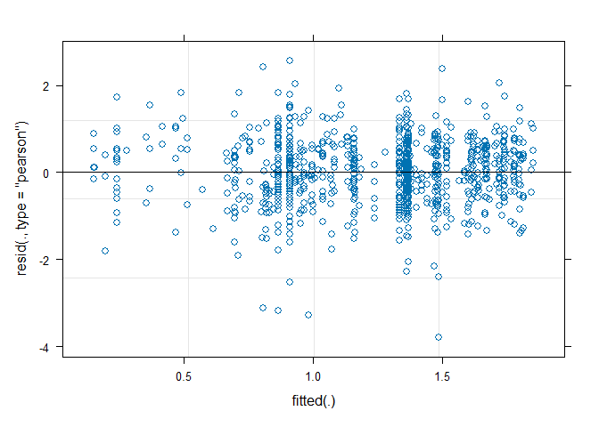
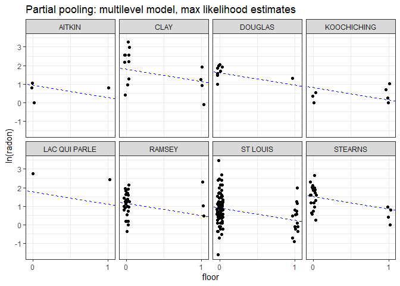
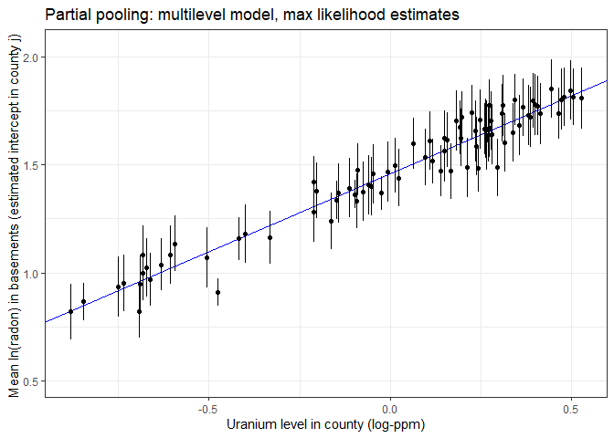
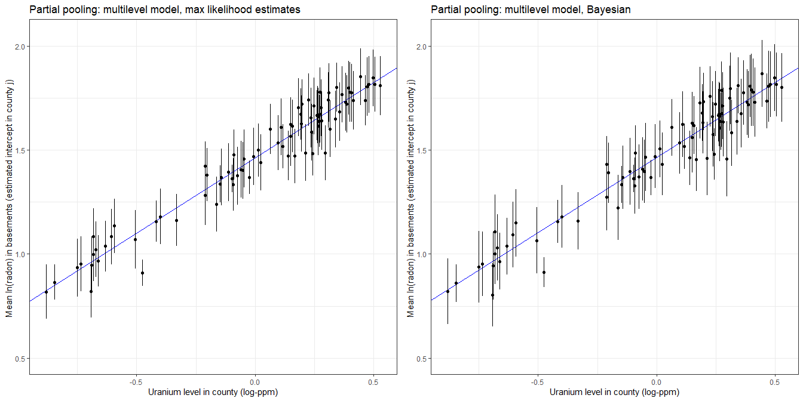

Multilevel model of radon levels M3
================
Brett Melbourne
1 Nov 2018 (updated 14 Nov 2024)

Chapter 12 of Gelman & Hill

For data source see:

- `data/radon_MN_about.txt`
- `data/radon_MN_U_about.txt`

This is part 4: M3 county-level predictor (G&H 12.6). Part 1 was EDA.
Part 2 (M1) introduced partial pooling and shrinkage (G&H 12.2). Part 3
(M2) considered a house-level predictor (G&H 12.3-4). Here, we add a
county-level predictor (G&H 12.6) focusing on the partial pooling model,
both likelihood and Bayesian.

``` r
library(lme4)      #max lik multilevel: lmer(), glmer() etc
library(arm)       #for se.ranef()
library(ggplot2)
library(gridExtra) #arranging multiple plots
library(dplyr)
library(rstanarm)  #Bayesian multilevel: stan_lmer(), stan_glmer() etc
options(mc.cores=parallel::detectCores())
theme_set(theme_bw())
```

Read in data and manipulate as required for analysis (see scripts for M1
& M2)

``` r
radon_dat <- read.csv("data/radon_MN.csv")
radon_dat$log_radon <- log(ifelse(radon_dat$radon==0, 0.1, radon_dat$radon))
radon_dat$county <- factor(radon_dat$county)
radon_dat$floor_x <- ifelse(radon_dat$floor=="basement", 0, 1)
head(radon_dat)
```

    ##      floor radon county log_radon floor_x
    ## 1    first   2.2 AITKIN 0.7884574       1
    ## 2 basement   2.2 AITKIN 0.7884574       0
    ## 3 basement   2.9 AITKIN 1.0647107       0
    ## 4 basement   1.0 AITKIN 0.0000000       0
    ## 5 basement   3.1  ANOKA 1.1314021       0
    ## 6 basement   2.5  ANOKA 0.9162907       0

### G&H 12.6. Analysis adding a county level predictor (uranium)

The predictor at the county level is uranium. That is, measurement of
uranium was not done house by house. The dataset has just one value for
uranium per county.

``` r
uranium_dat <- read.csv("data/radon_MN_U.csv")
head(uranium_dat)
```

    ##      county     uppm
    ## 1    AITKIN 0.502054
    ## 2     ANOKA 0.428565
    ## 3    BECKER 0.892741
    ## 4  BELTRAMI 0.552472
    ## 5    BENTON 0.866849
    ## 6 BIG STONE 1.472640

Log uranium

``` r
uranium_dat$logu <- log(uranium_dat$uppm)
```

Plot the uranium data. This is a predictor variable, so we are not
necessarily interested in its distribution (thus, I do not choose a
histogram here).

``` r
plot(x=sort(uranium_dat$logu), y=1:85, yaxt="n",
     ylab="County (ordered)", xlab="Log( uranium (ppm) )")
```

<!-- -->

I don’t see anything untoward in this plot.

Perhaps counter-intuitively, we now add these county-scale uranium data
to the dataframe that contains all our other data. The data will then be
in a tidy data format. Each row contains an observation for the level of
radon in a house but we add a column for the county-scale uranium
associated with each house. This means that the county-scale uranium
values are repeated multiple times in the dataset. This might feel like
cheating: aren’t we pretending there are more uranium data than we
actually have? No, we’re not. There is no problem here because uranium
will be a predictor variable. Furthermore, in the multilevel model,
we’ll be estimating the effect of uranium (*logu*) at the appropriate
scale by including *county* as a grouping variable.

``` r
radon_dat <- radon_dat |>
    left_join(uranium_dat, by="county")
radon_dat[sample(1:nrow(radon_dat), 50),] #print a sample of 50 rows to check
```

    ##        floor radon     county  log_radon floor_x     uppm        logu
    ## 371 basement   8.5    HOUSTON  2.1400662       0 1.654550  0.50352907
    ## 178 basement   8.2     DAKOTA  2.1041342       0 0.976144 -0.02414516
    ## 492    first   3.0   MORRISON  1.0986123       1 0.910987 -0.09322665
    ## 908 basement   2.1     WRIGHT  0.7419373       0 0.913909 -0.09002427
    ## 580    first   1.6     RAMSEY  0.4700036       1 0.658327 -0.41805351
    ## 132    first   2.5       CLAY  0.9162907       1 1.410270  0.34378118
    ## 123    first   0.9       CLAY -0.1053605       1 1.410270  0.34378118
    ## 294 basement   8.6   HENNEPIN  2.1517622       0 0.907991 -0.09652081
    ## 228 basement   6.4    DOUGLAS  1.8562980       0 1.168490  0.15571232
    ## 69     first   2.9     BENTON  1.0647107       1 0.866849 -0.14289048
    ## 62  basement   5.7   BELTRAMI  1.7404662       0 0.552472 -0.59335253
    ## 547    first  12.6 OTTER TAIL  2.5336968       1 0.814867 -0.20473037
    ## 733 basement   3.6   ST LOUIS  1.2809338       0 0.622088 -0.47467372
    ## 44     first   1.8      ANOKA  0.5877867       1 0.428565 -0.84731286
    ## 548 basement   3.2 OTTER TAIL  1.1631508       0 0.814867 -0.20473037
    ## 244 basement   4.2   FREEBORN  1.4350845       0 1.251330  0.22420699
    ## 305 basement   3.9   HENNEPIN  1.3609766       0 0.907991 -0.09652081
    ## 293 basement   1.5   HENNEPIN  0.4054651       0 0.907991 -0.09652081
    ## 902 basement   7.6     WINONA  2.0281482       0 1.589170  0.46321187
    ## 401 basement   3.8    KANABEC  1.3350011       0 0.948014 -0.05338601
    ## 740 basement   0.6   ST LOUIS -0.5108256       0 0.622088 -0.47467372
    ## 681 basement   8.7   ST LOUIS  2.1633230       0 0.622088 -0.47467372
    ## 666 basement   4.6   ST LOUIS  1.5260563       0 0.622088 -0.47467372
    ## 287 basement   3.9   HENNEPIN  1.3609766       0 0.907991 -0.09652081
    ## 479 basement  10.6     MCLEOD  2.3608540       0 1.150760  0.14042259
    ## 709 basement   1.5   ST LOUIS  0.4054651       0 0.622088 -0.47467372
    ## 766 basement   2.1   ST LOUIS  0.7419373       0 0.622088 -0.47467372
    ## 466 basement   1.5     MARTIN  0.4054651       0 1.180410  0.16586184
    ## 303 basement   2.1   HENNEPIN  0.7419373       0 0.907991 -0.09652081
    ## 476    first   1.6     MCLEOD  0.4700036       1 1.150760  0.14042259
    ## 799 basement   3.7    STEARNS  1.3083328       0 1.123440  0.11639541
    ## 457 basement  48.2   MARSHALL  3.8753590       0 1.013860  0.01376483
    ## 365 basement   4.2   HENNEPIN  1.4350845       0 0.907991 -0.09652081
    ## 728    first   7.2   ST LOUIS  1.9740810       1 0.622088 -0.47467372
    ## 301 basement   2.5   HENNEPIN  0.9162907       0 0.907991 -0.09652081
    ## 785    first   1.0    STEARNS  0.0000000       1 1.123440  0.11639541
    ## 513 basement  15.7   NICOLLET  2.7536607       0 1.281520  0.24804687
    ## 272 basement  11.2   HENNEPIN  2.4159138       0 0.907991 -0.09652081
    ## 650 basement   5.1  SHERBURNE  1.6292405       0 0.504879 -0.68343648
    ## 242 basement   3.2   FREEBORN  1.1631508       0 1.251330  0.22420699
    ## 229    first   3.7    DOUGLAS  1.3083328       1 1.168490  0.15571232
    ## 734 basement   0.8   ST LOUIS -0.2231436       0 0.622088 -0.47467372
    ## 194 basement  21.2     DAKOTA  3.0540012       0 0.976144 -0.02414516
    ## 173 basement   3.5     DAKOTA  1.2527630       0 0.976144 -0.02414516
    ## 516 basement   9.7     NOBLES  2.2721259       0 1.499980  0.40545177
    ## 885 basement   6.6 WASHINGTON  1.8870696       0 0.862876 -0.14748428
    ## 8   basement   1.0      ANOKA  0.0000000       0 0.428565 -0.84731286
    ## 601 basement   1.0     RAMSEY  0.0000000       0 0.658327 -0.41805351
    ## 436 basement   3.9   LE SUEUR  1.3609766       0 1.214640  0.19444774
    ## 264 basement   6.7    GOODHUE  1.9021075       0 1.217270  0.19661065

Alternatively, we could have used the function `merge` from base R

``` r
radon_dat <- merge(radon_dat, uranium_dat, by="county", all.x=TRUE)
```

or, explicitly row by row using a for loop

``` r
for ( i in 1:nrow(radon_dat) ) {
    radon_dat$logu[i] <- uranium_dat$logu[uranium_dat$county==radon_dat$county[i]]
}
```

#### Partial pooling: multilevel model

In the multilevel model, we model the variation among counties in the
intercept but now we allow the intercept to be a function of the uranium
level in the county.

``` r
ppfit <- lmer(log_radon ~ floor_x + logu + (1|county), REML=FALSE, data=radon_dat)
```

The deviations of the county intercepts from the county-scale mean
intercept will be modeled as a Normally distributed random variable.

Residual plot looks fine.

``` r
plot(ppfit)
```

<!-- -->

As in the model without a predictor, in the summary we have estimates
for two levels (or scales) of variance, county (among counties) and
residual (among houses within counties):

``` r
summary(ppfit)
```

    ## Linear mixed model fit by maximum likelihood  ['lmerMod']
    ## Formula: log_radon ~ floor_x + logu + (1 | county)
    ##    Data: radon_dat
    ## 
    ##      AIC      BIC   logLik deviance df.resid 
    ##   2132.8   2156.9  -1061.4   2122.8      914 
    ## 
    ## Scaled residuals: 
    ##     Min      1Q  Median      3Q     Max 
    ## -4.9976 -0.6163  0.0307  0.6561  3.3794 
    ## 
    ## Random effects:
    ##  Groups   Name        Variance Std.Dev.
    ##  county   (Intercept) 0.02127  0.1458  
    ##  Residual             0.57499  0.7583  
    ## Number of obs: 919, groups:  county, 85
    ## 
    ## Fixed effects:
    ##             Estimate Std. Error t value
    ## (Intercept)  1.46427    0.03714  39.421
    ## floor_x     -0.66644    0.06865  -9.708
    ## logu         0.72320    0.08965   8.067
    ## 
    ## Correlation of Fixed Effects:
    ##         (Intr) flor_x
    ## floor_x -0.361       
    ## logu     0.154 -0.011

Compared to our previous analysis without uranium (*logu*) as a
county-level predictor, the county-level variance is now markedly
reduced. The county-level variance (0.02) is now about five times less
than without uranium as a predictor (0.1, see M1 script) because *logu*
is accounting for most of the county-level variance.

The following will extract the fixed effects (the estimates of
$\beta_0$, $\beta_1$, $\beta_2$):

``` r
fixef(ppfit)
```

    ## (Intercept)     floor_x        logu 
    ##   1.4642651  -0.6664446   0.7232005

The following will extract the random effects (or county errors,
i.e. the deviations of each county from $\beta_0$, the county-scale
mean):

``` r
ranef(ppfit)$county
```

    ##                     (Intercept)
    ## AITKIN            -0.0179049553
    ## ANOKA              0.0132967914
    ## BECKER             0.0110287558
    ## BELTRAMI           0.1000862363
    ## BENTON             0.0074905000
    ## BIG STONE         -0.0230891610
    ## BLUE EARTH         0.1172682332
    ## BROWN              0.0383440827
    ## CARLTON           -0.0611033042
    ## CARVER             0.0005928621
    ## CASS               0.0587970219
    ## CHIPPEWA           0.0087706144
    ## CHISAGO            0.0192948986
    ## CLAY               0.0887146888
    ## CLEARWATER        -0.0141831962
    ## COOK              -0.0299061999
    ## COTTONWOOD        -0.0612961327
    ## CROW WING          0.0313021006
    ## DAKOTA            -0.0783189236
    ## DODGE              0.0145052057
    ## DOUGLAS            0.0377374237
    ## FARIBAULT         -0.1906697471
    ## FILLMORE          -0.0269580812
    ## FREEBORN           0.1156793235
    ## GOODHUE            0.1148136002
    ## HENNEPIN          -0.0314492806
    ## HOUSTON           -0.0132743951
    ## HUBBARD            0.0053968655
    ## ISANTI             0.0135324582
    ## ITASCA            -0.0169968356
    ## JACKSON            0.0519434864
    ## KANABEC           -0.0244053538
    ## KANDIYOHI          0.0667917505
    ## KITTSON            0.0095636906
    ## KOOCHICHING       -0.0078641968
    ## LAC QUI PARLE      0.0855960132
    ## LAKE              -0.1418611800
    ## LAKE OF THE WOODS  0.1120497108
    ## LE SUEUR           0.0206570459
    ## LINCOLN            0.0665354713
    ## LYON               0.0480987057
    ## MAHNOMEN          -0.0075429376
    ## MARSHALL           0.0244664122
    ## MARTIN            -0.1133097791
    ## MCLEOD            -0.0932052603
    ## MEEKER            -0.0416670319
    ## MILLE LACS        -0.0313718174
    ## MORRISON          -0.0636185948
    ## MOWER              0.0132526872
    ## MURRAY             0.0264114516
    ## NICOLLET           0.0671959196
    ## NOBLES             0.0169994943
    ## NORMAN            -0.0422783415
    ## OLMSTED           -0.1564744846
    ## OTTER TAIL         0.0642764988
    ## PENNINGTON        -0.0345269336
    ## PINE              -0.1076987708
    ## PIPESTONE          0.0047696890
    ## POLK               0.0048996570
    ## POPE              -0.0267387480
    ## RAMSEY            -0.0044843852
    ## REDWOOD            0.0379256899
    ## RENVILLE          -0.0086726566
    ## RICE               0.0691085347
    ## ROCK              -0.0376774205
    ## ROSEAU             0.1105065369
    ## SCOTT              0.0898010353
    ## SHERBURNE          0.0274040943
    ## SIBLEY            -0.0506964759
    ## ST LOUIS          -0.2115118076
    ## STEARNS           -0.0313500327
    ## STEELE            -0.0214618586
    ## STEVENS           -0.0008935427
    ## SWIFT             -0.0909600970
    ## TODD               0.0274960635
    ## TRAVERSE           0.0220112930
    ## WABASHA            0.0495946579
    ## WADENA             0.0446046828
    ## WASECA            -0.1310090098
    ## WASHINGTON        -0.0213916011
    ## WATONWAN           0.1075369683
    ## WILKIN             0.0212238364
    ## WINONA            -0.0613104471
    ## WRIGHT             0.0785885116
    ## YELLOW MEDICINE   -0.0368282736

The function `coef()` will return the county coefficients. Here are the
first six:

``` r
head(coef(ppfit)$county)
```

    ##           (Intercept)    floor_x      logu
    ## AITKIN       1.446360 -0.6664446 0.7232005
    ## ANOKA        1.477562 -0.6664446 0.7232005
    ## BECKER       1.475294 -0.6664446 0.7232005
    ## BELTRAMI     1.564351 -0.6664446 0.7232005
    ## BENTON       1.471756 -0.6664446 0.7232005
    ## BIG STONE    1.441176 -0.6664446 0.7232005

The first coefficient column here (`(Intercept)`) is the sum of the
overall intercept $\beta_0$ and the county random effects. That is:

``` r
head(fixef(ppfit)[1] + ranef(ppfit)$county)
```

    ##           (Intercept)
    ## AITKIN       1.446360
    ## ANOKA        1.477562
    ## BECKER       1.475294
    ## BELTRAMI     1.564351
    ## BENTON       1.471756
    ## BIG STONE    1.441176

We will use `coef()` next to form a dataframe for plotting.

Plot the fitted model (G&H Fig. 12.5) for 8 selected counties:

``` r
pp_pred_df <- data.frame(coef(ppfit)$county,
                         se.ranef(ppfit)$county[,1],
                         unique(radon_dat$county))
names(pp_pred_df) <- c("cty_mn","beta_1","beta_2","cty_se","county")

# Calculate the intercepts for each county (this will be the log(radon) level in
# a basement):
pp_pred_df$cty_mn <- pp_pred_df$cty_mn + pp_pred_df$beta_2 * uranium_dat$logu

# Add uranium data to the county-scale results dataframe
pp_pred_df <- cbind(pp_pred_df, uranium_dat[,-1])

display8 <- c("LAC QUI PARLE","AITKIN","KOOCHICHING","DOUGLAS","CLAY","STEARNS",
              "RAMSEY","ST LOUIS")
radon_dat |>
    filter(county %in% display8) |>
    ggplot() +
    geom_abline(data=filter(pp_pred_df, county %in% display8),
                mapping=aes(slope=beta_1, intercept=cty_mn), col="blue", lty=2) +
    geom_point(mapping=aes(x=jitter(floor_x, 0.2), y=log_radon)) +
    scale_x_continuous(breaks=c(0,1)) +
    facet_wrap(facets=vars(county), ncol=4) +
    labs(x="floor", y="ln(radon)",
         title="Partial pooling: multilevel model, max likelihood estimates")
```

<!-- -->

These estimates are not very different from the analysis that did not
include uranium as a predictor (see previous script for M2). The
difference is that the intercepts in each panel are now partly predicted
by the uranium level in a county.

Plot the estimated intercepts (G&H Fig. 12.6):

``` r
gh12.6 <- 
    pp_pred_df |>
    ggplot() +
    geom_abline(intercept=fixef(ppfit)[1], slope=fixef(ppfit)[3], col="blue") +
    geom_point(mapping=aes(x=logu, y=cty_mn)) +
    geom_linerange(mapping=aes(x=logu,
                               ymin=cty_mn - cty_se,
                               ymax=cty_mn + cty_se)) +
    ylim(0.5, 2.05) +
    labs(x="Uranium level in county (log-ppm)",
         y="Mean ln(radon) in basements (estimated intercept in county j) ",
         title="Partial pooling: multilevel model, max likelihood estimates")
gh12.6
```

<!-- -->

This plot is the same as in Fig. 12.6 of G&H, except that their plot
appears to be for the radon level on the first floor rather than the
basement (thus their plot is not strictly for the intercepts as labelled
on their y-axis). The estimated intercepts are the log(radon) levels in
basements.

#### Bayesian fit of multilevel model

The Bayesian fit is straightforward but may take a minute or two.

``` r
ppfit_bayes <- stan_lmer(log_radon ~ floor_x + logu + (1|county), data=radon_dat)
```

Print a selection of columns from the summary

``` r
print(summary(ppfit_bayes)[,c("mean","sd","n_eff","Rhat")], digits=3)
```

    ##                                              mean     sd n_eff  Rhat
    ## (Intercept)                              1.47e+00 0.0400  3203 1.000
    ## floor_x                                 -6.69e-01 0.0680  5430 1.000
    ## logu                                     7.21e-01 0.0952  3281 1.000
    ## b[(Intercept) county:AITKIN]            -2.41e-02 0.1505  5441 0.999
    ## b[(Intercept) county:ANOKA]              5.75e-03 0.1034  3534 1.000
    ## b[(Intercept) county:BECKER]             1.42e-02 0.1549  5516 0.999
    ## b[(Intercept) county:BELTRAMI]           1.12e-01 0.1498  3800 1.000
    ## b[(Intercept) county:BENTON]             6.53e-03 0.1464  5273 1.000
    ## b[(Intercept) county:BIG_STONE]         -2.73e-02 0.1532  5548 1.000
    ## b[(Intercept) county:BLUE_EARTH]         1.26e-01 0.1326  3495 1.001
    ## b[(Intercept) county:BROWN]              4.72e-02 0.1535  5809 1.000
    ## b[(Intercept) county:CARLTON]           -6.71e-02 0.1375  4978 1.000
    ## b[(Intercept) county:CARVER]            -7.48e-04 0.1430  5594 1.000
    ## b[(Intercept) county:CASS]               6.57e-02 0.1453  5130 1.000
    ## b[(Intercept) county:CHIPPEWA]           1.29e-02 0.1566  6237 1.000
    ## b[(Intercept) county:CHISAGO]            1.82e-02 0.1433  6271 1.000
    ## b[(Intercept) county:CLAY]               9.55e-02 0.1305  3989 1.000
    ## b[(Intercept) county:CLEARWATER]        -1.45e-02 0.1475  6194 1.000
    ## b[(Intercept) county:COOK]              -3.63e-02 0.1549  5642 0.999
    ## b[(Intercept) county:COTTONWOOD]        -7.31e-02 0.1549  4942 1.000
    ## b[(Intercept) county:CROW_WING]          2.89e-02 0.1298  6125 0.999
    ## b[(Intercept) county:DAKOTA]            -8.08e-02 0.0884  4507 1.000
    ## b[(Intercept) county:DODGE]              1.64e-02 0.1479  6292 0.999
    ## b[(Intercept) county:DOUGLAS]            4.08e-02 0.1348  5588 1.000
    ## b[(Intercept) county:FARIBAULT]         -2.22e-01 0.1776  2072 1.000
    ## b[(Intercept) county:FILLMORE]          -3.50e-02 0.1582  5446 1.000
    ## b[(Intercept) county:FREEBORN]           1.30e-01 0.1414  2837 1.000
    ## b[(Intercept) county:GOODHUE]            1.25e-01 0.1342  3413 1.001
    ## b[(Intercept) county:HENNEPIN]          -3.40e-02 0.0723  4264 1.000
    ## b[(Intercept) county:HOUSTON]           -1.43e-02 0.1453  5566 1.000
    ## b[(Intercept) county:HUBBARD]            3.48e-03 0.1440  6533 1.000
    ## b[(Intercept) county:ISANTI]             1.44e-02 0.1547  6271 1.000
    ## b[(Intercept) county:ITASCA]            -2.15e-02 0.1299  4983 1.000
    ## b[(Intercept) county:JACKSON]            6.01e-02 0.1509  4443 1.000
    ## b[(Intercept) county:KANABEC]           -3.07e-02 0.1494  6059 1.000
    ## b[(Intercept) county:KANDIYOHI]          7.83e-02 0.1537  3771 1.000
    ## b[(Intercept) county:KITTSON]            9.86e-03 0.1479  5469 0.999
    ## b[(Intercept) county:KOOCHICHING]       -9.43e-03 0.1473  5761 1.000
    ## b[(Intercept) county:LAC_QUI_PARLE]      1.06e-01 0.1634  3353 1.001
    ## b[(Intercept) county:LAKE]              -1.63e-01 0.1512  3225 1.001
    ## b[(Intercept) county:LAKE_OF_THE_WOODS]  1.33e-01 0.1620  3250 1.000
    ## b[(Intercept) county:LE_SUEUR]           2.62e-02 0.1457  5860 1.000
    ## b[(Intercept) county:LINCOLN]            8.04e-02 0.1508  4090 1.000
    ## b[(Intercept) county:LYON]               5.67e-02 0.1433  5982 1.000
    ## b[(Intercept) county:MAHNOMEN]          -1.44e-02 0.1630  6369 1.000
    ## b[(Intercept) county:MARSHALL]           2.93e-02 0.1335  5341 1.000
    ## b[(Intercept) county:MARTIN]            -1.30e-01 0.1521  3702 1.002
    ## b[(Intercept) county:MCLEOD]            -1.05e-01 0.1292  3873 1.000
    ## b[(Intercept) county:MEEKER]            -5.09e-02 0.1467  5873 1.000
    ## b[(Intercept) county:MILLE_LACS]        -4.06e-02 0.1572  5978 0.999
    ## b[(Intercept) county:MORRISON]          -7.02e-02 0.1327  5032 1.000
    ## b[(Intercept) county:MOWER]              1.29e-02 0.1225  7030 0.999
    ## b[(Intercept) county:MURRAY]             3.53e-02 0.1633  4635 1.000
    ## b[(Intercept) county:NICOLLET]           7.73e-02 0.1503  4571 0.999
    ## b[(Intercept) county:NOBLES]             1.91e-02 0.1532  5449 1.000
    ## b[(Intercept) county:NORMAN]            -5.17e-02 0.1526  4922 1.000
    ## b[(Intercept) county:OLMSTED]           -1.62e-01 0.1238  2891 1.001
    ## b[(Intercept) county:OTTER_TAIL]         7.25e-02 0.1384  4505 1.000
    ## b[(Intercept) county:PENNINGTON]        -4.03e-02 0.1514  5695 0.999
    ## b[(Intercept) county:PINE]              -1.25e-01 0.1566  3862 1.000
    ## b[(Intercept) county:PIPESTONE]          5.41e-03 0.1467  6283 1.000
    ## b[(Intercept) county:POLK]               7.10e-03 0.1510  6153 1.000
    ## b[(Intercept) county:POPE]              -3.47e-02 0.1565  5228 1.000
    ## b[(Intercept) county:RAMSEY]            -7.30e-03 0.1041  5143 0.999
    ## b[(Intercept) county:REDWOOD]            4.67e-02 0.1460  5401 1.000
    ## b[(Intercept) county:RENVILLE]          -9.79e-03 0.1507  5879 0.999
    ## b[(Intercept) county:RICE]               7.34e-02 0.1324  5359 0.999
    ## b[(Intercept) county:ROCK]              -4.56e-02 0.1549  4599 1.000
    ## b[(Intercept) county:ROSEAU]             1.18e-01 0.1294  3769 1.000
    ## b[(Intercept) county:SCOTT]              9.72e-02 0.1328  3980 1.000
    ## b[(Intercept) county:SHERBURNE]          2.96e-02 0.1375  5564 0.999
    ## b[(Intercept) county:SIBLEY]            -6.21e-02 0.1492  4796 0.999
    ## b[(Intercept) county:ST_LOUIS]          -2.10e-01 0.0890  1767 1.002
    ## b[(Intercept) county:STEARNS]           -3.32e-02 0.1081  5234 1.000
    ## b[(Intercept) county:STEELE]            -2.33e-02 0.1328  6071 0.999
    ## b[(Intercept) county:STEVENS]            9.52e-04 0.1603  7096 1.000
    ## b[(Intercept) county:SWIFT]             -1.10e-01 0.1542  3628 1.000
    ## b[(Intercept) county:TODD]               3.37e-02 0.1582  6734 0.999
    ## b[(Intercept) county:TRAVERSE]           2.34e-02 0.1508  5415 0.999
    ## b[(Intercept) county:WABASHA]            5.59e-02 0.1413  5221 1.000
    ## b[(Intercept) county:WADENA]             5.00e-02 0.1449  5050 1.000
    ## b[(Intercept) county:WASECA]            -1.60e-01 0.1739  2747 1.000
    ## b[(Intercept) county:WASHINGTON]        -2.46e-02 0.0919  5610 0.999
    ## b[(Intercept) county:WATONWAN]           1.29e-01 0.1648  3010 1.000
    ## b[(Intercept) county:WILKIN]             2.59e-02 0.1594  6088 1.000
    ## b[(Intercept) county:WINONA]            -6.38e-02 0.1279  4919 1.000
    ## b[(Intercept) county:WRIGHT]             8.51e-02 0.1284  4868 0.999
    ## b[(Intercept) county:YELLOW_MEDICINE]   -4.57e-02 0.1587  4929 1.000
    ## sigma                                    7.59e-01 0.0183  4722 0.999
    ## Sigma[county:(Intercept),(Intercept)]    2.75e-02 0.0167  1142 1.002
    ## mean_PPD                                 1.22e+00 0.0354  5028 0.999
    ## log-posterior                           -1.18e+03 9.2298   643 1.007

We see that the `Rhat`s are all close to 1, suggesting the chains have
converged, and the effective number of replicates `n_eff` is high or
maximal. The parameter estimates are very similar to the maximum
likelihood fit. The parameterization is important though: `sigma` with a
small “s” is the standard deviation at the lowest scale, whereas `Sigma`
with a big “S” is the variance at the county scale. You need to square
`sigma` to obtain the variance and compare with the residual variance in
the frequentist analysis, whereas `Sigma` is directly comparable with
the county variance in the frequentist analysis.

Diagnostics: inspect convergence, histograms for posteriors etc

``` r
launch_shinystan(ppfit_bayes)
```

The diagnostics look good. Trace plots show convergence. Histograms of
parameters are all fairly smooth and symmetric. The one exception is the
county `Sigma`, which has a longer right-tailed distribution. That’s
because `Sigma` is a variance, which typically have such a distribution.

Extract posterior samples:

``` r
samples <- as.data.frame(ppfit_bayes$stanfit)
names(samples)
```

    ##  [1] "(Intercept)"                            
    ##  [2] "floor_x"                                
    ##  [3] "logu"                                   
    ##  [4] "b[(Intercept) county:AITKIN]"           
    ##  [5] "b[(Intercept) county:ANOKA]"            
    ##  [6] "b[(Intercept) county:BECKER]"           
    ##  [7] "b[(Intercept) county:BELTRAMI]"         
    ##  [8] "b[(Intercept) county:BENTON]"           
    ##  [9] "b[(Intercept) county:BIG_STONE]"        
    ## [10] "b[(Intercept) county:BLUE_EARTH]"       
    ## [11] "b[(Intercept) county:BROWN]"            
    ## [12] "b[(Intercept) county:CARLTON]"          
    ## [13] "b[(Intercept) county:CARVER]"           
    ## [14] "b[(Intercept) county:CASS]"             
    ## [15] "b[(Intercept) county:CHIPPEWA]"         
    ## [16] "b[(Intercept) county:CHISAGO]"          
    ## [17] "b[(Intercept) county:CLAY]"             
    ## [18] "b[(Intercept) county:CLEARWATER]"       
    ## [19] "b[(Intercept) county:COOK]"             
    ## [20] "b[(Intercept) county:COTTONWOOD]"       
    ## [21] "b[(Intercept) county:CROW_WING]"        
    ## [22] "b[(Intercept) county:DAKOTA]"           
    ## [23] "b[(Intercept) county:DODGE]"            
    ## [24] "b[(Intercept) county:DOUGLAS]"          
    ## [25] "b[(Intercept) county:FARIBAULT]"        
    ## [26] "b[(Intercept) county:FILLMORE]"         
    ## [27] "b[(Intercept) county:FREEBORN]"         
    ## [28] "b[(Intercept) county:GOODHUE]"          
    ## [29] "b[(Intercept) county:HENNEPIN]"         
    ## [30] "b[(Intercept) county:HOUSTON]"          
    ## [31] "b[(Intercept) county:HUBBARD]"          
    ## [32] "b[(Intercept) county:ISANTI]"           
    ## [33] "b[(Intercept) county:ITASCA]"           
    ## [34] "b[(Intercept) county:JACKSON]"          
    ## [35] "b[(Intercept) county:KANABEC]"          
    ## [36] "b[(Intercept) county:KANDIYOHI]"        
    ## [37] "b[(Intercept) county:KITTSON]"          
    ## [38] "b[(Intercept) county:KOOCHICHING]"      
    ## [39] "b[(Intercept) county:LAC_QUI_PARLE]"    
    ## [40] "b[(Intercept) county:LAKE]"             
    ## [41] "b[(Intercept) county:LAKE_OF_THE_WOODS]"
    ## [42] "b[(Intercept) county:LE_SUEUR]"         
    ## [43] "b[(Intercept) county:LINCOLN]"          
    ## [44] "b[(Intercept) county:LYON]"             
    ## [45] "b[(Intercept) county:MAHNOMEN]"         
    ## [46] "b[(Intercept) county:MARSHALL]"         
    ## [47] "b[(Intercept) county:MARTIN]"           
    ## [48] "b[(Intercept) county:MCLEOD]"           
    ## [49] "b[(Intercept) county:MEEKER]"           
    ## [50] "b[(Intercept) county:MILLE_LACS]"       
    ## [51] "b[(Intercept) county:MORRISON]"         
    ## [52] "b[(Intercept) county:MOWER]"            
    ## [53] "b[(Intercept) county:MURRAY]"           
    ## [54] "b[(Intercept) county:NICOLLET]"         
    ## [55] "b[(Intercept) county:NOBLES]"           
    ## [56] "b[(Intercept) county:NORMAN]"           
    ## [57] "b[(Intercept) county:OLMSTED]"          
    ## [58] "b[(Intercept) county:OTTER_TAIL]"       
    ## [59] "b[(Intercept) county:PENNINGTON]"       
    ## [60] "b[(Intercept) county:PINE]"             
    ## [61] "b[(Intercept) county:PIPESTONE]"        
    ## [62] "b[(Intercept) county:POLK]"             
    ## [63] "b[(Intercept) county:POPE]"             
    ## [64] "b[(Intercept) county:RAMSEY]"           
    ## [65] "b[(Intercept) county:REDWOOD]"          
    ## [66] "b[(Intercept) county:RENVILLE]"         
    ## [67] "b[(Intercept) county:RICE]"             
    ## [68] "b[(Intercept) county:ROCK]"             
    ## [69] "b[(Intercept) county:ROSEAU]"           
    ## [70] "b[(Intercept) county:SCOTT]"            
    ## [71] "b[(Intercept) county:SHERBURNE]"        
    ## [72] "b[(Intercept) county:SIBLEY]"           
    ## [73] "b[(Intercept) county:ST_LOUIS]"         
    ## [74] "b[(Intercept) county:STEARNS]"          
    ## [75] "b[(Intercept) county:STEELE]"           
    ## [76] "b[(Intercept) county:STEVENS]"          
    ## [77] "b[(Intercept) county:SWIFT]"            
    ## [78] "b[(Intercept) county:TODD]"             
    ## [79] "b[(Intercept) county:TRAVERSE]"         
    ## [80] "b[(Intercept) county:WABASHA]"          
    ## [81] "b[(Intercept) county:WADENA]"           
    ## [82] "b[(Intercept) county:WASECA]"           
    ## [83] "b[(Intercept) county:WASHINGTON]"       
    ## [84] "b[(Intercept) county:WATONWAN]"         
    ## [85] "b[(Intercept) county:WILKIN]"           
    ## [86] "b[(Intercept) county:WINONA]"           
    ## [87] "b[(Intercept) county:WRIGHT]"           
    ## [88] "b[(Intercept) county:YELLOW_MEDICINE]"  
    ## [89] "b[(Intercept) county:_NEW_county]"      
    ## [90] "sigma"                                  
    ## [91] "Sigma[county:(Intercept),(Intercept)]"  
    ## [92] "mean_PPD"                               
    ## [93] "log-posterior"

``` r
samples_beta_0 <- samples$"(Intercept)" #Samples of overall mean
samples_beta_2 <- samples[,"logu"]
samples_b <- samples[,4:88] #Samples of county deviations. Samples by row, 85 cols
```

Algorithm for posterior samples of the county means in basements. This
is a derived quantity. County means in basements are

$$
\beta_0 + b + \beta_2 \mathrm{logu}
$$

so we’ll first derive posterior samples for the county mean and then
calculate summaries of their posterior distributions:

``` r
# Derive posterior samples for county means
countysamples <- samples_b * NA
for ( i in 1:85 ) {
    countysamples[,i] <- samples_beta_0 + samples_b[,i] + samples_beta_2 * uranium_dat$logu[i]
}
# Now calculate mean and standard deviation of the posterior distributions for
# the county means.
countypostmns <- rep(NA, 85)
countypostses <- rep(NA, 85)
for ( i in 1:85 ) {
    countypostmns[i] <- mean(countysamples[,i])
    countypostses[i] <- sd(countysamples[,i])
}
```

Plot of posterior means and standard deviations (and compare to the
maximum likelihood fit):

``` r
ppbayes_pred_df <- data.frame(cty_mn=countypostmns, cty_se=countypostses)
ppbayes_pred_df <- cbind(ppbayes_pred_df, uranium_dat) #Add U to the dataframe

gh12.6_bayes <-
    ppbayes_pred_df |>
    ggplot() +
    geom_abline(intercept=mean(samples_beta_0), slope=mean(samples_beta_2),
                col="blue") +
    geom_point(mapping=aes(x=logu, y=cty_mn)) +
    geom_linerange(mapping=aes(x=logu,
                               ymin=cty_mn-cty_se,
                               ymax=cty_mn+cty_se)) +
    ylim(0.5, 2.05) +
    labs(x="Uranium level in county (log-ppm)",
         y="Mean ln(radon) in basements (estimated intercept in county j) ",
         title="Partial pooling: multilevel model, Bayesian")
grid.arrange(gh12.6, gh12.6_bayes, nrow = 1)
```

<!-- -->

Once again, the maximum likelihood and Bayesian model estimates are very
similar. However, the Bayesian model suggests slightly higher
uncertainty (larger standard errors) in the estimate of radon level in
each county (this is because the uncertainty in the variance parameters
is propagated to the posterior distribution for the county means,
whereas the variance parameters in the frequentist analysis, once
estimated, are assumed fixed).
