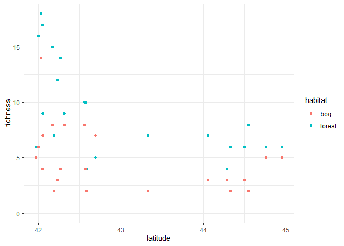
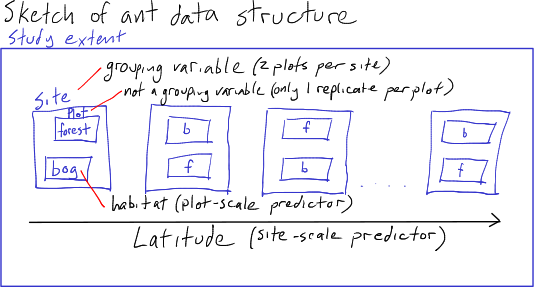
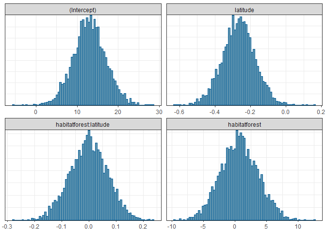
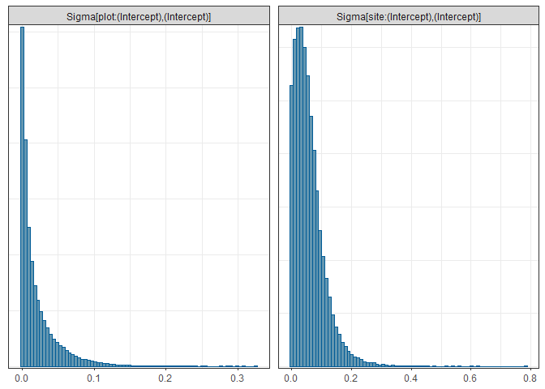
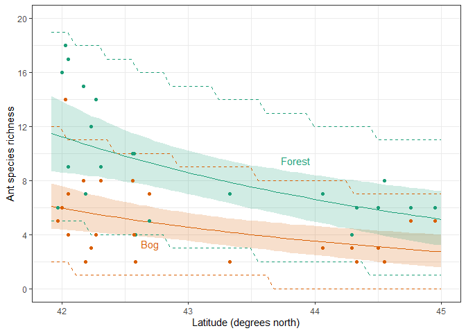
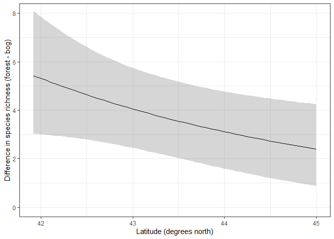

Ant data Generalized Linear Mixed Model
================
Brett Melbourne
11 Nov 2020 (minor updates 19 Nov 2024)

Seventh in a series of scripts to analyze the ant data described in
Ellison (2004). This script fits multilevel models to fully account for
the design structure. I’ll demonstrate both frequentist and Bayesian
approaches.

Set up (mostly for Bayesian analysis):

``` r
library(lme4)
library(ggplot2)
library(rstanarm)
library(bayesplot)
options(mc.cores=parallel::detectCores())
theme_set(theme_bw())
source("source/hpdi.R") #For calculating credible intervals
```

Read in and plot the data:

``` r
ant <- read.csv("data/ants.csv")
ant$habitat <- factor(ant$habitat)
ant |>
    ggplot(mapping=aes(x=latitude, y=richness, col=habitat)) +
    geom_point() +
    ylim(0,18)
```

<!-- -->

## GLMM

Recall that our first analysis was a GLM with Poisson distribution and
log link. The multilevel model will do the same. In the design, at each
site there are a pair of plots, one plot is a bog while the other is a
forest.

<figure>

<figcaption aria-hidden="true">ants_sketch</figcaption>
</figure>

Thus, *site* is a grouping variable, while *plot* is the data scale.
*Habitat type* is a predictor at the plot scale. *Latitude* is a
predictor at the site scale.

``` r
ant$site <- factor(ant$site)
```

We’ll first try a maximum likelihood fit using `glmer` but we’ll see
that the algorithm fails to converge (although the failed fit is pretty
close):

``` r
glmerHxL <- glmer(richness ~ habitat + latitude + habitat:latitude + (1|site),
                 family=poisson, data=ant)
```

    ## Warning in checkConv(attr(opt, "derivs"), opt$par, ctrl = control$checkConv, :
    ## Model failed to converge with max|grad| = 0.0139547 (tol = 0.002, component 1)

    ## Warning in checkConv(attr(opt, "derivs"), opt$par, ctrl = control$checkConv, : Model is nearly unidentifiable: very large eigenvalue
    ##  - Rescale variables?;Model is nearly unidentifiable: large eigenvalue ratio
    ##  - Rescale variables?

We get a warning suggesting to rescale variables. If we look at the
correlation matrix (`Correlation of Fixed Effects`), we see a very high
correlation (-1.000) between the `intercept` and `latitude` parameters,
and the `habitat` and `habitat:latitude` parameters:

``` r
summary(glmerHxL)
```

    ## Generalized linear mixed model fit by maximum likelihood (Laplace
    ##   Approximation) [glmerMod]
    ##  Family: poisson  ( log )
    ## Formula: richness ~ habitat + latitude + habitat:latitude + (1 | site)
    ##    Data: ant
    ## 
    ##      AIC      BIC   logLik deviance df.resid 
    ##    216.4    225.3   -103.2    206.4       39 
    ## 
    ## Scaled residuals: 
    ##      Min       1Q   Median       3Q      Max 
    ## -1.28068 -0.61850 -0.02911  0.54244  1.94715 
    ## 
    ## Random effects:
    ##  Groups Name        Variance Std.Dev.
    ##  site   (Intercept) 0.04704  0.2169  
    ## Number of obs: 44, groups:  site, 22
    ## 
    ## Fixed effects:
    ##                        Estimate Std. Error z value Pr(>|z|)   
    ## (Intercept)             12.2065     4.7298   2.581  0.00986 **
    ## habitatforest            1.7596     5.3706   0.328  0.74319   
    ## latitude                -0.2483     0.1105  -2.248  0.02457 * 
    ## habitatforest:latitude  -0.0263     0.1256  -0.209  0.83416   
    ## ---
    ## Signif. codes:  0 '***' 0.001 '**' 0.01 '*' 0.05 '.' 0.1 ' ' 1
    ## 
    ## Correlation of Fixed Effects:
    ##             (Intr) hbttfr latitd
    ## habitatfrst -0.734              
    ## latitude    -1.000  0.735       
    ## hbttfrst:lt  0.734 -1.000 -0.735
    ## optimizer (Nelder_Mead) convergence code: 0 (OK)
    ## Model failed to converge with max|grad| = 0.0139547 (tol = 0.002, component 1)
    ## Model is nearly unidentifiable: very large eigenvalue
    ##  - Rescale variables?
    ## Model is nearly unidentifiable: large eigenvalue ratio
    ##  - Rescale variables?

So, indeed this correlation might be the problem. Scaling and centering
latitude fixes convergence.

``` r
ant$latitude_s <- scale(ant$latitude)
glmerHxL <- glmer(richness ~ habitat + latitude_s + habitat:latitude_s + (1|site),
                 family=poisson, data=ant)
```

In the summary, we see we have a random effect term: the variance at the
site scale, which is quite small.

``` r
summary(glmerHxL)
```

    ## Generalized linear mixed model fit by maximum likelihood (Laplace
    ##   Approximation) [glmerMod]
    ##  Family: poisson  ( log )
    ## Formula: richness ~ habitat + latitude_s + habitat:latitude_s + (1 | site)
    ##    Data: ant
    ## 
    ##      AIC      BIC   logLik deviance df.resid 
    ##    216.4    225.3   -103.2    206.4       39 
    ## 
    ## Scaled residuals: 
    ##      Min       1Q   Median       3Q      Max 
    ## -1.28067 -0.61790 -0.02882  0.54285  1.94512 
    ## 
    ## Random effects:
    ##  Groups Name        Variance Std.Dev.
    ##  site   (Intercept) 0.04703  0.2169  
    ## Number of obs: 44, groups:  site, 22
    ## 
    ## Fixed effects:
    ##                          Estimate Std. Error z value Pr(>|z|)    
    ## (Intercept)                1.5239     0.1111  13.713   <2e-16 ***
    ## habitatforest              0.6285     0.1240   5.069    4e-07 ***
    ## latitude_s                -0.2666     0.1182  -2.255   0.0241 *  
    ## habitatforest:latitude_s  -0.0271     0.1343  -0.202   0.8401    
    ## ---
    ## Signif. codes:  0 '***' 0.001 '**' 0.01 '*' 0.05 '.' 0.1 ' ' 1
    ## 
    ## Correlation of Fixed Effects:
    ##             (Intr) hbttfr lttd_s
    ## habitatfrst -0.726              
    ## latitude_s   0.210 -0.195       
    ## hbttfrst:l_ -0.192  0.274 -0.735

Let’s compare to the fit without the site grouping structure. We see
that parameter estimates are almost the same.

``` r
summary(glm(richness ~ habitat + latitude_s + habitat:latitude_s,
    family=poisson, data=ant))
```

    ## 
    ## Call:
    ## glm(formula = richness ~ habitat + latitude_s + habitat:latitude_s, 
    ##     family = poisson, data = ant)
    ## 
    ## Coefficients:
    ##                          Estimate Std. Error z value Pr(>|z|)    
    ## (Intercept)               1.54619    0.10038  15.404  < 2e-16 ***
    ## habitatforest             0.62826    0.12449   5.047 4.49e-07 ***
    ## latitude_s               -0.27937    0.11024  -2.534   0.0113 *  
    ## habitatforest:latitude_s -0.02807    0.13706  -0.205   0.8377    
    ## ---
    ## Signif. codes:  0 '***' 0.001 '**' 0.01 '*' 0.05 '.' 0.1 ' ' 1
    ## 
    ## (Dispersion parameter for poisson family taken to be 1)
    ## 
    ##     Null deviance: 102.763  on 43  degrees of freedom
    ## Residual deviance:  50.242  on 40  degrees of freedom
    ## AIC: 218.6
    ## 
    ## Number of Fisher Scoring iterations: 4

So, why should we include the grouping term? First, because it is part
of the sample design. Thus, we know it is a contributing factor. This is
already a fact of the design and we can’t explain it away, for example,
with a non-significant hypothesis test for an effect of site. Second, we
see that the autocorrelation due to site has an effect on the
uncertainty of the latitude parameter. The mixed-effects model estimates
the latitude effect (see `latitude_s` parameter) as smaller with more
uncertainty (greater standard error), and a larger p-value for its
null-hypothesis test. This is because there is effectively less
replication of latitude because latitude occurs at the site scale and
plots within sites are pseudoreplicates with respect to latitude.
However, the correlation of plots within sites is not high (i.e. the
random effect variance is low), so plots within sites seem mostly
independent and hence these adjustments for dependence are relatively
small.

Now turning to the Bayesian model. We have the same likelihood but we
now have weakly informative priors as well (using here the sensible
default priors). If we did this analysis with the scaled latitude
variable we would see that the Bayesian analysis is substantially
similar to the frequentist one. However, recall that in `rstanarm`, the
predictor variables are rescaled automatically, so we’ll use the
unscaled latitude variable for convenience as it will return results on
the original scale, saving us from carrying out the back-conversions. We
see that the site random effect is estimated as almost the same as the
likelihood estimate above.

``` r
bayesHxL <- stan_glmer(richness ~ habitat + latitude + habitat:latitude + (1|site), 
                       family=poisson, data=ant)
print(summary(bayesHxL)[,c("mean","sd","n_eff","Rhat")], digits=3)
```

    ##                                          mean     sd n_eff  Rhat
    ## (Intercept)                          1.30e+01 4.0075  1934 1.000
    ## habitatforest                        6.91e-01 2.9628  1909 1.000
    ## latitude                            -2.68e-01 0.0935  1945 1.000
    ## habitatforest:latitude              -1.24e-03 0.0693  1915 1.000
    ## b[(Intercept) site:ARC]              2.92e-02 0.1760  4018 1.000
    ## b[(Intercept) site:BH]               8.83e-02 0.1759  3614 1.000
    ## b[(Intercept) site:CAR]              1.12e-01 0.2050  3118 1.001
    ## b[(Intercept) site:CB]              -1.10e-01 0.1830  3832 1.000
    ## b[(Intercept) site:CHI]             -5.35e-02 0.2014  4049 1.000
    ## b[(Intercept) site:CKB]              3.57e-01 0.2117  1751 1.001
    ## b[(Intercept) site:COL]              3.92e-02 0.1996  3829 1.000
    ## b[(Intercept) site:HAW]             -2.85e-01 0.2307  2520 1.003
    ## b[(Intercept) site:HBC]              1.21e-01 0.1809  3027 1.002
    ## b[(Intercept) site:MOL]              1.27e-03 0.2010  4259 0.999
    ## b[(Intercept) site:MOO]              9.79e-02 0.2060  3625 1.000
    ## b[(Intercept) site:OB]              -3.22e-02 0.1748  3913 1.000
    ## b[(Intercept) site:PEA]             -9.31e-02 0.2100  3317 1.000
    ## b[(Intercept) site:PK]              -2.20e-01 0.2056  2913 1.000
    ## b[(Intercept) site:QP]              -2.47e-02 0.1753  3871 0.999
    ## b[(Intercept) site:RP]               1.72e-01 0.1817  2963 1.000
    ## b[(Intercept) site:SKP]              1.76e-01 0.1823  2701 1.001
    ## b[(Intercept) site:SNA]             -2.50e-03 0.1945  4297 1.000
    ## b[(Intercept) site:SPR]             -1.09e-01 0.1957  4469 1.000
    ## b[(Intercept) site:SWR]              5.26e-02 0.1747  3814 1.000
    ## b[(Intercept) site:TPB]             -1.83e-01 0.1975  3304 1.000
    ## b[(Intercept) site:WIN]             -6.93e-02 0.1843  5007 1.000
    ## Sigma[site:(Intercept),(Intercept)]  6.56e-02 0.0495  1491 1.004
    ## mean_PPD                             7.01e+00 0.5615  4779 0.999
    ## log-posterior                       -1.39e+02 5.2406  1019 1.005

Inspect diagnostics of the fit

``` r
launch_shinystan(bayesHxL)
```

In particular, the posterior distributions for the linear coefficients
$\beta_i$ are all nicely symmetric, as expected for this type of model.

``` r
mcmc_hist(as.array(bayesHxL), pars="(Intercept)", 
          regex_pars=c("latitude", "habitat"), bins=75)
```

<!-- -->

We could next form credible intervals and prediction intervals but we’ll
defer that to the overdispersed model below.

## Overdispersed model

In the Poisson model, the variance is by definition equal to the mean.
What if there is more variance than this? This situation is called
overdispersion. We can include any extra variance by using a plot-level
error term, which effectively makes the likelihood a Poisson-lognormal
model. Our multilevel model now has two extra levels of variance, a
plot-level variance and a site-level variance, in addition to the
Poisson variance. Including a plot-level variance in a multilevel model
is a very neat way to include extra variation in single parameter
distributions like the Poisson. I prefer it compared to other options
(such as using a negative binomial distribution) because the Normal
error variance is more interpretable and can be compared directly to
variances at other levels in the multilevel model.

First define a plot-level indicator. Plot is the lowest level in this
dataset, so this is effectively the row number of the dataset.

``` r
ant$plot <- factor(1:nrow(ant))
#ant$plot <- 1:nrow(ant) #works just as well not as factor
```

Fit the mixed effects model now including the plot random effect. The
overdispersed GLMM using `glmer` with the unstandardized latitude again
fails to converge.

``` r
glmer_odHxL <- glmer(richness ~ habitat + latitude + habitat:latitude + (1|site) + (1|plot),
                        family=poisson, data=ant)
```

    ## Warning in checkConv(attr(opt, "derivs"), opt$par, ctrl = control$checkConv, :
    ## Model failed to converge with max|grad| = 0.00686651 (tol = 0.002, component 1)

    ## Warning in checkConv(attr(opt, "derivs"), opt$par, ctrl = control$checkConv, : Model is nearly unidentifiable: very large eigenvalue
    ##  - Rescale variables?;Model is nearly unidentifiable: large eigenvalue ratio
    ##  - Rescale variables?

Failure to fit often happens with `glmer`. Given the error message, we
might guess the trouble is with the high parameter correlations. So,
let’s try rescaling latitude:

``` r
ant$latitude_s <- scale(ant$latitude)
glmer_odHxL_s <- glmer(richness ~ habitat + latitude_s + habitat:latitude_s + 
                       (1|site) + (1|plot), family=poisson, data=ant)
```

    ## boundary (singular) fit: see help('isSingular')

This fits successfully. There is a warning because the plot-scale
variance estimate (the overdispersion term) is near zero (i.e. near the
boundary of parameter space).

``` r
summary(glmer_odHxL_s)
```

    ## Generalized linear mixed model fit by maximum likelihood (Laplace
    ##   Approximation) [glmerMod]
    ##  Family: poisson  ( log )
    ## Formula: richness ~ habitat + latitude_s + habitat:latitude_s + (1 | site) +  
    ##     (1 | plot)
    ##    Data: ant
    ## 
    ##      AIC      BIC   logLik deviance df.resid 
    ##    218.4    229.1   -103.2    206.4       38 
    ## 
    ## Scaled residuals: 
    ##     Min      1Q  Median      3Q     Max 
    ## -1.2807 -0.6179 -0.0288  0.5428  1.9451 
    ## 
    ## Random effects:
    ##  Groups Name        Variance  Std.Dev. 
    ##  plot   (Intercept) 1.472e-09 3.837e-05
    ##  site   (Intercept) 4.704e-02 2.169e-01
    ## Number of obs: 44, groups:  plot, 44; site, 22
    ## 
    ## Fixed effects:
    ##                          Estimate Std. Error z value Pr(>|z|)    
    ## (Intercept)               1.52387    0.11113  13.713   <2e-16 ***
    ## habitatforest             0.62850    0.12399   5.069    4e-07 ***
    ## latitude_s               -0.26660    0.11820  -2.255   0.0241 *  
    ## habitatforest:latitude_s -0.02711    0.13435  -0.202   0.8401    
    ## ---
    ## Signif. codes:  0 '***' 0.001 '**' 0.01 '*' 0.05 '.' 0.1 ' ' 1
    ## 
    ## Correlation of Fixed Effects:
    ##             (Intr) hbttfr lttd_s
    ## habitatfrst -0.726              
    ## latitude_s   0.210 -0.195       
    ## hbttfrst:l_ -0.192  0.274 -0.735
    ## optimizer (Nelder_Mead) convergence code: 0 (OK)
    ## boundary (singular) fit: see help('isSingular')

We could now go on to use this model for inference as before. For
intervals, we’ll need to use a parametric bootstrap approach. Instead,
we’ll now turn to the Bayesian model.

## Overdispersed model (Bayesian fit)

We don’t have any such problems with the Bayesian model, which takes the
overdispersion term in stride (the prior regularizes the estimate). I’m
also going to up the iterations here to smooth out the credible
intervals.

``` r
bayes_odHxL <- stan_glmer(richness ~ habitat + latitude + habitat:latitude + 
                          (1|site) + (1|plot), family=poisson, data=ant,
                          warmup=1000, iter=16000)
print(summary(bayes_odHxL)[,c("mean","sd","n_eff","Rhat")], digits=3)
```

    ##                                          mean     sd n_eff Rhat
    ## (Intercept)                          1.29e+01 3.9652 46170    1
    ## habitatforest                        7.04e-01 2.9714 45566    1
    ## latitude                            -2.65e-01 0.0925 46207    1
    ## habitatforest:latitude              -1.48e-03 0.0695 45536    1
    ## b[(Intercept) plot:1]               -5.92e-02 0.1411 37320    1
    ## b[(Intercept) plot:2]                4.75e-02 0.1315 46359    1
    ## b[(Intercept) plot:3]                4.39e-02 0.1359 33168    1
    ## b[(Intercept) plot:4]                5.58e-02 0.1347 38184    1
    ## b[(Intercept) plot:5]               -1.94e-02 0.1270 66540    1
    ## b[(Intercept) plot:6]                3.67e-02 0.1282 48540    1
    ## b[(Intercept) plot:7]               -3.28e-02 0.1334 50103    1
    ## b[(Intercept) plot:8]                2.25e-02 0.1237 73432    1
    ## b[(Intercept) plot:9]                4.17e-02 0.1293 52104    1
    ## b[(Intercept) plot:10]              -2.32e-02 0.1250 67158    1
    ## b[(Intercept) plot:11]              -5.80e-03 0.1218 74919    1
    ## b[(Intercept) plot:12]               5.90e-03 0.1222 77910    1
    ## b[(Intercept) plot:13]              -6.13e-02 0.1476 35446    1
    ## b[(Intercept) plot:14]              -5.92e-02 0.1419 41677    1
    ## b[(Intercept) plot:15]              -5.95e-03 0.1260 77730    1
    ## b[(Intercept) plot:16]               5.58e-03 0.1280 78464    1
    ## b[(Intercept) plot:17]              -3.02e-02 0.1337 60180    1
    ## b[(Intercept) plot:18]               1.55e-04 0.1287 77641    1
    ## b[(Intercept) plot:19]               1.85e-03 0.1303 84640    1
    ## b[(Intercept) plot:20]               3.18e-02 0.1328 56462    1
    ## b[(Intercept) plot:21]               1.53e-03 0.1304 77419    1
    ## b[(Intercept) plot:22]               4.64e-03 0.1316 75818    1
    ## b[(Intercept) plot:23]              -7.21e-03 0.1310 77019    1
    ## b[(Intercept) plot:24]              -6.62e-03 0.1288 82287    1
    ## b[(Intercept) plot:25]               9.38e-02 0.1670 25326    1
    ## b[(Intercept) plot:26]               6.23e-03 0.1275 73799    1
    ## b[(Intercept) plot:27]              -2.43e-02 0.1336 64406    1
    ## b[(Intercept) plot:28]               2.44e-02 0.1308 62862    1
    ## b[(Intercept) plot:29]              -4.85e-02 0.1449 44335    1
    ## b[(Intercept) plot:30]              -4.02e-02 0.1374 55186    1
    ## b[(Intercept) plot:31]              -2.76e-02 0.1335 68301    1
    ## b[(Intercept) plot:32]               3.69e-02 0.1344 60220    1
    ## b[(Intercept) plot:33]               3.91e-02 0.1363 55048    1
    ## b[(Intercept) plot:34]              -1.82e-02 0.1323 71759    1
    ## b[(Intercept) plot:35]              -3.95e-02 0.1406 49766    1
    ## b[(Intercept) plot:36]               3.52e-02 0.1340 63359    1
    ## b[(Intercept) plot:37]              -3.44e-02 0.1405 56399    1
    ## b[(Intercept) plot:38]              -8.38e-03 0.1336 72736    1
    ## b[(Intercept) plot:39]              -3.49e-03 0.1344 77807    1
    ## b[(Intercept) plot:40]              -2.02e-02 0.1376 64631    1
    ## b[(Intercept) plot:41]              -2.09e-03 0.1343 78748    1
    ## b[(Intercept) plot:42]              -2.08e-02 0.1380 70602    1
    ## b[(Intercept) plot:43]               3.24e-02 0.1383 61642    1
    ## b[(Intercept) plot:44]               3.45e-02 0.1407 58632    1
    ## b[(Intercept) site:ARC]              2.79e-02 0.1721 72467    1
    ## b[(Intercept) site:BH]               7.68e-02 0.1731 58464    1
    ## b[(Intercept) site:CAR]              9.42e-02 0.2012 59796    1
    ## b[(Intercept) site:CB]              -9.78e-02 0.1808 58823    1
    ## b[(Intercept) site:CHI]             -4.67e-02 0.1913 74455    1
    ## b[(Intercept) site:CKB]              3.05e-01 0.2207 21634    1
    ## b[(Intercept) site:COL]              3.14e-02 0.1932 74224    1
    ## b[(Intercept) site:HAW]             -2.43e-01 0.2290 29704    1
    ## b[(Intercept) site:HBC]              1.02e-01 0.1750 51226    1
    ## b[(Intercept) site:MOL]             -3.53e-03 0.1926 76966    1
    ## b[(Intercept) site:MOO]              8.10e-02 0.1988 60656    1
    ## b[(Intercept) site:OB]              -3.44e-02 0.1706 78691    1
    ## b[(Intercept) site:PEA]             -8.01e-02 0.1976 65730    1
    ## b[(Intercept) site:PK]              -1.91e-01 0.2068 34970    1
    ## b[(Intercept) site:QP]              -2.33e-02 0.1736 79255    1
    ## b[(Intercept) site:RP]               1.44e-01 0.1821 37807    1
    ## b[(Intercept) site:SKP]              1.49e-01 0.1824 39782    1
    ## b[(Intercept) site:SNA]             -5.04e-03 0.1862 83623    1
    ## b[(Intercept) site:SPR]             -9.35e-02 0.1907 61751    1
    ## b[(Intercept) site:SWR]              4.17e-02 0.1707 68868    1
    ## b[(Intercept) site:TPB]             -1.55e-01 0.1953 42221    1
    ## b[(Intercept) site:WIN]             -6.03e-02 0.1785 68062    1
    ## Sigma[plot:(Intercept),(Intercept)]  2.05e-02 0.0278 18796    1
    ## Sigma[site:(Intercept),(Intercept)]  5.80e-02 0.0497 18519    1
    ## mean_PPD                             7.02e+00 0.5620 66929    1
    ## log-posterior                       -2.04e+02 7.1482 18878    1

Inspecting the posterior distribution for the parameters reveals nice
symmetric distributions, except for the Sigma parameters (variances of
the random effects), which is expected.

``` r
launch_shinystan(bayes_odHxL)
```

Sigma_plot in particular has a high probability mass near zero.

``` r
mcmc_hist(as.array(bayes_odHxL), regex_pars=c("Sigma"), bins=75)
```

<!-- -->

## Bayesian intervals

The code for the GLMM is substantially the same as the GLM that we
looked at previously. First form a new dataset for prediction.

``` r
newd <- data.frame(latitude=rep(seq(from=41.92, to=45, length.out=50), 2),
                   habitat=factor(rep(c("bog","forest"), each=50)))
```

Then derive samples for the posterior distribution of the inverse link
function, i.e. Dist($\mu$), which we’ll call `pmu`. In the GLMM we can
choose whether we want predictions to include the specific grouping
terms or not (in other words, do we want to predict for a specific
site?). Here, we want to predict for generic new sites, so we don’t
include the specific sites. To do that, we use the argument
`re.form=NA`, which means “don’t form the random effects”).

``` r
pmu <- posterior_linpred(bayes_odHxL, transform=TRUE, re.form=NA, newdata=newd)
```

This is a matrix with samples in rows and the variable combinations in
columns. The estimated means are then:

``` r
mnmu <- colMeans(pmu)
```

and the 95% credible intervals for the mean are:

``` r
n <- nrow(newd)
mean_intervals <- data.frame(mulo95=rep(NA,n), muhi95=rep(NA,n))
for ( i in 1:n ) {
    mean_intervals[i,] <- hpdi(pmu[,i], prob=0.95)
}
```

For predictions, first derive samples for the posterior predictive
distribution, which we’ll call ppd:

``` r
ppd <- posterior_predict(bayes_odHxL, re.form=NA, newdata=newd)
```

and the prediction intervals (here CPI) are then:

``` r
prediction_intervals <- predictive_interval(ppd, prob=0.95)
prediction_intervals <- data.frame(prediction_intervals)
names(prediction_intervals) <- c("ppdlo95", "ppdhi95")
```

The plot shows that the credible intervals for the means are a little
wider than the fit that did not include the site-level grouping term or
the overdispersion term (compare to
[11_6_ants_bayes_GLM_rstanarm.md](11_6_ants_bayes_GLM_rstanarm.md)).

``` r
preds <- cbind(newd, mnmu, mean_intervals, prediction_intervals)
bfc <- c("#d95f02", "#1b9e77") #bog & forest colors
preds |>
    ggplot() +
    geom_ribbon(aes(x=latitude, ymin=mulo95, ymax=muhi95, fill=habitat),
                alpha=0.2) +
    geom_line(aes(x=latitude, y=mnmu, col=habitat)) +
    geom_line(aes(x=latitude, y=ppdlo95, col=habitat), lty=2) +
    geom_line(aes(x=latitude, y=ppdhi95, col=habitat), lty=2) +
    geom_point(data=ant, aes(x=latitude, y=richness, col=habitat)) +
    annotate("text", x=42.7, y=3.3, label="Bog", col=bfc[1]) +
    annotate("text", x=43.85, y=9.5, label="Forest", col=bfc[2]) +
    scale_fill_manual(values=bfc) +
    scale_color_manual(values=bfc) +
    scale_y_continuous(breaks=seq(0, 20, 4), minor_breaks=seq(0, 20, 2)) +
    coord_cartesian(ylim=c(0, 20)) +
    xlab("Latitude (degrees north)") +
    ylab("Ant species richness") +
    theme(legend.position="none")
```

<!-- -->

Now we can derive the differences in species richness between forest and
bog across latitude, as previously (code is the same):

``` r
diff <- pmu[,51:100] - pmu[,1:50]
diff_mn <- colMeans(diff)
n <- ncol(diff)
diff_cpi <- data.frame(difflo95=rep(NA,n), diffhi95=rep(NA,n))
for ( i in 1:n ) {
    diff_cpi[i,] <- quantile(diff[,i], prob=c(0.025,0.975))
}
diff_df <- data.frame(cbind(diff_mn, diff_cpi, latitude=newd$latitude[1:50]))
```

The plot shows similar estimates compared to the fit that did not
include the site-level grouping term or the overdispersion term (compare
to [11_6_ants_bayes_GLM_rstanarm.md](11_6_ants_bayes_GLM_rstanarm.md)).
However, the decline with latitude is a little less steep and the
credible interval is a little wider after accounting for the spatial
structure and overdispersion.

``` r
diff_df |> 
    ggplot() +
    geom_ribbon(mapping=aes(x=latitude, ymin=difflo95, ymax=diffhi95), alpha=0.2) +
    geom_line(mapping=aes(x=latitude, y=diff_mn)) +
    coord_cartesian(ylim=c(0,8)) +
    xlab("Latitude (degrees north)") +
    ylab("Difference in species richness (forest - bog)")
```

<!-- -->
