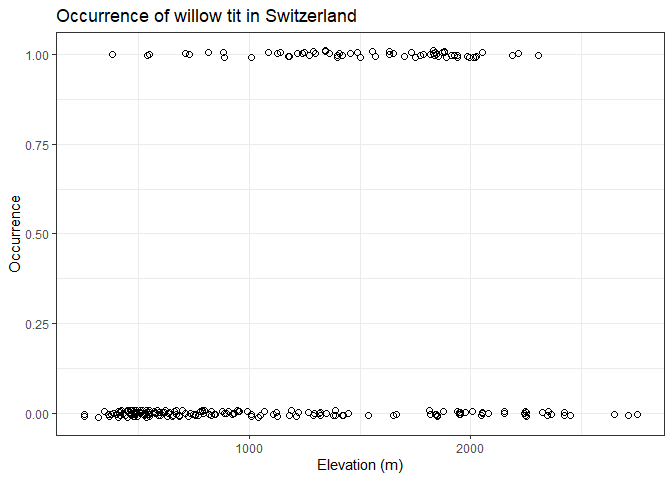

Binomial GLM. Swiss breeding bird survey example
================
Brett Melbourne
16 Nov 2020 (updated 21 Nov 2024)

Willow tit distribution with altitude. This is an example of a nonlinear
biological model with a binomial distribution. The model is logit-linear
and together with the binomial distribution, is a classic **generalized
linear model** (GLM); the special case of **logistic regression**, a GLM
with logit link function and binomial distribution. The data are
occurrence (presence-absence) of the willow tit. This example is from
Royle JA & Dorazio RM (2008) Hierarchical Modeling and Inference in
Ecology, p 87. Altitude data are from eros.usgs.gov. I demonstrate a
Bayesian approach here.

``` r
library(ggplot2)
library(dplyr)
library(rethinking)
library(rstanarm)
library(bayesplot)
source("source/hpdi.R")
options(mc.cores=parallel::detectCores())
theme_set(theme_bw())
```

Read in and plot elevation data from a digital elevation model (DEM) for
Switzerland.

``` r
swissdem <- read.csv("data/switzerland_tidy.csv")

swissdem |> 
    ggplot() +
    geom_raster(mapping=aes(x=x, y=y, fill=Elev_m)) +
    scale_fill_gradientn(colors=terrain.colors(22), name="Elevation (m)") + 
    coord_quickmap() +
    labs(title="Switzerland: DEM") +
    theme_void() +
    theme(plot.title=element_text(hjust=0.5, vjust=-2))
```

<!-- -->

Read in the bird data. We’ll focus for now on the occurrence data from
year 1 in the column `y.1`.

``` r
willowtit <- read.csv("data/wtmatrix.csv") 
```

Here are the first 30 rows of data

``` r
willowtit |> 
    select(y.1, elev) |> 
    head(n=30)
```

    ##    y.1 elev
    ## 1    0  420
    ## 2    0  450
    ## 3    0 1050
    ## 4    0 1110
    ## 5    0  510
    ## 6    0  630
    ## 7    0  590
    ## 8    0  530
    ## 9    1 1140
    ## 10   0  770
    ## 11   0 1220
    ## 12   0  460
    ## 13   0 1010
    ## 14   0  760
    ## 15   1 1300
    ## 16   1 1270
    ## 17   0  380
    ## 18   1  550
    ## 19   0  390
    ## 20   0 1380
    ## 21   0  530
    ## 22   0 1190
    ## 23   1 1490
    ## 24   0  920
    ## 25   0  620
    ## 26   0  540
    ## 27   1  820
    ## 28   1 1220
    ## 29   1 1180
    ## 30   0  730

We see that the data for occurrence are binary with zeros coding for
absence and ones for presence. Confirming that we have only zeros and
ones:

``` r
unique(willowtit$y.1)
```

    ## [1] 0 1

Binary response variables are more challenging to visualize than
continuous variables. Plotting the raw zeros and ones data against
elevation is a little bit useful but not especially informative (we can
see that occurrences appear more often at mid elevation but that’s about
as good as we can perceive). I’ve jittered the points and used open
circles to help with overlap.

``` r
willowtit |> 
    ggplot() +
    geom_jitter(mapping=aes(x=elev, y=y.1), shape=1, size=2, height=0.01) +
    labs(x="Elevation (m)", y="Occurrence", 
         title="Occurrence of willow tit in Switzerland")
```

<!-- -->

Two useful approaches for visualizing binary data are binning and
smoothing. Here, we’ll bin elevation into 500 m increments and summarize
the binary records of occurrence. We set up bins, then calculate the
proportion present in each bin, then the midpoint of the bin. The
proportion of occurrences is the sum of the occurrences divided by the
number of observations; since the proportion is just the mean of a
binary variable, we can use the mean function.

``` r
freq_table <-
    willowtit |> 
    group_by(bin=cut(elev, breaks=seq(0, 3000, by=500))) |> 
    summarize(p=mean(y.1)) |> 
    mutate(mid=seq(250, 3000, by=500)) 
freq_table
```

    ## # A tibble: 6 × 3
    ##   bin                  p   mid
    ##   <fct>            <dbl> <dbl>
    ## 1 (0,500]         0.0244   250
    ## 2 (500,1e+03]     0.0972   750
    ## 3 (1e+03,1.5e+03] 0.490   1250
    ## 4 (1.5e+03,2e+03] 0.628   1750
    ## 5 (2e+03,2.5e+03] 0.276   2250
    ## 6 (2.5e+03,3e+03] 0       2750

Plot including the binned proportion and a smoother on the occurrence
data. Since the smoother is modeling the mean of the zeros and ones, it
is modeling a smooth function of the proportion of occurrences. The
smoother is probably the most useful technique.

``` r
willowtit |> 
    ggplot() +
    geom_jitter(mapping=aes(x=elev, y=y.1), shape=1, size=2, height=0.01) +
    geom_smooth(mapping=aes(x=elev, y=y.1), linewidth=0.5, se=FALSE) +
    geom_line(data=freq_table, 
              mapping=aes(x=mid, y=p), col=2) +
    geom_point(data=freq_table, 
               mapping=aes(x=mid, y=p), shape=1, size=2, col=2) +
    coord_cartesian(ylim=c(-0.01,1.01)) +
    labs(x="Elevation (m)", y="Occurrence (or proportion)", 
         title="Relationship appears humped")
```

    ## `geom_smooth()` using method = 'loess' and formula = 'y ~ x'

<!-- -->

The most striking feature in this plot is that the relationship appears
to be hump shaped. There is an optimal elevation for willow tits. Above
and below that elevation, the probability of occurrence appears lower.

### Model algorithm

We’ll use a GLM with binomial distribution and logit link. The basic
linear predictor, $\eta$, with logit link, relates probability of
occurrence, $p$, to elevation as

$$
\mathrm{ln} \left( \frac{p}{1-p} \right) =
    \eta =
    \beta_0 + \beta_1 \mathrm{elev}
$$

The logit link function ranges from -INF to +INF on the scale of the
linear predictor but is bounded 0-1 on the probability scale, as we’ll
see in the next two plots. The following function encodes the
deterministic component of the model algorithm; it calculates the
predicted probability.

``` r
p_pred_linear  <- function(b0, b1, elev) {
    lp <- b0 + b1 * elev            #logit p
    prob <- exp(lp) / (1 + exp(lp)) #antilogit
    return(prob)
}
```

Here’s an example of this linear logit(p) as a function of elevation.

``` r
b0 <- -15
b1 <- 0.01
elev <- seq(500, 2500, 20)
logit_p <- b0 + b1 * elev
ggplot() +
    geom_line(aes(x=elev, y=logit_p))
```

<!-- -->

and now probability as a function of elevation via the inverse link
function

``` r
p <- p_pred_linear(b0, b1, elev)
ggplot() +
    geom_line(aes(x=elev, y=p))
```

<!-- -->

Thus, the probability curve for the basic logistic regression is sigmoid
shaped. The probability monotonically increases with elevation. This is
a poor description for the willowtit data for which the probability
appears to peak at intermediate elevations.

We want to allow for the distribution of willow tits as a function of
elevation to be hump shaped since we clearly saw that in the exploratory
data analysis above. One simple model for a hump relates logit(p) to
elevation by a quadratic function:

$$
\mathrm{ln} \left( \frac{p}{1-p} \right) = 
    \beta_0 + \beta_1 \mathrm{elev} + \beta_2 \mathrm{elev}^2
$$

Here’s the code

``` r
p_pred_quadratic  <- function(b0, b1, b2, elev) {
    lp <- b0 + b1 * elev + b2 * elev^2   #logit p
    prob <- exp(lp) / (1 + exp(lp))      #antilogit
    return(prob)
}
```

Here’s an example of this quadratic logit(p) as a function of elevation

``` r
b0 <- -8
b1 <- 0.01
b2 <- -3.5e-06
logit_p <- b0 + b1 * elev + b2 * elev^2
ggplot() +
    geom_line(aes(x=elev, y=logit_p))
```

<!-- -->

and now probability as a function of elevation

``` r
p <- p_pred_quadratic(b0, b1, b2, elev)
ggplot() +
    geom_line(aes(x=elev, y=p))
```

<!-- -->

So we now have the probability of occurrence, $p$, peaking at
intermediate elevations, as desired.

The stochastic component of this model generates either a presence or
absence coded as 1 or 0 respectively.

$$
y_i \sim \mathrm{Bernoulli}(p_i)
$$

which is a special case of a Binomial distribution with 1 trial.

$$
y_i \sim \mathrm{Binomial}(p_i, n=1)
$$

We can simulate the full data generating process as follows

``` r
b0 <- -8
b1 <- 0.01
b2 <- -3.5e-06
elev <- seq(500, 2500, 20)
p <- p_pred_quadratic(b0, b1, b2, elev)
y <- rbinom(length(elev), prob=p, size=1)
```

Plotting simulated y (occurrence) against elevation, along with a
smoother

``` r
ggplot() +
    geom_jitter(aes(x=elev, y=y), shape=1, size=2, height=0.01) +
    geom_smooth(aes(x=elev, y=y), linewidth=0.5, se=FALSE) +
    labs(x="Elevation (m)", y="Occurrence", 
         title="Simulated occurrence data")
```

    ## `geom_smooth()` using method = 'loess' and formula = 'y ~ x'

<!-- -->

So we have a model for the data generating process that seems to be
working in the way we want.

For the full Bayesian model, add priors for the parameters. We’ll assume
that $\mathrm{elev}$ and $\mathrm{elev}^2$ will be scaled by centering
and dividing by their standard deviations for efficient training by
MCMC.

$$
\begin{align}
  y_i &\sim \mathrm{Bernoulli}(p_i) \\
  \mathrm{ln} \left( \frac{p}{1-p} \right) &= 
    \beta_0 + \beta_1 \mathrm{elev} + \beta_2 \mathrm{elev}^2 \\
  \beta_0 &\sim \mathrm{Normal}(0, 2.5) \\
  \beta_1 &\sim \mathrm{Normal}(0, 2.5) \\
  \beta_2 &\sim \mathrm{Normal}(0, 2.5)
\end{align}
$$

### Training algorithm

Here we’ll specify and train the model in a Bayesian framework, first
explicitly using `ulam()`, then equivalently as a common GLM with
`stan_glm()`.

``` r
# Set up standardized variables in a separate data frame
mean_elev <- mean(willowtit$elev)
sd_elev <- sd(willowtit$elev)
mean_elev_sq <- mean(willowtit$elev ^ 2)
sd_elev_sq <- sd(willowtit$elev ^ 2)
d <- willowtit |>
    mutate(intercept = rep(1, n()),
           elevc = elev,     #need a copy to use in next two lines
           elev = (elevc - mean_elev) / sd_elev,
           elev_sq = (elevc ^ 2 - mean_elev_sq) / sd_elev_sq) |>
    rename(y = y.1) |>
    select(y, intercept, elev, elev_sq)
head(d, 20)
```

    ##    y intercept        elev     elev_sq
    ## 1  0         1 -1.17984672 -0.93702044
    ## 2  0         1 -1.13343102 -0.92209048
    ## 3  0         1 -0.20511694 -0.40726438
    ## 4  0         1 -0.11228553 -0.33312942
    ## 5  0         1 -1.04059961 -0.88914161
    ## 6  0         1 -0.85493679 -0.81088804
    ## 7  0         1 -0.91682440 -0.83880306
    ## 8  0         1 -1.00965581 -0.87724341
    ## 9  1         1 -0.06586982 -0.29451746
    ## 10 0         1 -0.63833017 -0.69877036
    ## 11 0         1  0.05790539 -0.18651838
    ## 12 0         1 -1.11795911 -0.91688502
    ## 13 0         1 -0.26700454 -0.45439957
    ## 14 0         1 -0.65380208 -0.70752240
    ## 15 1         1  0.18168060 -0.07119734
    ## 16 1         1  0.13526489 -0.11530077
    ## 17 0         1 -1.24173433 -0.95532537
    ## 18 1         1 -0.97871200 -0.86488758
    ## 19 0         1 -1.22626242 -0.95092074
    ## 20 0         1  0.30545581  0.05144568

``` r
fit_ulam <- ulam(
    alist(
        y ~ bernoulli(p),
        logit(p) <- beta_0 * intercept +
                    beta_1 * elev +
                    beta_2 * elev_sq,
        beta_0 ~ dnorm(0, 2.5),
        beta_1 ~ dnorm(0, 2.5),
        beta_2 ~ dnorm(0, 2.5)
    ),
    data=d
)
```

    ## Running MCMC with 1 chain, with 1 thread(s) per chain...
    ## 
    ## Chain 1 Iteration:   1 / 1000 [  0%]  (Warmup) 
    ## Chain 1 Iteration: 100 / 1000 [ 10%]  (Warmup) 
    ## Chain 1 Iteration: 200 / 1000 [ 20%]  (Warmup) 
    ## Chain 1 Iteration: 300 / 1000 [ 30%]  (Warmup) 
    ## Chain 1 Iteration: 400 / 1000 [ 40%]  (Warmup) 
    ## Chain 1 Iteration: 500 / 1000 [ 50%]  (Warmup) 
    ## Chain 1 Iteration: 501 / 1000 [ 50%]  (Sampling) 
    ## Chain 1 Iteration: 600 / 1000 [ 60%]  (Sampling) 
    ## Chain 1 Iteration: 700 / 1000 [ 70%]  (Sampling) 
    ## Chain 1 Iteration: 800 / 1000 [ 80%]  (Sampling) 
    ## Chain 1 Iteration: 900 / 1000 [ 90%]  (Sampling) 
    ## Chain 1 Iteration: 1000 / 1000 [100%]  (Sampling) 
    ## Chain 1 finished in 0.7 seconds.

The model compiles and the training algorithm doesn’t complain. Now the
serious run.

``` r
fit_ulam <- ulam(fit_ulam, chains=4, cores=4, warmup=1000, iter=2500)
```

We seem to have good parameter estimates, convergence of chains, and a
good effective sample size:

``` r
precis(fit_ulam, prob=0.95, digits=4)
```

    ##             mean        sd      2.5%      97.5%     rhat ess_bulk
    ## beta_0 -1.344676 0.1972697 -1.748448 -0.9797595 1.001457 2193.436
    ## beta_1  5.385031 0.9278282  3.589122  7.2501242 1.002324 1536.453
    ## beta_2 -4.445962 0.8685425 -6.184832 -2.7975358 1.002434 1601.012

For our scaled predictor variables, $x_{.}^{'}$, we have fitted the
linear predictor

$$
\eta = \beta_0^{'} + \beta_1^{'} x_1^{'} + \beta_2^{'} x_2^{'}
$$

where

$$
x^{'} = \frac{x - \bar{x}}{\sigma_x}
$$

So to rescale our parameters to the original scale of the predictors:

$$
\begin{align}
\eta &= \beta_0^{'} +
        \frac{\beta_1^{'}}{\sigma_{x_1}} x_1 -
        \beta_1^{'} \frac{\bar{x}_1}{\sigma_{x_1}} +
        \frac{\beta_2^{'}}{\sigma_{x_2}} x_2 -
        \beta_2^{'} \frac{\bar{x}_2}{\sigma_{x_2}} \\
     &= \left( \beta_0^{'} -
        \beta_1^{'} \frac{\bar{x}_1}{\sigma_{x_1}} -
        \beta_2^{'} \frac{\bar{x}_2}{\sigma_{x_2}} \right) +
        \left( \frac{\beta_1^{'}}{\sigma_{x_1}} \right) x_1 + 
        \left( \frac{\beta_2^{'}}{\sigma_{x_2}} \right) x_2 \\
     &= \beta_0 + \beta_1 x_1 + \beta_2 x_2
\end{align}
$$

Comparing the last two lines above, we can recognize that

$$
\begin{align}
\beta_0  &= \beta_0^{'} -
            \beta_1^{'} \frac{\bar{x}_1}{\sigma_{x_1}} -
            \beta_2^{'} \frac{\bar{x}_2}{\sigma_{x_2}} \\
\beta_1 &=  \frac{\beta_1^{'}}{\sigma_{x_1}} \\
\beta_2 &=  \frac{\beta_2^{'}}{\sigma_{x_2}} \\
\end{align}
$$

So the estimated parameters of our quadratic model, with respect to the
original scale of elevation, are

``` r
cf <- coef(fit_ulam)
beta_0 <- cf["beta_0"] - 
          cf["beta_1"] * mean_elev / sd_elev - 
          cf["beta_2"] * mean_elev_sq / sd_elev_sq
beta_1 <- cf["beta_1"] / sd_elev
beta_2 <- cf["beta_2"] / sd_elev_sq
c(beta_0, beta_1, beta_2)
```

    ##        beta_0        beta_1        beta_2 
    ## -6.582906e+00  8.331666e-03 -2.543219e-06

For a quick visualization, we can form predictions from the fitted model
using the deterministic part of the model algorithm:

``` r
elevxx <- seq(min(willowtit$elev), max(willowtit$elev), length.out=100) #grid for the x axis
predp <- p_pred_quadratic(beta_0, beta_1, beta_2, elevxx)
preds_quad <- data.frame(elev=elevxx, p=predp)
```

Plot the fitted model with the (summarized) data

``` r
preds_quad |> 
    ggplot() +
    geom_point(data=freq_table, 
               mapping=aes(x=mid, y=p), shape=1, size=2) +
    geom_line(mapping=aes(x=elev, y=p)) +
    coord_cartesian(ylim=c(0,1)) +
    labs(x="Elevation (m)", y="Probability of occurrence",
         title="Fitted model compared to binned proportions")
```

<!-- -->

``` r
rm(b0,b1,b2,elev,logit_p,p,y) #clean up
```

We’ve established that we can fit the fundamental GLM from first
principles. Now, let’s turn to the more convenient `stan_glm()` to fit
the same model. We can use the original data and let `stan_glm()` do the
work of scaling elevation, setting priors, etc

``` r
fit_stan <- stan_glm(y.1 ~ elev + I(elev^2), family=binomial, data=willowtit,
                     warmup=1000, iter=3500)
print(summary(fit_stan)[,c("mean","sd","n_eff","Rhat")], digits=3)
```

    ##                    mean       sd n_eff Rhat
    ## (Intercept)   -6.64e+00 9.58e-01  2502    1
    ## elev           8.41e-03 1.42e-03  2451    1
    ## I(elev^2)     -2.57e-06 4.88e-07  2499    1
    ## mean_PPD       2.83e-01 3.67e-02  6447    1
    ## log-posterior -1.16e+02 1.24e+00  2955    1

The parameter estimatess are essentially the same as our `ulam` fit.

### Model checking

``` r
launch_shinystan(fit_stan)
```

All the diagnostics look good. We have nice histograms for the posterior
distributions and we can see that these are slightly skewed.

``` r
plot(fit_stan, "hist", bins=50)
```

<!-- -->

The posterior predictive check looks good. Recall that we only have
zeros and ones, so we’re just paying attention to the ends of this plot.

``` r
pp_check(fit_stan, plotfun = "dens_overlay")
```

<!-- -->

### Inference algorithm

We’ll form credible intervals in the usual way. Here, $p$ is `mu` to
stay with our standard formulation for a GLM. There is little sense in
calculating prediction intervals for binomial data, since these are all
(0,1).

``` r
newd <- data.frame(elev=seq(min(willowtit$elev),max(willowtit$elev),length.out=100))
pmu <- posterior_linpred(fit_stan, transform=TRUE, newdata=newd)
#pmu <- posterior_epred(fit_stan, newdata=newd) #equivalent
```

Take a look at some of these samples to judge the shape and noisiness of
the posterior. We have a nice large sample, so these look good. There is
skewness in these distributions at the ends of the elevation range, as
expected.

``` r
mcmc_hist(pmu, pars=sample(colnames(pmu), 6), bins=75)
```

<!-- -->

Summarize the distributions to form means and credible intervals

``` r
mnmu <- colMeans(pmu)
n <- nrow(newd)
mean_intervals <- data.frame(mulo95=rep(NA,n), muhi95=rep(NA,n))
for ( i in 1:n ) {
    mean_intervals[i,] <- hpdi(pmu[,i], prob=0.95)
}
```

Plot the fitted model with its uncertainty

``` r
preds <- cbind(newd, mnmu, mean_intervals)
preds |> 
    ggplot() +
    geom_point(data=freq_table, aes(x=mid, y=p), shape=1, size=2) +
    geom_ribbon(aes(x=elev, ymin=mulo95, ymax=muhi95), alpha=0.2) +
    geom_line(aes(x=elev, y=mnmu), col="blue") +
    coord_cartesian(ylim=c(0, 1)) +
    labs(x="Elevation (m)", y="Probability of occurrence",
         title="Fitted model with 95% credible intervals compared to binned proportions")
```

<!-- -->

### Plot predictions as a map

We can also make a nice visualization of the predicted occurrence across
Switzerland. We input the elevations from the map of Switzerland to the
model algorithm, forming a raster data structure in tidy format (which
incidentally is a very inefficient way to store a raster in memory but
is necessary for `ggplot()`). It turns out there is not enough memory to
calculate the predicted probability for all the elevations in the raster
at once, so we’ll process them in batches. This will take a few minutes.

``` r
n <- length(swissdem$Elev_m)
mnmu <- rep(NA, n)
batch <- 1000
j <- 1
while ( j < n ) {
    i <- j:min(n, j + batch - 1)
    newd <- data.frame(elev=swissdem$Elev_m[i])
    pmu <- posterior_linpred(fit_stan, transform=TRUE, newdata=newd)
    mnmu[i] <- colMeans(pmu)
    j <- j + batch
    print(j) #progress
}
willowtit_ras <- cbind(swissdem[,1:2], p=mnmu)
```

Now we can plot a map of probability. The viridis color scale has
excellent properties for visualizing a continuous scale. The locations
where we’re most likely to observe this species pop out in yellow.

``` r
willowtit_ras |> 
    ggplot() +
    geom_raster(mapping=aes(x=x, y=y, fill=p)) +
    scale_fill_viridis_c(name="Probability") + 
    coord_quickmap() +
    labs(title="Probability of observing a willow tit in year 1") +
    theme_void() +
    theme(plot.title=element_text(hjust=0.5, vjust=-2))
```

<!-- -->
