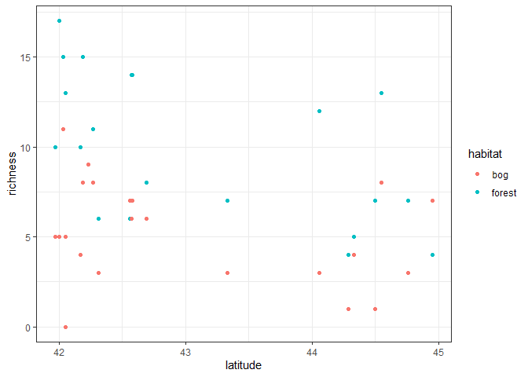

Ant data: simulating data to solidify understanding and test algorithms
================
Brett Melbourne
4 Dec 2021 (updated 22 Nov 2024)

``` r
library(lme4)
library(dplyr)
library(ggplot2)
library(rstanarm)
options(mc.cores = parallel::detectCores())
theme_set(theme_bw())
```

This is the eighth in a series of scripts to analyze the ant data
described in Ellison (2004). In this script we generate simulated data
to solidify our understanding of the model (the data generating process)
and to check that our model, training, and inference algorithms are
working as intended.

Simulating a model means to create data using the model. Such “data” are
called simulated data or fake data. Throughout the semester, we’ve
already seen many examples of simulated data generated from models. Why
simulate a model?

1.  **Gain understanding** of your scientific problem, your experimental
    design, and the training (model fitting) algorithm.
2.  **Test that everything is set up correctly** in your analysis. If
    you have everything set up correctly, including the math and the
    code, estimated parameters from the model fitted to simulated data
    should be consistent with the known parameters in the simulation.
3.  **Before** you conduct a study **explore sampling or experimental
    designs** to get the strongest inference. This is related to, and is
    an excellent replacement for, power analysis, an older approach for
    evaluating designs.
4.  **After** you’ve done an analysis, simulation can be used to ask:
    **“Does the fitted model look right?”**. In other words, does the
    fitted model generate data that look anything like the real data? In
    `rstanarm` this is the **posterior predictive check** in the
    diagnostics that we considered in previous scripts.

We want to simulate the response variable (species richness) as a
function of the predictors. Our current model is a generalized linear
model with a Poisson distribution for species richness and log link,
with latitude and habitat type as linear predictors. We also have a
random effect of site. A site is a pair of sampling plots, each plot
with a different habitat type. We looked in detail at the mathematical
model in [13_3_slides_tue_ants_GLMM.pdf](13_3_slides_tue_ants_GLMM.pdf)
and fitted the model to data using both likelihood and Bayesian
approaches in [13_4_ants_multilevel.Rmd](13_4_ants_multilevel.Rmd). We
also added an overdispersion term but to keep things simple we’ll leave
that out for now. The hierarchical form of this model (with some minor
notation changes to improve clarity) is:

$y_i \sim \mathrm{Poisson}(\mu_i)$  
$\mathrm{ln}(\mu_i) = \alpha_{j[i]} + \beta_1 \mathrm{forest}_{i} + \beta_3 \mathrm{forest}_{i} \times \mathrm{latitude}_{j[i]}$  
$\alpha_j \sim \mathrm{Normal}(\mathrm{ln}(\mu_j),\sigma_{\alpha}^2)$  
$\mathrm{ln}(\mu_j) = \beta_0 + \beta_2 \mathrm{latitude}_j$

It would be simpler to simulate the additive decomposition form of this
model (see
[13_3_slides_tue_ants_GLMM.pdf](13_3_slides_tue_ants_GLMM.pdf)) because
it collapses some of the data generating processes into an equivalent
but simpler form. We’ll use the above hierarchical form of the model
here because it’s a more literal expression of our concept for how the
data are generated step by step, and so simulating it will consolidate
our understanding of our biologically-inspired theory (or *story*) of
the data generating process. In other words, the data simulation will
help us to think through the question of “does my model tell my story
for how I imagine the biology?”. To simulate data for this model we need
to implement it as an algorithm in code.

The equations broadly say there are four steps to generating species
richness, starting from line 4 of the equations and working back to
line 1. In pseudocode, our data story is as follows:

    for each site j
        latitude determines broad-scale richness (Eq. line 4)
        but there is some stochasticity about this (Eq. line 3)
        
    for each plot i
        habitat modifies local richness (Eq. line 2)
        then stochasticity determines the final richness (Eq. line 1)

So, we have a hierarchical and step-by-step concept for how biological
processes at different scales ultimately give rise to the number of ant
species at the scale of individual data points (plots). First, latitude
determines the big picture, then it’s modified by habitat at smaller
scales, and stochasticity is important at both large and small scales.

To generate data then, broadly our **data generating algorithm** is:

    for each site j
        generate an expected ln(richness) based on latitude (Eq. line 4)
        generate stochasticity around this expectation (Eq. line 3)
        
    for each plot i
        generate an expected ln(richness) based on habitat type (Eq. line 2)
        generate richness with stochasticity (Eq. line 1)

The data are generated separately at the different scales, reflecting
our biological story.

Our intention is to match the study design of our real dataset, so we
want to use the predictor variables as they are in the real dataset:

``` r
ant <- read.csv("data/ants.csv")
```

Recall that we have 22 sites, each with an associated latitude, and at
each site we have both a forest and a bog sample plot:

``` r
ant |>
    select(latitude, site, habitat) |>
    arrange(latitude, site, habitat) |>
    head(10)
```

    ##    latitude site habitat
    ## 1     41.97  TPB     bog
    ## 2     41.97  TPB  forest
    ## 3     42.00  HBC     bog
    ## 4     42.00  HBC  forest
    ## 5     42.03  CKB     bog
    ## 6     42.03  CKB  forest
    ## 7     42.05   CB     bog
    ## 8     42.05   CB  forest
    ## 9     42.05  SKP     bog
    ## 10    42.05  SKP  forest

We’re going to need some parameter values for the model. There’s a lot
of flexibility here depending on what we want to do. If this is a
post-analysis simulation, we’d set parameters to the estimated values
from the fitted model and with data structure that matched the data
(number of replicates within groups etc). If it’s a pre-analysis
simulation, such as for exploring experimental designs, or testing
training algorithms, then we want to choose values that make sense, or
we can vary the parameters to examine the implications of different
scenarios, such as where most of the variance is (data vs group level),
or how replicates are distributed among groups, or which scales
treatments are applied to.

In this example, we could use estimates from the fit of the model we
obtained in [13_4_ants_multilevel.Rmd](13_4_ants_multilevel.Rmd). That’s
a great thing to do! But let’s imagine we’re one step back and haven’t
fitted a model to real data yet. From a plot of the real data, I
eyeballed mean richness values at latitudes 42 and 45 for bog habitat to
give these equations for the linear predictor (from line 4 of the
mathematical model equation above):

$\mathrm{ln}(6) = \beta_0 + \beta_2 \times 42$  
$\mathrm{ln}(3) = \beta_0 + \beta_2 \times 45$

which I then solved by hand (2 equations, 2 unknowns) to give reasonable
values for $\beta_0$ and $\beta_2$. I did the same for forest habitat,
where I discovered the slope was about the same (i.e. $\beta_3$ = 0).
For $\sigma_{\alpha}$ I thought 20% stochasticity was a good place to
start based on my knowledge of ecological processes; given the natural
logarithm scale, that’s about 0.2. Ballpark parameter values like these
are all we need!

Now, let’s translate our pseudocode into R code, adding the necessary
detail from the equations plus some infrastructure (parameter values and
data structures), as well as vectorizing the `for` loops from our
pseudocode.

``` r
# Set a seed for reproducibility
set.seed(381)

# Parameters
b_0 <- 11.5
b_1 <- 0.7
b_2 <- -0.231
b_3 <- 0
sigma_alpha <- 0.2

# Set up the study design the same as the real data:

# Site-scale variable (22 sites)
latitude <- ant$latitude[1:22]

# Plot-scale variables (44 plots, 2 per site)
j <- rep(1:22, 2) #site ID
forest <- ifelse(ant$habitat == "forest", 1, 0) #forest indicator

# Generate data:

# For each site, generate an expected ln(richness) based on latitude (Eq. line 4)
mu_alpha <- b_0 + b_2 * latitude

# For each site, generate stochasticity around this expectation (Eq. line 3)
# (note how this value will be the same for both plots at a site)
alpha <- rnorm(22, mu_alpha, sigma_alpha)

# For each plot, generate an expected ln(richness) based on habitat type (Eq. line 2)
# (we use j to extract the appropriate alpha and latitude values)
ln_mu <- alpha[j] + b_1 * forest + b_3 * forest * latitude[j]

# For each plot, generate richness with stochasticity (Eq. line 1)
# (we use the inverse link function to obtain mu)
y <- rpois(44, exp(ln_mu))

# Put in a data frame
sim_dat <- cbind(ant[,1:3], richness=y)
```

How do the simulated data look?

``` r
ggplot(data=sim_dat, mapping=aes(x=latitude, y=richness, col=habitat)) +
    geom_point()
```

<!-- -->

Not bad! It’s even quite like the real data. Now, if we fit the model to
these simulated data, can we recover the known parameters (i.e. the
parameter values we coded in)?

``` r
sim_dat$habitat <- factor(sim_dat$habitat)
sim_dat$site <- factor(sim_dat$site)
fit_HxL <- stan_glmer(richness ~ habitat + latitude + habitat:latitude + (1|site), 
                       family=poisson, data=sim_dat)
print(summary(fit_HxL)[,c("mean","sd","n_eff","Rhat")], digits=3)
```

    ##                                          mean     sd n_eff  Rhat
    ## (Intercept)                          1.00e+01 3.5452  1862 1.001
    ## habitatforest                        1.27e+00 2.9018  1773 1.001
    ## latitude                            -1.96e-01 0.0827  1859 1.001
    ## habitatforest:latitude              -1.43e-02 0.0678  1768 1.001
    ## b[(Intercept) site:ARC]             -1.72e-01 0.1876  2226 1.000
    ## b[(Intercept) site:BH]              -6.55e-02 0.1565  3393 0.999
    ## b[(Intercept) site:CAR]              2.64e-02 0.1691  3858 1.000
    ## b[(Intercept) site:CB]              -1.02e-01 0.1622  2796 0.999
    ## b[(Intercept) site:CHI]             -5.29e-02 0.1710  3700 1.000
    ## b[(Intercept) site:CKB]              1.50e-01 0.1621  1986 1.001
    ## b[(Intercept) site:COL]              2.30e-01 0.2146  1463 1.001
    ## b[(Intercept) site:HAW]              1.01e-01 0.1535  2829 1.001
    ## b[(Intercept) site:HBC]              7.21e-02 0.1566  2797 1.001
    ## b[(Intercept) site:MOL]             -7.06e-02 0.1720  3122 1.000
    ## b[(Intercept) site:MOO]             -6.29e-03 0.1669  3644 1.001
    ## b[(Intercept) site:OB]               1.82e-02 0.1425  4274 1.000
    ## b[(Intercept) site:PEA]             -1.58e-01 0.1950  2089 1.001
    ## b[(Intercept) site:PK]               1.07e-01 0.1556  2682 1.000
    ## b[(Intercept) site:QP]               8.02e-02 0.1535  2829 1.001
    ## b[(Intercept) site:RP]              -6.94e-02 0.1571  3561 1.000
    ## b[(Intercept) site:SKP]              8.08e-04 0.1443  4074 1.001
    ## b[(Intercept) site:SNA]              7.09e-02 0.1585  3141 1.000
    ## b[(Intercept) site:SPR]             -8.30e-02 0.1638  3647 1.000
    ## b[(Intercept) site:SWR]              3.70e-02 0.1488  3810 1.000
    ## b[(Intercept) site:TPB]             -6.30e-02 0.1569  4112 0.999
    ## b[(Intercept) site:WIN]             -3.55e-02 0.1493  4373 1.000
    ## Sigma[site:(Intercept),(Intercept)]  4.13e-02 0.0396  1212 1.000
    ## mean_PPD                             7.57e+00 0.5883  4674 1.000
    ## log-posterior                       -1.47e+02 5.2306   787 1.002

Comparing the relevant parameters in turn, we see that the estimated
values are close to the known values we coded in.

``` r
cbind(b_0, estimated=summary(fit_HxL)["(Intercept)","mean"])
```

    ##       b_0 estimated
    ## [1,] 11.5   10.0299

``` r
cbind(b_1, estimated=summary(fit_HxL)["habitatforest","mean"])
```

    ##      b_1 estimated
    ## [1,] 0.7   1.27039

``` r
cbind(b_2, estimated=summary(fit_HxL)["latitude","mean"])
```

    ##         b_2  estimated
    ## [1,] -0.231 -0.1959142

``` r
cbind(b_3, estimated=summary(fit_HxL)["habitatforest:latitude","mean"])
```

    ##      b_3   estimated
    ## [1,]   0 -0.01431833

``` r
cbind(sigma_alpha, estimated=sqrt(summary(fit_HxL)["Sigma[site:(Intercept),(Intercept)]","mean"]))
```

    ##      sigma_alpha estimated
    ## [1,]         0.2  0.203296

This gives us confidence that 1) we understand our model (our intended
data generating process), 2) we’ve correctly translated the model into
`stan_glmer` syntax, and 3) the algorithms for training and inference
are working as expected. We should run the above code a number of times
to get a feeling for the variability in the data generating process and
how consistently the estimated parameters from model fitting compare to
the known values. The model fit from a single realization is not
necessarily going to be close to the known parameters.

We can do many things from here. We can try different parameter values
to test the model fitting or to explore how parameter values determine
the data generating process. For example, how does site-scale
stochasticity influence the uncertainty of species richness at the plot
scale? We could add complexity to the model, for example by adding new
variables, or overdispersion. We could turn the model code into a
function so that we can easily change parameter values. We could run the
model many times and use a facet plot to visualize the variability in
stochastic realizations of the data generating process and the resulting
model fits. Finally, once we’ve fitted the model to real data, we can
use the parameter estimates from the model fit to generate simulated
data and ask if the simulated data is similar to the real data, a good
way to diagnose whether our model is appropriate for the data.

Simulating data is a powerful approach to clarify our scientific
thinking, build our understanding of our model and quantitative methods,
and to test our code and algorithms.
